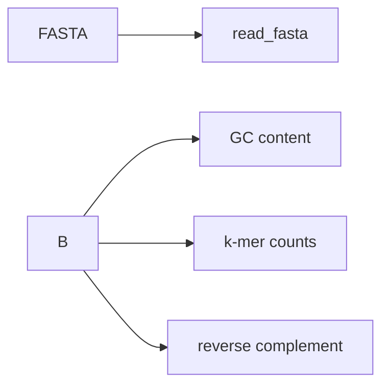

### DNA: Sequences

Functions: `read_fasta`, `reverse_complement`, `gc_content`, `kmer_counts`, `kmer_frequencies`.



Examples

```python
from pathlib import Path
from metainformant.dna import sequences

fasta = Path("tests/data/dna/toy.fasta")
id_to_seq = sequences.read_fasta(str(fasta))

rc = {k: sequences.reverse_complement(v) for k, v in id_to_seq.items()}
gc = {k: sequences.gc_content(v) for k, v in id_to_seq.items()}
k2 = sequences.kmer_counts(next(iter(id_to_seq.values())), k=2)
```
