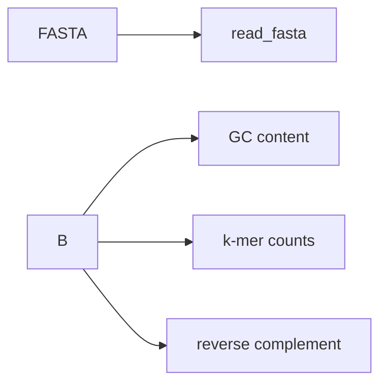

### DNA: Sequences

Functions: `read_fasta`, `reverse_complement`, `gc_content`, `kmer_counts`, `kmer_frequencies`.


```mermaid
flowchart LR
  A[FASTA] --> BreadFasta[read_fasta]
  B --> CgcContent[GC content]
  B --> Dk-merCounts[k-mer counts]
  B --> EreverseComplement[reverse complement]
```

Examples

```python
from pathlib import Path
from metainformant.dna.sequence.core import gc_content, read_fasta, reverse_complement
from metainformant.dna.sequence.kmer import count_kmers

fasta = Path("tests/data/dna/toy.fasta")
id_to_seq = read_fasta(str(fasta))

rc = {k: reverse_complement(v) for k, v in id_to_seq.items()}
gc = {k: gc_content(v) for k, v in id_to_seq.items()}
k2 = count_kmers(next(iter(id_to_seq.values())), k=2)
```
