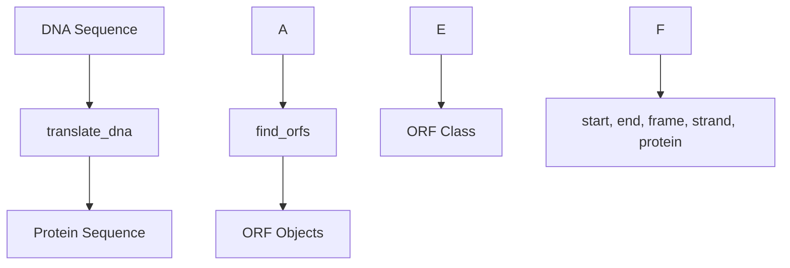

### DNA: Translation

Functions: `translate_dna`, `find_orfs`
Classes: `ORF`



Example

```python
from metainformant.dna import translation

# Simple DNA translation
dna = "ATGAAATTTAAATAG"
protein = translation.translate_dna(dna)  # "MKF*"

# Stop at first stop codon
protein = translation.translate_dna(dna, to_stop=True)  # "MKF"

# Find all open reading frames
seq = "ATGAAATTTTAAATGGGCCCCTAGATGAAATTTAAA"
orfs = translation.find_orfs(seq, min_aa=3)

# Access ORF properties
for orf in orfs:
    print(f"Position: {orf.start}-{orf.end}")
    print(f"Frame: {orf.frame}, Strand: {orf.strand}")
    print(f"Protein: {orf.protein}")
    print(f"Start codon: {orf.start_codon}")
```

ORF Class attributes:
- **start**: Start position (0-based)
- **end**: End position (0-based, exclusive)
- **frame**: Reading frame (0, 1, or 2)
- **strand**: DNA strand (+1 forward, -1 reverse)
- **protein**: Translated amino acid sequence
- **start_codon**: Start codon sequence (usually ATG)
- **stop_codon**: Stop codon sequence (TAA/TAG/TGA) or None

Features:
- **Genetic code tables**: Supports different translation tables
- **Bidirectional search**: Finds ORFs on both strands
- **Flexible filtering**: Minimum amino acid length threshold
- **Complete ORFs**: Only returns complete start-to-stop sequences
- **Multiple frames**: Searches all six reading frames

Applications:
- **Gene prediction**: Identify potential protein-coding regions
- **Annotation**: Characterize genomic sequences
- **Proteomics**: Translate DNA sequences for protein analysis
- **Comparative analysis**: ORF conservation across species

Related: Works with [transcription](./transcription.md) and [codon](./codon.md) analysis.
