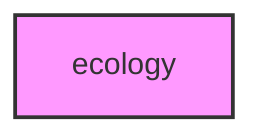

# ECOLOGY

## Overview
Functionality for ecology.

## 📦 Contents


## 📊 Structure


```mermaid
graph TD
    ecology[ecology]
    style ecology fill:#f9f,stroke:#333,stroke-width:2px
```

## Usage
Import module:
```python
from metainformant.ecology import ...
```
