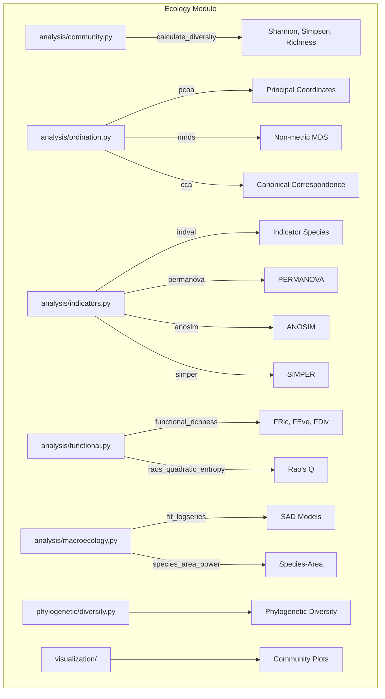

# ECOLOGY

## Overview
Ecology and community analysis module for METAINFORMANT.

## 📦 Contents
- **[analysis/](analysis/)**
- **[visualization/](visualization/)**
- `[__init__.py](__init__.py)`

## 📊 Structure



## Usage
Import module:
```python
from metainformant.ecology import ...
```
