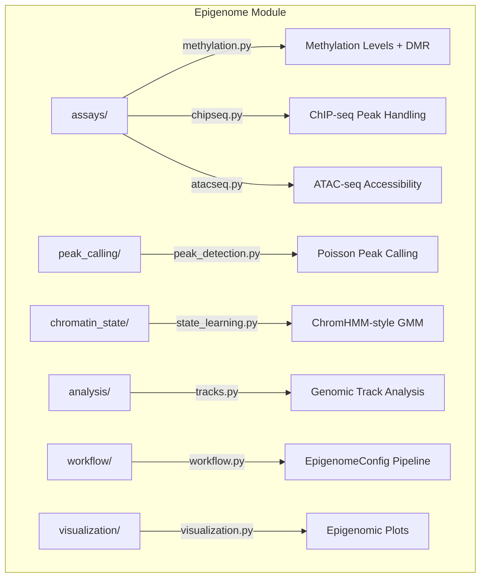

# EPIGENOME

## Overview
Epigenome analysis module for METAINFORMANT.

## Contents
- **[analysis/](peak_calling.md)**
- **[assays/](atac_seq.md)**
- **[visualization/](methylation.md)**
- **[workflow/](workflow.md)**
- `__init__.py`

## Structure



## Usage
Import module:
```python-snippet
from metainformant.epigenome import ...
```
