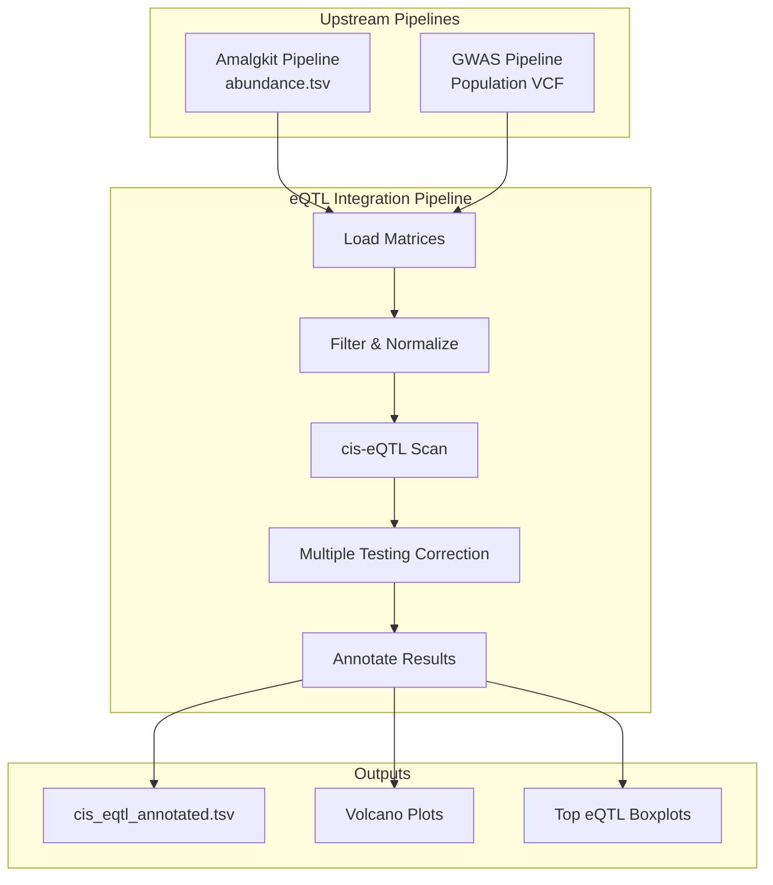

# eQTL Integration Pipeline

The eQTL (expression Quantitative Trait Loci) Integration Pipeline bridges the gap between genomic variation and transcriptomic expression, linking the **[Amalgkit RNA-seq Pipeline](../rna/README.md)** with the **[GWAS DNA Pipeline](../gwas/README.md)**. 

By analyzing how genetic variants (from VCFs) correlate with gene expression levels (from Amalgkit quantification), this pipeline identifies genetic markers that regulate gene transcription.

> **Note**: eQTL is a **cross-cutting integration pipeline** — it does not have its own `src/metainformant/eqtl/` module. Instead, the core logic lives in `metainformant.gwas.finemapping.eqtl`, `metainformant.gwas.visualization.eqtl_visualization`, and `metainformant.multiomics.analysis.integration`. Scripts are in `scripts/eqtl/`.

## 📖 Documentation

| Doc | Description |
|-----|-------------|
| [Pipeline Guide](./pipeline_guide.md) | Step-by-step walkthrough of transcriptome SNP calling |
| [Configuration Reference](./configuration.md) | All YAML config options |
| This page | Overview, architecture, and integration scripts |

## 📊 Pipeline Architecture



## 🚀 Workflows

The repository provides end-to-end execution scripts in the `scripts/eqtl/` directory highlighting both synthetic and real-world usage.

### 1. Real Data eQTL Analysis (`scripts/eqtl/run_eqtl_real.py`)

This workflow uses **real, quantified Amalgkit transcriptomic data** generated by the pipeline (e.g., from *Apis mellifera*). Because matched population-scale whole-genome sequencing frequently doesn't exist out of the box for these exact RNA samples, the script generates context-aware synthetic genotypes linked to the real gene positions.

```bash
uv run python scripts/eqtl/run_eqtl_real.py
```

**Key Steps:**
1. Loads real Kallisto expression data from Amalgkit `work/quant/` subdirectories.
2. Filters out low-expression genes (mean TPM < threshold).
3. Parses actual gene loci.
4. Synthesizes genotype variants surrounding these genes based on realistic allele frequencies.
5. Runs cis-eQTL scanning (500kb windows).
6. Generates full summary statistics, volcano plots, and effect size boxplots.

### 2. Synthetic Demo (`scripts/eqtl/run_eqtl_demo.py`)

A fully synthetic pipeline designed for rapid testing, methods development, and CI/CD validation. It simulates 100 samples, 50 genes, and 500 variants with a defined set of "true" eQTL effects.

```bash
uv run python scripts/eqtl/run_eqtl_demo.py
```

### 3. Transcriptome SNP Calling (`scripts/eqtl/rna_snp_pipeline.py`)

Extracts SNP variants directly from RNA-seq data by re-downloading FASTQs, aligning with HISAT2, and calling variants with bcftools. Produces per-sample VCFs and population genetics summaries.

```bash
# With CLI args
uv run python scripts/eqtl/rna_snp_pipeline.py --species amellifera --n-samples 3

# With YAML config
uv run python scripts/eqtl/rna_snp_pipeline.py --config config/eqtl/eqtl_amellifera.yaml
```

See [Pipeline Guide](./pipeline_guide.md) and [Configuration Reference](./configuration.md) for details.

## 📦 Core Submodules

Under the hood, the eQTL workflows rely on the highly optimized functions located in:

- `metainformant.gwas.finemapping.eqtl`: Core statistical scanning, matrix operations, effect size calculation, and `load_transcriptome_variants()` for VCF→matrix conversion.
- `metainformant.gwas.visualization.eqtl_visualization`: Plotting utilities for volcano plots, summary grids, and genotype/expression boxplots.
- `metainformant.multiomics.analysis.integration`: Helper functions to convert and harmonize VCFs and expression `DataFrames`.

## 🔗 Related

- **[Amalgkit Total Pipeline](../rna/README.md)**: Upstream transcriptomics.
- **[GWAS Total Pipeline](../gwas/README.md)**: Upstream genomic variants.
- **[Multiomics](../multiomics/README.md)**: Advanced omics integration (Joint PCA, NMF).
