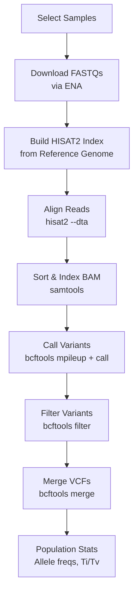

# eQTL Pipeline: Step-by-Step Guide

This document walks through the transcriptome SNP calling pipeline, which extracts genetic variants directly from RNA-seq data.

## Prerequisites

- **hisat2** ≥ 2.2: Splice-aware RNA-seq aligner
- **samtools** ≥ 1.21: BAM processing
- **bcftools** ≥ 1.21: Variant calling and manipulation
- Completed Amalgkit quantification (`abundance.tsv`) for target samples

Install tools:
```bash
sudo apt install hisat2 samtools bcftools
```

## Pipeline Steps



### Step 1: Sample Selection
The pipeline discovers samples that have completed Amalgkit quantification (have `abundance.tsv`). You can also specify samples explicitly.

### Step 2: FASTQ Download
Re-downloads FASTQs from ENA using `scripts/rna/download_ena.py`. FASTQs are deleted after alignment to save disk space.

### Step 3: HISAT2 Index
Builds a splice-aware index from the reference genome FASTA (e.g., `GCF_003254395.2_Amel_HAv3.1_genomic.fna.gz`). Built once per species.

### Step 4: Alignment
Aligns RNA-seq reads with `hisat2 --dta` and pipes through `samtools sort` to produce coordinate-sorted BAMs.

### Step 5: Variant Calling
Runs `bcftools mpileup` → `bcftools call -mv` to call SNPs and small indels from the aligned reads.

### Step 6: Filtering
Applies quality filters (`QUAL≥30`, `DP≥10`) using `bcftools filter`.

### Step 7: Merge & Population Analysis
Merges per-sample VCFs into a population VCF with `bcftools merge`. Computes allele frequencies and summary statistics (Ti/Tv ratio, variant counts).

## Output Structure

```
output/eqtl/{species}/
├── index/                  # HISAT2 index (built once)
├── samples/
│   ├── {SRR_ID}/
│   │   ├── aligned.bam     # Sorted alignment
│   │   ├── aligned.bam.bai
│   │   ├── variants.vcf.gz # Filtered per-sample VCF
│   │   └── variant_stats.json
├── population/
│   ├── merged.vcf.gz       # Multi-sample population VCF
│   ├── allele_freqs.tsv    # Per-site allele frequencies
│   └── popgen_summary.json # Population genetics summary
├── logs/
│   └── pipeline.log
└── run_summary.json
```

## Integration with eQTL Analysis

After the pipeline completes, use `load_transcriptome_variants()` to feed the real SNPs into the eQTL scan:

```python
from metainformant.gwas.finemapping.eqtl import load_transcriptome_variants, cis_eqtl_scan

# Load real transcriptome-derived variants
geno_matrix, var_positions = load_transcriptome_variants(
    "output/eqtl/amellifera/population/merged.vcf.gz"
)

# Run eQTL scan with real RNA expression + real RNA-derived variants
results = cis_eqtl_scan(expr_matrix, geno_matrix, gene_positions, var_positions)
```

## Related

- [eQTL Pipeline Overview](./README.md)
- [Configuration Reference](./configuration.md)
- [Amalgkit Pipeline](../rna/amalgkit/README.md)
