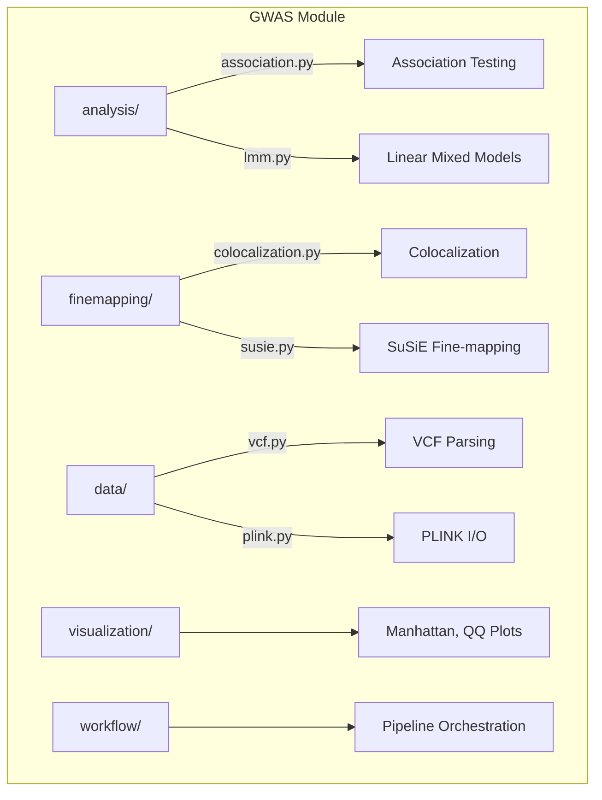

# GWAS Module

Genome-Wide Association Studies analysis, fine-mapping, and variant-expression integration.

## 📊 Architecture



## 🔑 Key Capabilities

### Fine-Mapping & Colocalization

```python
from metainformant.gwas.finemapping import (
    eqtl_coloc,        # GWAS-eQTL colocalization
    multi_trait_coloc, # Multi-trait analysis
    compute_clpp,      # CLPP method
    regional_coloc,    # Regional analysis
)

# Test if GWAS signal colocalizes with expression QTL
result = eqtl_coloc(
    gwas_z=[1.2, 2.5, 3.1],  # GWAS Z-scores per variant
    eqtl_z=[1.1, 2.3, 2.9],  # eQTL Z-scores
    gene_id="LOC12345"
)
# Returns: PP_H4 (shared causal), interpretation, credible sets
```

### Association Testing

| Function | Purpose |
|----------|---------|
| `run_gwas()` | Full GWAS pipeline |
| `logistic_regression()` | Case-control associations |
| `linear_regression()` | Quantitative trait analysis |
| `lmm_association()` | Mixed models for population structure |

### Data I/O

| Function | Purpose |
|----------|---------|
| `read_vcf()` | Parse VCF variant files |
| `read_plink()` | Load PLINK bed/bim/fam |
| `write_sumstats()` | Export summary statistics |

## 📦 Submodules

| Module | Purpose |
|--------|---------|
| [`analysis/`](analysis/) | Association testing |
| [`data/`](data/) | VCF, PLINK I/O |
| [`finemapping/`](finemapping/) | Fine-mapping, colocalization |
| [`heritability/`](heritability/) | Heritability estimation |
| [`visualization/`](visualization/) | Manhattan, QQ, LocusZoom |
| [`workflow/`](workflow/) | Pipeline orchestration |

## 🧬 Integration with Expression Data

The GWAS module integrates with RNA-seq via the multiomics module:

```python
from metainformant.multiomics.analysis import integration
from metainformant.gwas.finemapping import eqtl_coloc

# Convert GWAS and expression data to common format
dna_data = integration.from_dna_variants(gwas_sumstats)
rna_data = integration.from_rna_expression(expression_matrix)

# Run integrated analysis
integrated = integration.integrate_omics_data(
    dna_data=dna_data,
    rna_data=rna_data,
)
```

## 🔗 Related

- [metainformant.multiomics](../multiomics/) - Multi-omic integration
- [metainformant.rna](../rna/) - RNA-seq analysis
- [config/gwas/](../../../config/gwas/) - Configuration files
