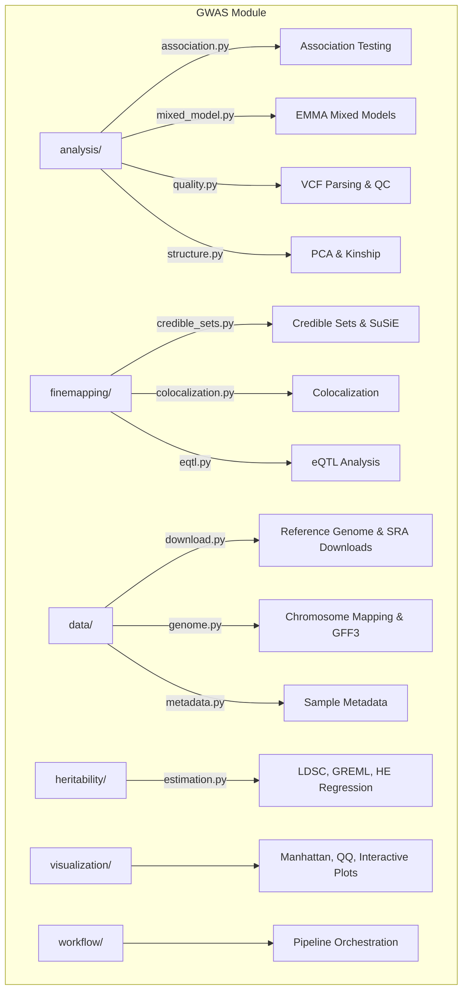

# GWAS Module

Genome-Wide Association Studies analysis, fine-mapping, and variant-expression integration.

## 📊 Architecture


```mermaid
graph TD
    subgraph "GWAS Module"
        A[analysis/] --> |association.py| AS[Association Testing]
        A --> |mixed_model.py| LM[EMMA Mixed Models]
        A --> |quality.py| QC[VCF Parsing & QC]
        A --> |structure.py| ST[PCA & Kinship]

        F[finemapping/] --> |credible_sets.py| CS[Credible Sets & SuSiE]
        F --> |colocalization.py| CO[Colocalization]
        F --> |eqtl.py| EQ[eQTL Analysis]

        D[data/] --> |download.py| DL[Reference Genome & SRA Downloads]
        D --> |genome.py| GN[Chromosome Mapping & GFF3]
        D --> |metadata.py| MD[Sample Metadata]

        H[heritability/] --> |estimation.py| HE[LDSC, GREML, HE Regression]

        V[visualization/] --> VIS[Manhattan, QQ, Interactive Plots]

        W[workflow/] --> WF[Pipeline Orchestration]
    end
```

## 🔑 Key Capabilities

### Fine-Mapping & Colocalization

```python
from metainformant.gwas.finemapping.colocalization import (
    eqtl_coloc,        # GWAS-eQTL colocalization
    multi_trait_coloc, # Multi-trait analysis
    compute_clpp,      # CLPP method
    regional_coloc,    # Regional analysis
)

# Test if GWAS signal colocalizes with expression QTL
result = eqtl_coloc(
    gwas_z=[1.2, 2.5, 3.1],  # GWAS Z-scores per variant
    eqtl_z=[1.1, 2.3, 2.9],  # eQTL Z-scores
    gene_id="LOC12345"
)
# Returns: PP_H4 (shared causal), interpretation, credible sets
```

### Association Testing

| Function | Module | Purpose |
|----------|--------|---------|
| `run_gwas()` | `metainformant.gwas.workflow` | Full config-driven GWAS workflow (linear, logistic, or mixed model; LD pruning, summary statistics, SNP-to-gene annotation) |
| `run_mixed_model_gwas()` | `metainformant.gwas.analysis.mixed_model` | EMMA mixed-model GWAS across variants (eigendecomposes the kinship matrix once) |
| `association_test_mixed()` | `metainformant.gwas.analysis.mixed_model` | Single-SNP mixed-model association test |
| `run_linear_model_gwas()` | `metainformant.gwas.analysis.association` | Quantitative-trait GWAS across variants |
| `run_logistic_model_gwas()` | `metainformant.gwas.analysis.association` | Case-control GWAS across variants |
| `association_test_linear()` | `metainformant.gwas.analysis.association` | Single-variant linear association test |
| `association_test_logistic()` | `metainformant.gwas.analysis.association` | Single-variant logistic (case-control) test |

### Data I/O

| Function | Module | Purpose |
|----------|--------|---------|
| `parse_vcf_full()` | `metainformant.gwas.analysis.quality` | Parse VCF variant files |
| `discover_sample_vcfs()` | `metainformant.gwas.data.vcf_utils` | Discover per-sample VCFs under a data root |
| `count_variants()` | `metainformant.gwas.data.vcf_utils` | Count variants in a VCF |
| `merge_vcfs()` | `metainformant.gwas.data.vcf_utils` | Merge per-sample VCFs |
| `subsample_vcf()` | `metainformant.gwas.data.vcf_utils` | Subsample a VCF by fraction or interval |
| `extract_sample_ids()` | `metainformant.gwas.data.vcf_utils` | Extract sample IDs from a VCF |
| `bgzip_and_index()` | `metainformant.gwas.data.vcf_utils` | Bgzip-compress and tabix-index a VCF |
| `write_summary_statistics()` | `metainformant.gwas.analysis.summary_stats` | Export summary statistics |

There is no PLINK bed/bim/fam reader in the current checkout.

## 📦 Submodules

| Module | Purpose |
|--------|---------|
| [`analysis/`](../../src/metainformant/gwas/analysis/) | Association testing |
| [`data/`](../../src/metainformant/gwas/data/) | VCF, PLINK I/O |
| [`finemapping/`](../../src/metainformant/gwas/finemapping/) | Fine-mapping, colocalization |
| [`heritability/`](../../src/metainformant/gwas/heritability/) | Heritability estimation |
| [`visualization/`](../../src/metainformant/gwas/visualization/) | Manhattan, QQ, LocusZoom |
| [`workflow/`](../../src/metainformant/gwas/workflow/) | Pipeline orchestration |

## 🧬 Integration with Expression Data

The GWAS module integrates with RNA-seq via the multiomics module:

```python
from metainformant.multiomics.analysis import integration
from metainformant.gwas.finemapping.colocalization import eqtl_coloc

# Convert GWAS and expression data to common format
dna_data = integration.from_dna_variants(gwas_sumstats)
rna_data = integration.from_rna_expression(expression_matrix)

# Run integrated analysis
integrated = integration.integrate_omics_data(
    dna_data=dna_data,
    rna_data=rna_data,
)
```

## 🔗 Related

- [metainformant.multiomics](../multiomics/) - Multi-omic integration
- [metainformant.rna](../rna/) - RNA-seq analysis
- [config/gwas/](../../config/gwas/) - Configuration files

## Apis mellifera Real Data

- Real genome/read organization, reads-to-estimators runbook, and BeeWAS
  synthetic-validation notes: `projects/apis_gwas/doc/current/`
  (gitlinked submodule — checkout that submodule to read them;
  `doc/current/` files were not present in this checkout at audit time)
- Real-cohort QC reporter: `scripts/gwas/pipelines/analyze_beewas_2026_real.py`
- Genomic-estimator validator: `scripts/gwas/pipelines/validate_beewas_genomic_estimators.py`
- Shared BeeWAS reporting helpers: `scripts/gwas/pipelines/beewas_reporting.py`
- Real guarded config: `projects/apis_gwas/config/beewas_2026_full_guarded.yaml`
- Generated/demo config: `config/gwas/gwas_amellifera.yaml`
