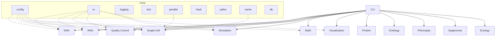

### METAINFORMANT Documentation

Welcome to the METAINFORMANT docs. This site is organized by domain and core utilities. Use the navigation below to explore each analysis area.

- [Architecture](./architecture.md)
- [CLI](./cli.md)
- [Core Utilities](./core.md)
- [Setup](./setup.md)
- [Testing](./testing.md)

- DNA
  - [Overview](./dna/index.md)
  - [Sequences](./dna/sequences.md)
  - [Pairwise Alignment](./dna/alignment.md)
  - [Multiple Sequence Alignment (MSA)](./dna/msa.md)
  - [Phylogeny](./dna/phylogeny.md)
  - [Population Genetics](./dna/population.md)

- RNA
  - [Overview](./rna/index.md)
  - [amalgkit Wrapper](./rna/amalgkit/amalgkit.md)
  - [Workflow](./rna/workflow.md)
  - [Configs](./rna/configs.md)
  - [Steps](./rna/steps.md)

- Single-Cell Genomics
  - [Overview](./singlecell/index.md)
  - [Preprocessing](./singlecell/preprocessing.md)
  - [Dimensionality Reduction](./singlecell/dimensionality.md)
  - [Clustering](./singlecell/clustering.md)
  - [Trajectory Analysis](./singlecell/trajectory.md)
  - [Visualization](./singlecell/visualization.md)
  - [Integration](./singlecell/integration.md)

- Quality Control
  - [Overview](./quality/index.md)
  - [FASTQ Analysis](./quality/fastq.md)

- Simulation
  - [Overview](./simulation/index.md)
  - [Sequence Generators](./simulation/sequences.md)
  - [RNA Counts](./simulation/rna_counts.md)
  - [Agents & GridWorld](./simulation/agents.md)

- Math
  - [Overview](./math/index.md)
  - [Price Equation](./math/price.md)
  - [Selection Models](./math/selection.md)
  - [Drift–Diffusion Model](./math/ddm.md)

- Visualization
  - [Overview](./visualization/index.md)
  - [Phylogenetic Trees](./visualization/trees.md)
  - [Plots](./visualization/plots.md)
  - [Animations](./visualization/animations.md)

- Other Domains
  - [Protein](./protein/index.md)
  - [Ontology](./ontology/index.md)
  - [Phenotype](./phenotype/index.md)
  - [Epigenome](./epigenome/index.md)
  - [Ecology](./ecology/index.md)

See also: the top-level project README for quickstarts.

