### METAINFORMANT Documentation

Welcome to the METAINFORMANT docs. This site is organized by domain and core utilities. Use the navigation below to explore each analysis area.

**📖 New to the documentation?** Check the **[Documentation Guide](DOCUMENTATION_GUIDE.md)** for complete navigation tips and best practices.

## Core Documentation

- [Documentation Guide](./DOCUMENTATION_GUIDE.md) - Complete guide to using this documentation
- [Architecture](./architecture.md)
- [CLI](./cli.md)
- [Core Utilities](./core/README.md)
- [Setup](./setup.md)
- [Testing](./testing.md)

- DNA
  - [Overview](./dna/index.md)
  - [Sequences](./dna/sequences.md)
  - [Pairwise Alignment](./dna/alignment.md)
  - [Multiple Sequence Alignment (MSA)](./dna/msa.md)
  - [Phylogeny](./dna/phylogeny.md)
  - [Population Genetics](./dna/population.md)
  - [FASTQ Processing](./dna/fastq.md)
  - [Codon Usage](./dna/codon.md)
  - [Sequence Composition](./dna/composition.md)
  - [Evolutionary Distances](./dna/distances.md)
  - [Transcription](./dna/transcription.md)
  - [Translation](./dna/translation.md)
  - [Variants](./dna/variants.md)

- RNA
  - [Overview](./rna/index.md)
  - [Workflow](./rna/workflow.md)
  - [Configs](./rna/configs.md)
  - [Steps](./rna/steps.md)

- GWAS (Genome-Wide Association Studies)
  - [Overview](./gwas/index.md)
  - [Complete README](./gwas/README.md)
  - [Workflow](./gwas/workflow.md)
  - [Configuration](./gwas/config.md)
  - [P. barbatus Example](./gwas/pbarbatus_config.md)
  - [Verification Report](./gwas/verification_report.md)

- Single-Cell Genomics
  - [Overview](./singlecell/index.md)
  - [Preprocessing](./singlecell/preprocessing.md)
  - [Dimensionality Reduction](./singlecell/dimensionality.md)
  - [Clustering](./singlecell/clustering.md)
  - [Trajectory Analysis](./singlecell/trajectory.md)
  - [Visualization](./singlecell/visualization.md)
  - [Integration](./singlecell/integration.md)

- Quality Control
  - [Overview](./quality/index.md)
  - [FASTQ Analysis](./quality/fastq.md)

- Simulation
  - [Overview](./simulation/index.md)
  - [Sequence Generators](./simulation/sequences.md)
  - [RNA Counts](./simulation/rna_counts.md)
  - [Agents & GridWorld](./simulation/agents.md)

- Math
  - [Overview](./math/index.md)
  - [Price Equation](./math/price.md)
  - [Selection Models](./math/selection.md)
  - [Drift–Diffusion Model](./math/ddm.md)

- Visualization
  - [Overview](./visualization/index.md)
  - [Phylogenetic Trees](./visualization/trees.md)
  - [Plots](./visualization/plots.md)
  - [Animations](./visualization/animations.md)

- Other Domains
  - [Protein](./protein/index.md)
  - [Ontology](./ontology/index.md)
  - [Phenotype](./phenotype/index.md)
  - [Epigenome](./epigenome/index.md)
  - [Ecology](./ecology/index.md)
  - [Machine Learning](./ml/index.md)
  - [Multi-omics](./multiomics/index.md)
  - [Networks](./networks/index.md)
  - [Information Theory](./information/index.md)
  - [Life Events](./life_events/index.md)

See also: the top-level project README for quickstarts.

```mermaid
graph TD
  A[CLI] --> B[DNA]
  A --> C[RNA]
  A --> GWAS[GWAS]
  A --> SC[Single-Cell]
  A --> QC[Quality Control]
  A --> D[Simulation]
  A --> E[Math]
  A --> F[Visualization]
  A --> G[Protein]
  A --> H[Ontology]
  A --> I[Phenotype]
  A --> J[Epigenome]
  A --> K[Ecology]
  A --> L[Machine Learning]
  A --> M[Multi-omics]
  A --> N[Networks]
  A --> INFO[Information Theory]
  A --> LE[Life Events]
  subgraph Core
    O[config]
    P[io]
    Q[logging]
    R[text]
    S[parallel]
    T[hash]
    U[paths]
    V[cache]
    W[db]
  end
  O -.-> B
  P -.-> B
  O -.-> C
  P -.-> C
  O -.-> GWAS
  P -.-> GWAS
  O -.-> SC
  P -.-> SC
  O -.-> QC
  P -.-> QC
  O -.-> D
  P -.-> D
  O -.-> E
  P -.-> F
  S -.-> SC
  V -.-> SC
  O -.-> L
  P -.-> L
  O -.-> M
  P -.-> M
  O -.-> N
  P -.-> N
```

