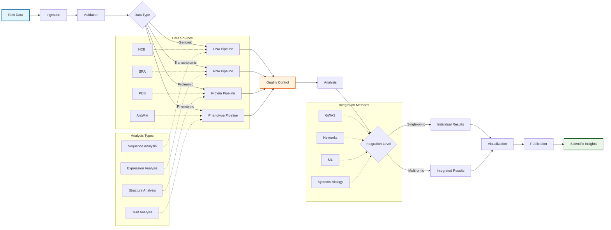

# METAINFORMANT Documentation

```{include} ../README.md
:start-after: "## Overview"
:end-before: "## Installation"
```

## Documentation Navigation

```mermaid
graph TD
    A[METAINFORMANT Documentation] --> B[Getting Started]
    A --> C[User Guides]
    A --> D[Module Documentation]
    A --> E[Developer Resources]
    A --> F[Reference]

    B --> B1[Installation]
    B --> B2[Quick Start]
    B --> B3[Tutorials]

    C --> C1[Workflow Guides]
    C --> C2[Best Practices]
    C --> C3[Troubleshooting]

    D --> D1[Core Modules]
    D --> D2[Molecular Analysis]
    D --> D3[Statistical Methods]
    D --> D4[Systems Biology]
    D --> D5[Annotation & Metadata]
    D --> D6[Utilities]

    E --> E1[Architecture]
    E --> E2[Contributing]
    E --> E3[Testing]
    E --> E4[API Reference]

    F --> F1[CLI Reference]
    F --> F2[Configuration]
    F --> F3[Error Codes]

    style A fill:#e1f5fe,stroke:#01579b,stroke-width:2px
    style D fill:#fff3e0,stroke:#e65100,stroke-width:2px
    style F fill:#e8f5e8,stroke:#1b5e20,stroke-width:2px

    subgraph "Primary Entry Points"
        G1[README.md] -.-> B
        G2[QUICKSTART.md] -.-> B
        G3[TUTORIALS.md] -.-> C
    end

    subgraph "Module Categories"
        H1[core/] -.-> D1
        H2[dna/, rna/, protein/, epigenome/] -.-> D2
        H3[gwas/, math/, ml/, information/] -.-> D3
        H4[networks/, multiomics/, singlecell/, simulation/] -.-> D4
        H5[ontology/, phenotype/, ecology/, life_events/] -.-> D5
        H6[quality/, visualization/] -.-> D6
    end

    subgraph "Key Documents"
        I1[architecture.md] -.-> E1
        I2[testing.md] -.-> E3
        I3[cli.md] -.-> F1
        I4[UV_SETUP.md] -.-> B1
    end
```



## Module Overview Matrix

| Category | Module | Description | Key Features |
|----------|--------|-------------|--------------|
| **Core** | [core](core/) | Shared utilities and infrastructure | Configuration, I/O, logging, parallel processing, caching |
| **DNA** | [dna](dna/) | Genomic sequence analysis | Sequences, alignment, phylogeny, population genetics |
| **RNA** | [rna](rna/) | Transcriptomic analysis | RNA-seq workflows, amalgkit integration |
| **Protein** | [protein](protein/) | Protein structure and function | Sequences, AlphaFold integration, proteomics |
| **Epigenome** | [epigenome](epigenome/) | Epigenetic modifications | Methylation, ChIP-seq, chromatin accessibility |
| **GWAS** | [gwas](gwas/) | Genome-wide association studies | Association testing, quality control, visualization |
| **Math** | [math](math/) | Mathematical biology | Population genetics theory, coalescent models |
| **ML** | [ml](ml/) | Machine learning pipelines | Classification, regression, feature selection |
| **Information** | [information](information/) | Information theory | Entropy, mutual information, semantic similarity |
| **Networks** | [networks](networks/) | Biological networks | PPI, pathways, community detection |
| **Multi-omics** | [multiomics](multiomics/) | Multi-omic integration | Joint analysis, data harmonization |
| **Single-cell** | [singlecell](singlecell/) | Single-cell genomics | Preprocessing, clustering, trajectory analysis |
| **Simulation** | [simulation](simulation/) | Synthetic data generation | Sequence simulation, agent-based models |
| **Ontology** | [ontology](ontology/) | Functional annotation | Gene Ontology, semantic similarity |
| **Phenotype** | [phenotype](phenotype/) | Phenotypic data | Trait analysis, AntWiki integration |
| **Ecology** | [ecology](ecology/) | Ecological analysis | Community diversity, environmental data |
| **Life Events** | [life_events](life_events/) | Temporal event analysis | Life course modeling, embeddings |
| **Quality** | [quality](quality/) | Data quality assessment | FASTQ analysis, assembly validation |
| **Visualization** | [visualization](visualization/) | Plotting and graphics | 20+ specialized plotting modules |

## Data Flow Architecture



## Quick Start

### Installation

METAINFORMANT can be installed via pip, uv, or from source:

```bash
# Via pip
pip install metainformant

# Via uv (recommended)
uv add metainformant

# From source
git clone https://github.com/your-org/metainformant.git
cd metainformant
uv pip install -e .
```

### Basic Usage

```python
import metainformant as mi

# DNA sequence analysis
seq = "ATCGATCGATCG"
gc_content = mi.dna.composition.gc_content(seq)
print(f"GC content: {gc_content:.2f}")

# RNA-seq workflow
import metainformant.rna.workflow as rna_workflow
config = rna_workflow.AmalgkitWorkflowConfig(
    work_dir="output/rna_analysis",
    species_list=["Apis_mellifera"]
)
results = rna_workflow.execute_amalgkit_workflow(config)
```

### Command Line Interface

METAINFORMANT provides a comprehensive CLI:

```bash
# Show help
metainformant --help

# DNA analysis
metainformant dna gc-content --sequence ATCGATCG

# RNA workflow
metainformant rna run --config config/rna_config.yaml

# GWAS analysis
metainformant gwas run --config config/gwas_config.yaml
```

## Documentation Contents

### User Guides

```{toctree}
:maxdepth: 2
:caption: User Guides

getting_started
installation
workflows
configuration
troubleshooting
```

### API Reference

```{toctree}
:maxdepth: 3
:caption: API Reference

api/core
api/dna
api/rna
api/protein
api/gwas
api/epigenome
api/ontology
api/phenotype
api/ecology
api/math
api/ml
api/networks
api/singlecell
api/quality
api/visualization
api/simulation
api/life_events
```

### Module Documentation

```{toctree}
:maxdepth: 2
:caption: Modules

core/index
dna/index
rna/index
protein/index
gwas/index
epigenome/index
ontology/index
phenotype/index
ecology/index
math/index
ml/index
networks/index
singlecell/index
quality/index
visualization/index
simulation/index
life_events/index
```

### Development

```{toctree}
:maxdepth: 2
:caption: Development

contributing
testing
ci_cd
building
api_design
```

## Key Features

### 🔬 **Comprehensive Domain Coverage**
- **DNA Analysis**: Sequence composition, alignments, phylogenetics, population genetics
- **RNA Analysis**: Transcriptome quantification, differential expression, cross-species analysis
- **Protein Analysis**: Structure prediction, domain analysis, functional annotation
- **GWAS**: Genome-wide association studies with population structure correction
- **Epigenomics**: DNA methylation analysis, chromatin accessibility
- **Systems Biology**: Network analysis, pathway enrichment, multi-omics integration

### 🚀 **Production Ready**
- **Real Implementations**: No mocks or fakes - actual external API calls and tool integration
- **Scalable**: Parallel processing, memory-efficient algorithms for large datasets
- **Robust**: Comprehensive error handling and validation
- **Tested**: Extensive test suite with real-world validation

### 🛠 **Developer Friendly**
- **Type Hints**: Full type annotation throughout codebase
- **Documentation**: Comprehensive docstrings and API documentation
- **CLI**: Intuitive command-line interface with subcommands
- **Modular**: Clean separation of concerns, easy to extend

### 📊 **Research Grade**
- **Scientific Rigor**: Algorithms validated against established methods
- **Reproducible**: Version-controlled configurations and deterministic workflows
- **Standards Compliant**: Follows bioinformatics best practices and data formats

## Architecture

```{mermaid}
graph TB
    subgraph "User Interfaces"
        CLI[Command Line Interface<br/>metainformant]
        API[Python API<br/>import metainformant]
        Scripts[Workflow Scripts<br/>scripts/*/]
    end

    subgraph "Core Framework"
        Workflow[Workflow Orchestration<br/>core.workflow]
        Config[Configuration Management<br/>core.config]
        IO[I/O Utilities<br/>core.io]
        Logging[Structured Logging<br/>core.logging]
    end

    subgraph "Domain Modules"
        DNA[DNA Analysis<br/>dna.*]
        RNA[RNA Analysis<br/>rna.*]
        PROT[Protein Analysis<br/>protein.*]
        GWAS[GWAS<br/>gwas.*]
        EPI[Epigenomics<br/>epigenome.*]
        ONT[Ontology<br/>ontology.*]
        PHENO[Phenotype<br/>phenotype.*]
        ECOL[Ecology<br/>ecology.*]
        MATH[Math Biology<br/>math.*]
        ML[ML/AI<br/>ml.*]
        NET[Networks<br/>networks.*]
        SC[Single Cell<br/>singlecell.*]
        QUAL[Quality Control<br/>quality.*]
        VIZ[Visualization<br/>visualization.*]
        SIM[Simulation<br/>simulation.*]
        LE[Life Events<br/>life_events.*]
    end

    CLI --> Workflow
    API --> Workflow
    Scripts --> Workflow

    Workflow --> Config
    Workflow --> IO
    Workflow --> Logging

    DNA --> Core
    RNA --> Core
    PROT --> Core
    GWAS --> Core
    EPI --> Core
    ONT --> Core
    PHENO --> Core
    ECOL --> Core
    MATH --> Core
    ML --> Core
    NET --> Core
    SC --> Core
    QUAL --> Core
    VIZ --> Core
    SIM --> Core
    LE --> Core
```

## Getting Help

### Community Support
- **GitHub Issues**: Report bugs and request features
- **Discussions**: Ask questions and share ideas
- **Documentation**: Comprehensive guides and API reference

### Development
- **Contributing Guide**: How to contribute to METAINFORMANT
- **Development Setup**: Setting up development environment
- **Testing Guide**: Running and writing tests
- **API Design**: Understanding the codebase architecture

---

**METAINFORMANT** is a comprehensive bioinformatics toolkit designed for modern multi-omics research. Whether you're analyzing genomes, transcriptomes, proteomes, or integrating multi-omics datasets, METAINFORMANT provides the tools and workflows you need.