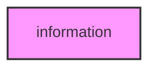

# INFORMATION

## Overview
Information theory analysis module for METAINFORMANT.

## 📦 Contents
- **[integration/](integration/)** — Cross-module information integration
- **[metrics/](metrics/)** — Information metrics (`core/`, `advanced/`, `analysis/` subpackages)
- **[network_info/](network_info/)** — Network information analysis
- **[workflow/](workflow/)** — Information theory workflows

## 📊 Structure



## Usage
Import module:
```python
from metainformant.information import ...
```
