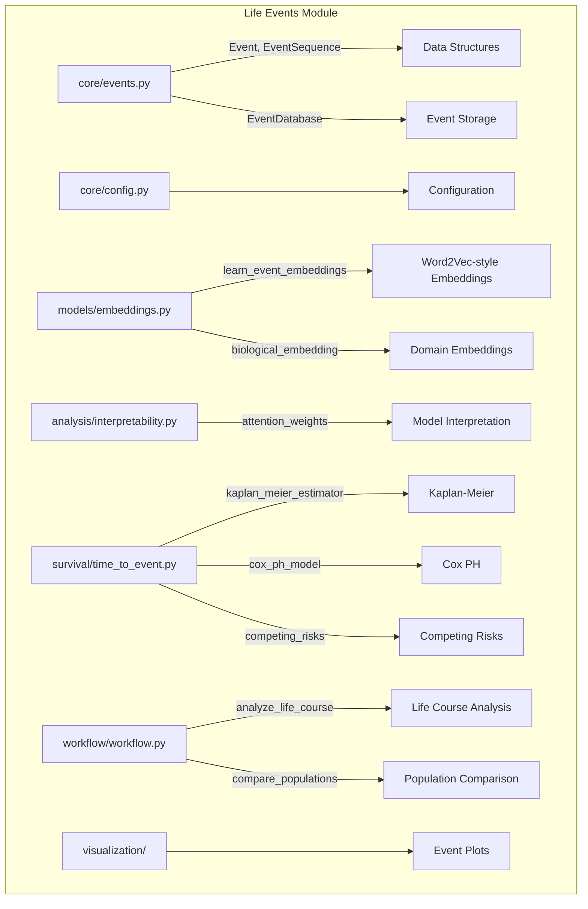

# LIFE_EVENTS

## Overview
Life events and trajectory analysis module for METAINFORMANT.

## 📦 Contents
- **[analysis/](analysis/)**
- **[core/](core/)**
- **[models/](models/)**
- **[visualization/](visualization/)**
- **[workflow/](workflow/)**
- `[__init__.py](__init__.py)`

## 📊 Structure



## Usage
Import module:
```python
from metainformant.life_events import ...
```
