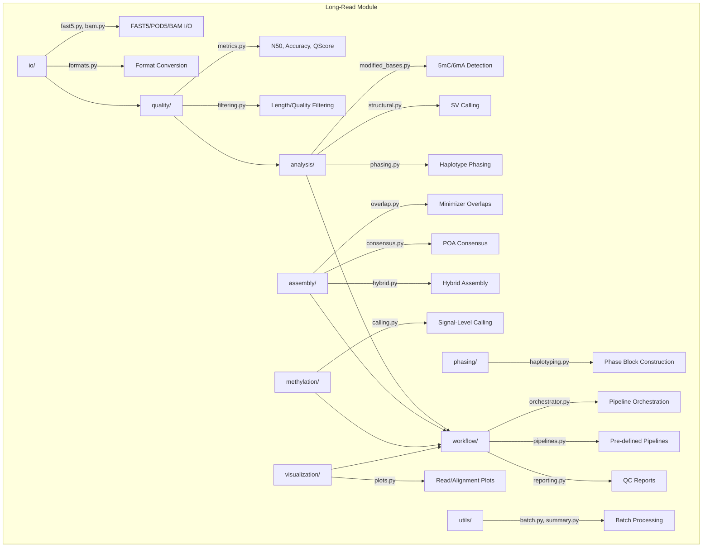

# Long-Read Sequencing

## Overview

PacBio and Oxford Nanopore long-read sequencing analysis module for METAINFORMANT. Covers signal I/O, quality assessment, assembly, methylation calling, haplotype phasing, and structural variant detection.

## Contents

- **io/** - FAST5, POD5, BAM reading/writing and format conversion
- **quality/** - Read metrics (N50, Nx, accuracy), filtering by length/quality
- **analysis/** - Modified base detection, structural variants, phasing
- **assembly/** - Minimizer overlaps, POA consensus, hybrid assembly
- **methylation/** - Signal-level methylation calling and DMR detection
- **phasing/** - Read-based haplotyping and switch error computation
- **workflow/** - Pipeline orchestration with dependency resolution
- **visualization/** - Read length, quality, alignment, and methylation plots
- **utils/** - Batch processing and run summary generation

## Architecture



## Usage

```python
from metainformant.longread.workflow.orchestrator import LongReadOrchestrator
from metainformant.longread.io import fast5, bam
from metainformant.longread.quality import metrics, filtering
from metainformant.longread.analysis import modified_bases, structural
from metainformant.longread.assembly import overlap, consensus, hybrid
```
