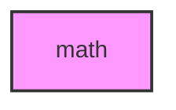

# MATH

## Overview
Functionality for math.

## 📦 Contents


## 📊 Structure


```mermaid
graph TD
    math[math]
    style math fill:#f9f,stroke:#333,stroke-width:2px
```

## Usage
Import module:
```python
from metainformant.math import ...
```
