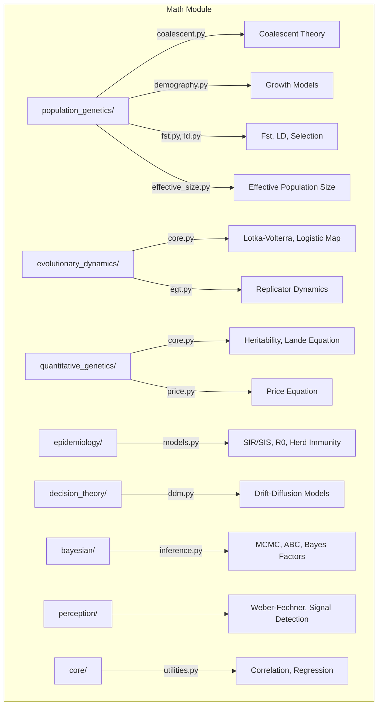

# MATH

## Overview
Mathematical biology and theoretical modeling module for METAINFORMANT.

## Contents
- **[core/](index.md)**
- **[decision_theory/](ddm.md)**
- **[epidemiology/](epidemiology.md)**
- **[evolutionary_dynamics/](dynamics.md)**
- **perception/**
- **[population_genetics/](popgen.md)**
- **[quantitative_genetics/](popgen_stats.md)**
- **bayesian/** — Bayesian inference methods

## Structure



## Usage
Import module:
```python-snippet
from metainformant.math import ...
```
