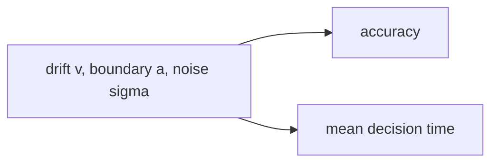

### Math: Drift–Diffusion Model (DDM)

Functions: `ddm_analytic_accuracy`, `ddm_mean_decision_time`.



Example

```python
from metainformant.math import ddm

acc = ddm.ddm_analytic_accuracy(0.2, 1.0)
edt = ddm.ddm_mean_decision_time(0.2, 1.0)
```
