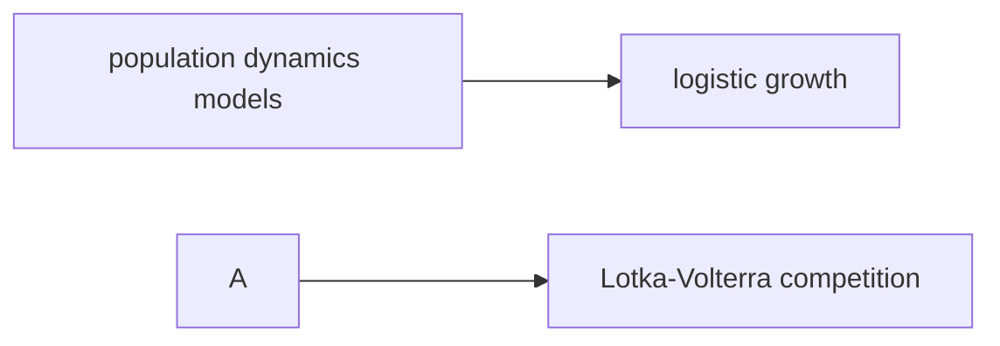

### Math: Population Dynamics

Functions: `logistic_growth`, `lotka_volterra_competition`.



Mathematical models of population dynamics and ecological interactions.

#### Logistic Growth Model

The logistic growth model describes population growth with carrying capacity:

```
dN/dt = rN(1 - N/K)
```

Where:
- N: population size
- r: intrinsic growth rate
- K: carrying capacity

#### Lotka-Volterra Competition Model

Models competition between two species for shared resources:

```
dN1/dt = r1N1(1 - N1/α - βN2)
dN2/dt = r2N2(1 - N2/γ - δN1)
```

Where α, β, γ, δ are competition coefficients.

Example

```python
from metainformant.math import dynamics

# Logistic growth simulation
growth = dynamics.logistic_growth(
    initial_population=100,
    carrying_capacity=1000,
    growth_rate=0.1,
    time_steps=100
)

# Lotka-Volterra competition
competition = dynamics.lotka_volterra_competition(
    species1_initial=100,
    species2_initial=80,
    alpha=1.2,  # Competition coefficient
    beta=0.8,
    time_steps=200
)
```
