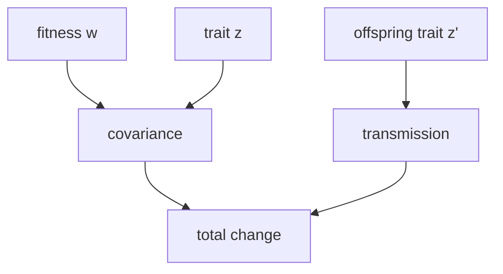

### Math: Price Equation

Functions: `expectation`, `covariance`, `price_equation`.



Example

```python
from metainformant.math import price

cov, trans, total = price.price_equation([1.0, 1.2, 0.9], [0.2, 0.4, 0.1], [0.25, 0.35, 0.15])
```


