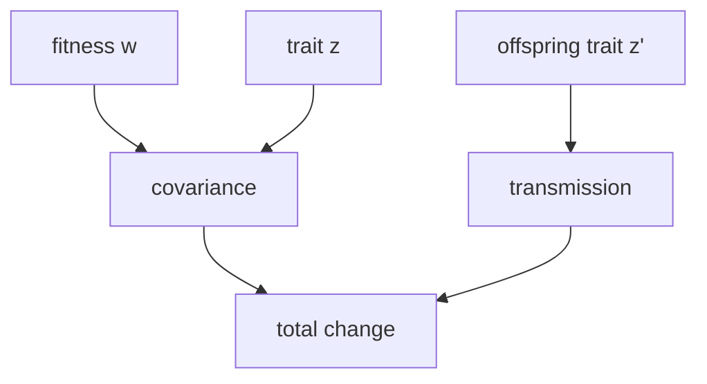

### Math: Price Equation

Functions: `expectation`, `variance`, `standard_deviation`, `weighted_variance`, `covariance`, `weighted_covariance`, `correlation`, `weighted_correlation`, `relative_fitness`, `selection_differential`, `selection_intensity`, `selection_gradient`, `price_equation`, `delta_mean_trait`.



Examples

```python
from metainformant.math import price

# Moments
mu_z = price.expectation([0.2, 0.4, 0.1])
var_z = price.variance([0.2, 0.4, 0.1])
sd_z = price.standard_deviation([0.2, 0.4, 0.1])
var_wz = price.weighted_variance([0.2, 0.4, 0.1], [1.0, 2.0, 1.0])
cov_wz = price.covariance([1.0, 1.2, 0.9], [0.2, 0.4, 0.1])
cov_w = price.weighted_covariance([1.0, 1.2, 0.9], [0.2, 0.4, 0.1], [1.0, 2.0, 1.0])
rho_wz = price.correlation([1.0, 1.2, 0.9], [0.2, 0.4, 0.1])
rho_w = price.weighted_correlation([1.0, 1.2, 0.9], [0.2, 0.4, 0.1], [1.0, 2.0, 1.0])

# Selection metrics
wr = price.relative_fitness([1.0, 1.2, 0.9])
S = price.selection_differential([1.0, 1.2, 0.9], [0.2, 0.4, 0.1])
i = price.selection_intensity([1.0, 1.2, 0.9], [0.2, 0.4, 0.1])
beta = price.selection_gradient([1.0, 1.2, 0.9], [0.2, 0.4, 0.1])

# Price equation decomposition
cov, trans, total = price.price_equation(
    [1.0, 1.2, 0.9],
    [0.2, 0.4, 0.1],
    [0.25, 0.35, 0.15],
)

# Total change in mean trait
dz = price.delta_mean_trait(
    [1.0, 1.2, 0.9],
    [0.2, 0.4, 0.1],
    [0.25, 0.35, 0.15],
)
```
