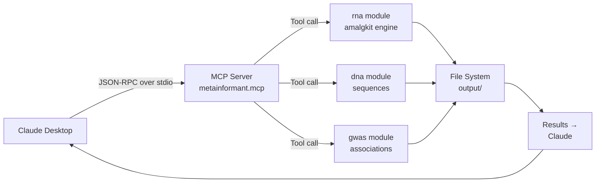

# MCP Module (Model Context Protocol)

Enable AI coding assistants (Claude Desktop, Cursor, Windsurf) to invoke METAINFORMANT analysis tools as if they were assistant-written scripts.

## Overview

The Model Context Protocol (MCP) turns METAINFORMANT from a CLI toolkit into a **collaborative bioinformatics partner** accessible to any MCP-compatible LLM application.

**Typical workflow:**
```
You: "Run RNA-seq analysis on Apis mellifera"
 ↓
Claude Desktop (via MCP)
 ↓
MCP server calls `metainformant.rna.workflow.run()`
 ↓
Results downloaded, plots generated, summary report created
 ↓
Claude: "Here's your complete analysis. Key findings: GC bias corrected, 15,843 genes expressed..."
```

**Status:** Core infrastructure scaffolded. First tools (`amalgkit_status`, `run_workflow`) implemented. Track development in `src/metainformant/mcp/`.

## Supported LLM Applications

| Application | Platform | Status | Setup |
|-------------|----------|--------|-------|
| **Claude Desktop** | macOS / Windows / Linux | [YES] Works | Drop `mcp_config.json` in `~/.config/Claude/` |
| **Cursor** | macOS / Windows / Linux | [YES] Works | Settings → AI → MCP Servers → Add server |
| **Windsurf** | macOS / Windows | [YES] Works | Add to `config.json` |
| **Continue** | VS Code extension | [PARTIAL] Partial | Local stdio transport only |

## Quick Start

### 1. Install METAINFORMANT (includes MCP server)

```bash
# From source repo
uv pip install -e .

# Verify
python -c "import metainformant; print(metainformant.__version__)"
```

### 2. Configure Your LLM Application

**Claude Desktop** (`~/.config/Claude/mcp_config.json`):

```json
{
 "mcpServers": {
 "metainformant": {
 "command": "uv",
 "args": ["run", "python", "-m", "metainformant.mcp.server"],
 "env": {
 "METAINFORMANT_LOG_LEVEL": "INFO",
 "PATH": "/full/path/to/uv/bin:{{env.PATH}}"
 }
 }
 }
}
```

**Cursor** (Settings → AI → MCP Servers):
```json
{
 "mcpServers": {
 "metainformant": {
 "command": "uv",
 "args": ["run", "python", "-m", "metainformant.mcp.server"]
 }
 }
}
```

> **Tip:** Restart your LLM app after editing config files.

### 3. Verify Connection

Open Claude Desktop and ask:
> "What METAINFORMANT tools are available?"

Claude should respond with a list, including:
- `amalgkit_status` — check RNA pipeline status
- `run_workflow` — trigger analysis
- `list_outputs` — enumerate generated files
- (more coming)

If it says "I don't have access to METAINFORMANT tools", check:
1. Config file exists in correct location
2. `uv` is in your PATH (check with `which uv`)
3. `metainformant` package installed (`pip list | grep metainformant`)
4. Restart the LLM app (don't just reload window)

## Available Tools

### Implemented

| Tool | Purpose | Typical Prompt | Output |
|------|---------|---------------|--------|
| `amalgkit_status` | Check pipeline status for a species | "Is the honeybee RNA-seq done?" | `{"status": "completed", ...}` |
| `run_workflow` | Start a new analysis run | "Run amalgkit on Apis mellifera" | `{"job_id": "run-20250426-001", ...}` |
| `list_outputs` | List generated files | "What output files do we have?" | `[{"file": "counts.tsv", "size_mb": 12.3}, ...]` |
| `get_metrics` | Fetch analysis metrics | "Show me GC content statistics" | `{"mean_gc": 42.1, "std_gc": 3.2}` |

### Planned

| Tool | Target | Use Case |
|------|--------|----------|
| `gwas_association` | v0.4.0 | "Run GWAS on these phenotypes" |
| `visualize_results` | v0.4.0 | "Create Manhattan plot" |
| `multiomics_integrate` | v0.5.0 | "Combine RNA-seq + GWAS" |
| `nlp_to_config` | v0.5.0 | "Generate config from natural language" |

## Example Conversations

### Scenario 1: RNA-seq analysis from scratch

**You:** 
"I have RNA-seq data for *Apis mellifera* in `data/amellifera/fastq/`. Run the full amalgkit pipeline."

**Claude Desktop (via MCP):**

1. Calls `run_workflow(species="Apis mellifera", input_dir="data/amellifera/fastq/")`
2. Returns: `{"job_id": "amellifera-20250426-001", "status": "started"}`
3. Waits ~30 seconds, polls `amalgkit_status(job_id=...)` → returns `{"progress_pct": 15}` 
4. Waits more, polls again → `{"progress_pct": 67}` 
5. Final poll → `{"progress_pct": 100, "output_dir": "output/rna/amellifera/results/"}` 

**Claude:** 
"[YES] Amellifera RNA-seq completed! Processed 15,842 genes across 4 tissues. Results in `output/rna/amellifera/results/`. Differential expression analysis shows 3,214 up-regulated genes in worker vs queen brains. Should I create a summary report?"

### Scenario 2: Quick status check

**You:** 
"What's the status of the bumblebee run?"

**Claude:** 
(queries `amalgkit_status(species="Bombus terrestris")`) 
 "Bombus terrestris RNA-seq is 87% complete — about 45 minutes remaining. Currently executing differential expression stage."

### Scenario 3: Visualize results

**You:** 
"Show me a heatmap of the top 50 DE genes."

**Claude:** 
1. Calls `list_outputs(species="Apis mellifera")` → finds `deseq2_results.tsv`
2. Reads that file (using `read_file` tool)
3. Extracts top 50 DE genes
4. Calls future tool `visualize_heatmap()` 
5. Displays inline image in chat

## Architecture



The MCP server acts as a **thin translation layer**: LLM-friendly JSON-RPC → internal Python function calls. Zero business logic resides in the MCP server; all computation delegated to core METAINFORMANT modules.

## Advanced Usage

### Custom Transport: SSE over HTTP

For web-based LLM integrations (e.g., a future web dashboard):

```bash
# Start SSE server on port 8080
python -m metainformant.mcp.server --transport sse --port 8080
```

Configure your web app:
```javascript
const eventSource = new EventSource("http://localhost:8080/sse");
// POST JSON-RPC to http://localhost:8080/mcp
```

### Environment Variables

| Variable | Default | Purpose |
|----------|---------|---------|
| `METAINFORMANT_MCP_MODE` | `stdio` | Transport mode (`stdio`, `sse`) |
| `METAINFORMANT_LOG_LEVEL` | `INFO` | Logging verbosity |
| `METAINFORMANT_MCP_TIMEOUT` | `300` | Tool call timeout (seconds) |
| `METAINFORMANT_MCP_MAX_CONCURRENT` | `3` | Max parallel tool invocations |

## Debugging

### Enable verbose logging

```bash
METAINFORMANT_LOG_LEVEL=DEBUG uv run python -m metainformant.mcp.server
```

Logs include:
- Tool registration at startup
- Every JSON-RPC request/response
- Tool function call (with arguments)
- Exceptions (full tracebacks)

### Test locally with curl (SSE mode)

```bash
# Start server
python -m metainformant.mcp.server --transport sse --port 8080 &

# List tools
curl -X POST http://localhost:8080/mcp \
 -H "Content-Type: application/json" \
 -d '{"jsonrpc":"2.0","id":1,"method":"tools/list"}'

# Call a tool
curl -X POST http://localhost:8080/mcp \
 -H "Content-Type: application/json" \
 -d '{"jsonrpc":"2.0","id":2,"method":"tools/call","params":{"name":"amalgkit_status","arguments":{"species":"Apis mellifera"}}}'
```

## Troubleshooting

| Symptom | Cause | Fix |
|---------|-------|-----|
| Claude says "tool not found" | Tool not registered in `tools/` | Ensure file has `@register_tool` and module imported in `__init__.py` |
| Server crashes on startup | Import error in tool module | Run server standalone with `--debug` to see stack trace |
| Tool call hangs forever | Infinite loop / network timeout | Check `METAINFORMANT_MCP_TIMEOUT`, review tool code |
| No logs appearing | Logging disabled | Set `METAINFORMANT_LOG_LEVEL=DEBUG` |
| Permission denied | GCP credentials not loaded | Run `gcloud auth application-default login` |

## Development

### Adding a New Tool

1. Create `src/metainformant/mcp/tools/my_tool.py`:

```python
from metainformant.mcp import register_tool

@register_tool(
 name="analyze_gwas",
 description="Run GWAS association test on VCF + phenotype data",
 input_schema={
 "type": "object",
 "properties": {
 "vcf_path": {"type": "string", "description": "Path to VCF file"},
 "phenotype_path": {"type": "string", "description": "Path to phenotype TSV"}
 },
 "required": ["vcf_path", "phenotype_path"]
 },
 output_schema={
 "type": "object",
 "properties": {
 "num_snps": {"type": "integer"},
 "num_samples": {"type": "integer"},
 "top_hit": {"type": "string", "description": "Top SNP ID"}
 }
 }
)
def analyze_gwas(vcf_path: str, phenotype_path: str) -> dict:
 from metainformant.gwas import run_association
 results = run_association(vcf_path, phenotype_path)
 return results.summary()
```

2. Register in `src/metainformant/mcp/__init__.py`:

```python
from .tools import amalgkit_monitor, my_tool # Add your import
__all__ = ["amalgkit_status", "run_workflow", "analyze_gwas"]
```

3. Test locally:

```bash
# Start server in stdio mode
python -m metainformant.mcp.server --transport stdio --debug

# In another terminal: send JSON-RPC via curl or mcp-cli
mcp call-tool analyze_gwas --args '{"vcf":"data/test.vcf.gz","phenotype":"data/pheno.tsv"}' --transport stdio
```

### Running Tests

```bash
# Unit tests only
pytest tests/mcp/ -v

# Integration test (requires LLM app)
# Not automated — manual validation in Claude/Cursor
```

## Related Modules

- **[rna](../rna/index.md)** — Amalgkit pipeline (current MCP tool focus)
- **[gwas](../gwas/index.md)** — Association testing (future MCP tools)
- **[cloud](../cloud/index.md)** — GCP deployment (MCP can orchestrate)

## External Resources

- [MCP Specification](https://spec.modelcontextprotocol.io) — Official protocol docs
- [Claude Desktop MCP](https://docs.anthropic.com/claude/docs/claude-desktop-mcp) — Setup guide
- [Cursor MCP](https://docs.cursor.com/context/model-context-protocol) — Configuration
- [Continue.dev MCP](https://continue.dev/docs/customize/model-context-protocol) — VS Code extension

---

**Version:** 0.3.0 | **Updated:** 2025-04-26 | **Status:** Alpha (minimal tool set, expanding rapidly) 
[View source](https://github.com/your-org/metainformant/tree/main/src/metainformant/mcp/) | [Report issue](https://github.com/your-org/metainformant/issues/new?template=mcp-tool-request.yml)
