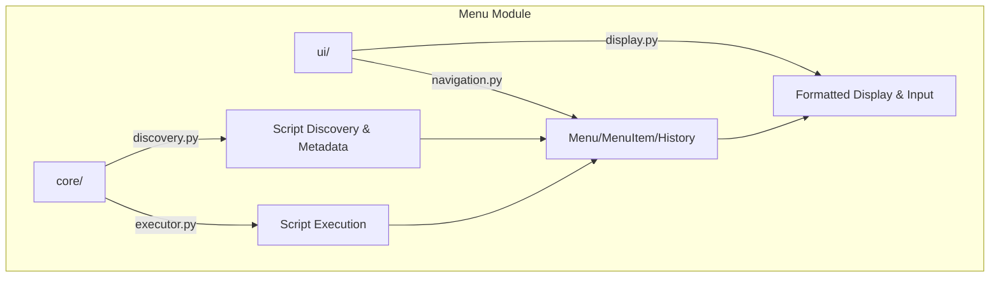

# Menu System

## Overview

Interactive command-line menu and discovery system module for METAINFORMANT. Provides script discovery, navigation, execution, and formatted display.

## Contents

- **core/** - Script discovery (`ScriptInfo`, `extract_script_metadata`) and execution (`validate_script_executable`)
- **ui/** - Menu navigation (`Menu`, `MenuItem`, `MenuHistory`) and display formatting (`format_menu`, `show_menu`)

## Architecture



## Usage

```python
from metainformant.menu.core.discovery import extract_script_metadata, categorize_script
from metainformant.menu.ui.navigation import Menu, MenuItem, MenuHistory
from metainformant.menu.ui.display import format_menu, show_menu
```
