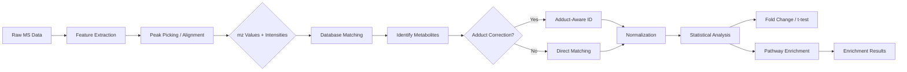
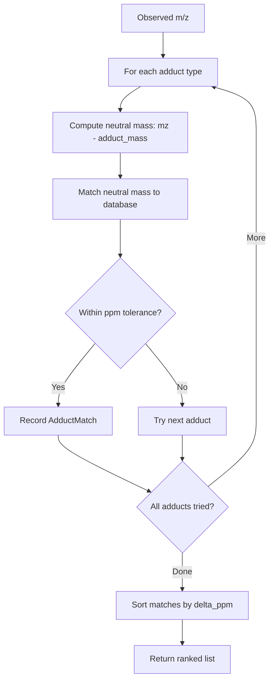

# Metabolomics Module Architecture

Comprehensive overview of the METAINFORMANT metabolomics module architecture, including component responsibilities, data flow, and integration points.

## Table of Contents

1. [Module Structure](#module-structure)
2. [Component Responsibilities](#component-responsibilities)
3. [Data Flow](#data-flow)
4. [Integration Points](#integration-points)
5. [Design Patterns](#design-patterns)

## Module Structure

### Directory Layout

```
src/metainformant/metabolomics/
├── __init__.py              # Public API exports
├── README.md                # Module overview
├── SPEC.md                  # Technical specification
├── AGENTS.md                # Agent directives
├── PAI.md                   # PAI guidelines
│
├── analysis/               # Analysis functions
│   ├── __init__.py
│   ├── identification.py   # Metabolite ID, adduct handling, normalization
│   └── visualization/      # Plotting utilities (stub)
│
├── io/                     # Input/Output
│   ├── __init__.py
│   └── formats.py          # CSV, MGF readers/writers, MassSpectrum
│
├── pathways/               # Pathway analysis
│   ├── __init__.py
│   └── enrichment.py       # ORA, GSEA-like enrichment, FDR correction
│
└── visualization/          # Module-specific plots
    ├── __init__.py
    └── plots.py
```

### Component Responsibilities

#### `analysis/identification.py`

Core metabolomics analysis functionality:

- **`identify_metabolites()`** - Match observed m/z values to reference database using mass tolerance (ppm)
- **`identify_with_adducts()`** - Adduct-aware identification for ESI ionization modes
- **`normalize_intensities()`** - Sample normalization (TIC, median, log2, pareto scaling)
- **`fold_change()`** - Log2 fold change between groups
- **`differential_abundance()`** - Two-sample t-tests with Welch's approximation
- **`cosine_spectral_similarity()`** - Spectral library matching
- **`missing_value_imputation()`** - Handle missing data (min/half, KNN, median)

**Key Data Classes**:
- `MetaboliteMatch` - Identification result (m/z, name, delta_ppm, score)
- `AdductMatch` - Adduct-aware match including neutral mass and adduct type
- `AdductMatch` - Extended result with adduct annotation

#### `io/formats.py`

Mass spectrometry file I/O:

- **`read_csv()` / `write_csv()`** - Metabolomics intensity matrix I/O
- **`read_mgf()` / `write_mgf()`** - Mascot Generic Format for MS2 spectra
- **`filter_spectra()`** - Quality filtering (min peaks, TIC, MS level, RT range)
- **`extract_chromatogram()`** - EIC extraction for targeted m/z values

**Key Data Classes**:
- `MetabolomicsDataset` - Container for metabolite × sample matrices
- `MassSpectrum` - Single MS spectrum with m/z, intensity, precursor, RT

#### `pathways/enrichment.py`

Pathway-level analysis:

- **`metabolite_set_enrichment()`** - Over-representation analysis (Fisher's exact test)
- **`enrichment_with_fdr()`** - Enrichment with Benjamini-Hochberg multiple testing correction
- **`pathway_activity_scoring()`** - Aggregate metabolite scores to pathway level

**Key Data Classes**:
- `EnrichmentResult` - Pathway enrichment statistics (p-value, fold, overlap)
- `PathwayActivityScore` - Aggregated pathway activity from metabolite-level statistics

## Data Flow

### Metabolite Identification Pipeline



**Processing Steps**:

1. **Acquisition**: Raw mass spectra loaded via `read_mgf()` or `read_csv()`
2. **Feature Detection**: Peak picking (external tools like MZmine, XCMS) produces m/z-intensity table
3. **Identification**: `identify_metabolites()` matches m/z to database; `identify_with_adducts()` handles ion adducts
4. **Normalization**: `normalize_intensities()` corrects for sample loading variation
5. **Differential Analysis**: `differential_abundance()` identifies significant changes between conditions
6. **Pathway Analysis**: `metabolite_set_enrichment()` tests pathway-level enrichment

### Adduct Identification Flow



**Common ESI Adducts** (built-in `COMMON_ADDUCTS`):

| Adduct | Mass Delta (Da) | Mode |
|--------|----------------|------|
| [M+H]+ | +1.007276 | Positive |
| [M+Na]+ | +22.989218 | Positive |
| [M+K]+ | +38.963158 | Positive |
| [M+NH4]+ | +18.034164 | Positive |
| [M-H]- | -1.007276 | Negative |
| [M+Cl]- | +34.969402 | Negative |
| [M+FA-H]- | +44.998201 | Negative |

## Integration Points

### With Other METAINFORMANT Modules

| Target Module | Integration Type | Use Case |
|---------------|-----------------|----------|
| `multiomics` | metabolite-gene integration | Correlate metabolites with transcriptomic features |
| `visualization` | plotting functions | Volcano plots, PCA, heatmaps (shared plotting utilities) |
| `core.io` | file operations | Unified JSON/CSV reading/writing |
| `core.config` | configuration | Environment variable handling |

**Integration Pattern**:

```python
from metainformant.metabolomics import analysis, pathways
from metainformant.multiomics import integration  # metabolite-gene correlation
from metainformant.visualization import plots

# Load metabolomics data
dataset = analysis.io.formats.read_csv("metabolites.csv")

# Normalize
normalized = analysis.identification.normalize_intensities(
    dataset.intensities, method="total_ion_count"
)

# Differential analysis (case vs control)
t_stats, pvals = analysis.identification.differential_abundance(
    normalized, group_a=[0, 1, 2], group_b=[3, 4, 5]
)

# Pathway enrichment
enriched = pathways.enrichment.metabolite_set_enrichment(
    query_metabolites=significant_metabolites,
    pathway_db=KEGG_PATHWAYS,
)

# Multi-omics integration (correlate with gene expression)
from metainformant.multiomics import correlate_omics_layers
correlations = correlate_omics_layers(
    metabolite_matrix=normalized,
    gene_expression=rna.merged_matrix,
    method="pearson",
)
```

### External Data Sources

- **Metabolite Databases**: HMDB, KEGG, Reactome, METLIN (user-provided mapping files)
- **Pathway Definitions**: KEGG pathways, Reactome reactions (loaded from JSON/YAML)
- **Spectral Libraries**: NIST, MassBank, GNPS (MGF format via `read_mgf()`)

## Design Patterns

### Normalization Strategy Pattern

The `normalize_intensities()` function supports multiple methods through a simple string dispatch:

```python
NORMALIZATION_METHODS = {
    "total_ion_count": _normalize_tic,
    "median": _normalize_median,
    "log2": _normalize_log2,
    "pareto": _normalize_pareto,
}
```

This pattern allows easy extension: add a new method by implementing `_normalize_<name>()` and adding it to the dispatch dict.

### Match Result Dataclasses

Results are plain dataclasses for clarity and type safety:

```python
@dataclass
class MetaboliteMatch:
    query_mz: float
    matched_name: str
    matched_mz: float
    delta_ppm: float
    score: float
```

Benefits:
- Self-documenting field names
- Type checking support
- Easy to serialize to JSON/dicts
- No hidden state or side effects

### Tolerance-Based Matching

Identification uses **parts-per-million (ppm)** tolerance universally, which scales with m/z:

```python
ppm_error = abs(db_mz - observed_mz) / observed_mz * 1e6
matches = [db_entry for db_entry in database if ppm_error <= tolerance]
```

This is standard in mass spectrometry; a 10 ppm threshold is typical for low-resolution MS, 5 ppm for high-resolution (Orbitrap, TOF).

### Missing Value Imputation Strategy

Three imputation strategies are provided, selected by string:

| Method | Strategy | Use Case |
|--------|----------|----------|
| `min_half` | Replace with half minimum non-zero per metabolite | Simple, conservative |
| `knn` | k-nearest neighbors (k=5) using row correlation | Preserves relationships |
| `median` | Replace with row median | Robust to outliers |

Implementation uses row-wise (metabolite-wise) imputation since each metabolite is a feature.

## Performance Considerations

- **Database matching**: O(n × m) for n observed m/z, m database entries. For large databases (>10k metabolites), consider k-d tree or binning by integer m/z for speed.
- **Adduct handling**: Multiplicative factor — if database has m entries and a adducts are tried, complexity is O(n × m × a). Default 7 adducts × database size.
- **Normalization**: O(n × s) where n = metabolites, s = samples (fast vectorized NumPy).
- **Differential abundance**: O(n × s) for t-tests across n metabolites and s samples.

**Optimization Tips**:

1. **Pre-filter database**: Restrict to plausible m/z range (e.g., 50–1500 Da) before matching
2. **Use k-mer pre-filter**: For large search spaces, bin database by integer m/z and only search adjacent bins
3. **Vectorize ppm calculation**: Use NumPy broadcasting for batch m/z comparisons (future enhancement)

## Future Extensions

Planned enhancements (not yet implemented):

- **MS2 spectral matching**: Cosine similarity against spectral library (MS/MS)
- **Isotope pattern matching**: Validate identifications via isotope distributions
- **Retention time prediction**: Machine learning RT predictors for improved scoring
- **Quantification methods**: XCMS, MZmine peak integration wrappers
- **Batch effect correction**: ComBat, limma-style normalization
- **Network analysis**: Metabolite correlation networks, module detection
