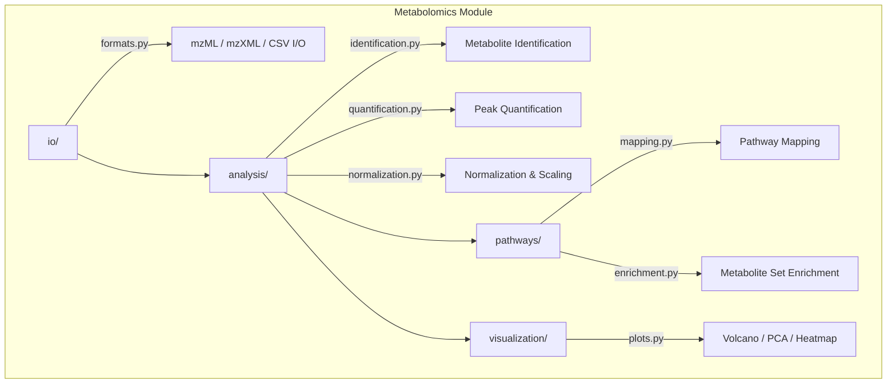

# Metabolomics

## Overview

Metabolomics analysis module for METAINFORMANT. Covers mass spectrometry data processing, metabolite identification, pathway mapping, and metabolite-gene integration.

## Contents

- **io/** - Mass spectrometry file reading (mzML, mzXML, CSV), format conversion
- **analysis/** - Metabolite identification, peak quantification, normalization
- **pathways/** - KEGG/Reactome pathway mapping, metabolite set enrichment
- **visualization/** - Volcano plots, PCA ordination, concentration heatmaps

## Architecture



## Usage

```python
from metainformant.metabolomics.io import formats
from metainformant.metabolomics.analysis import identification, quantification, normalization
from metainformant.metabolomics.pathways import mapping, enrichment
from metainformant.metabolomics.visualization import plots
```
