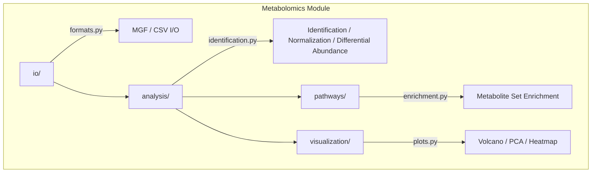

# Metabolomics

## Overview

Metabolomics analysis module for METAINFORMANT. Covers mass spectrometry data processing, metabolite identification, pathway mapping, and metabolite-gene integration.

## Contents

- **io/** - Mass spectrometry file I/O (MGF spectra, CSV metabolite × sample tables); no mzML/mzXML readers
- **analysis/** - Metabolite identification, normalization, fold change, differential abundance
- **pathways/** - Metabolite set enrichment
- **visualization/** - Volcano plots, PCA ordination, concentration heatmaps

## Architecture


```mermaid
graph TD
    subgraph "Metabolomics Module"
        IO[io/] --> |formats.py| FMT[MGF / CSV I/O]

        AN[analysis/] --> |identification.py| ID[Identification / Normalization / Differential Abundance]

        PW[pathways/] --> |enrichment.py| PE[Metabolite Set Enrichment]

        VZ[visualization/] --> |plots.py| PL[Volcano / PCA / Heatmap]
    end

    IO --> AN
    AN --> PW
    AN --> VZ
```

## Usage

```python-snippet
from metainformant.metabolomics.io import formats
from metainformant.metabolomics.analysis import identification
from metainformant.metabolomics.pathways import enrichment
from metainformant.metabolomics.visualization import plots

# formats: read_csv / write_csv, read_mgf / write_mgf, filter_spectra, extract_chromatogram
# identification: identify_metabolites, normalize_intensities, fold_change, differential_abundance
# enrichment: metabolite_set_enrichment, enrichment_with_fdr
# plots: volcano_plot_data, pca_metabolomics, intensity_heatmap_data
```
