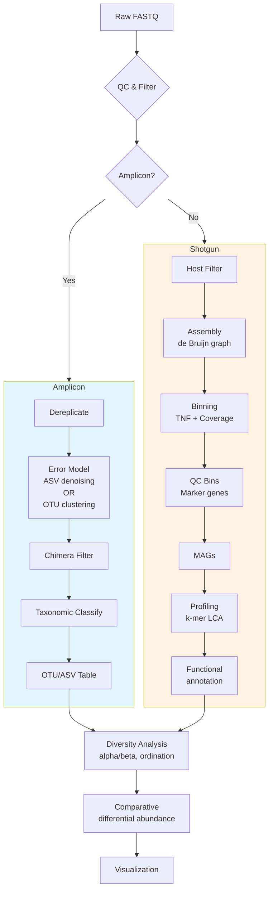

# Metagenomics Module Architecture

Comprehensive architectural overview of the METAINFORMANT metagenomics module, covering amplicon and shotgun workflows, data flow, and integration with analysis pipelines.

## Table of Contents

1. [Module Structure](#module-structure)
2. [Amplicon Workflow](#amplicon-workflow)
3. [Shotgun Workflow](#shotgun-workflow)
4. [Component Responsibilities](#component-responsibilities)
5. [Data Flow](#data-flow)
6. [Integration with Diversity & Functional Analysis](#integration-with-diversity--functional-analysis)
7. [Design Patterns](#design-patterns)

---

## Module Structure

### Directory Layout

```
src/metainformant/metagenomics/
├── __init__.py              # Public API exports
├── README.md                # Module overview
├── SPEC.md                  # Technical specification
├── AGENTS.md                # Agent directives
├── PAI.md                   # PAI guidelines
│
├── amplicon/               # 16S/ITS amplicon analysis
│   ├── __init__.py
│   ├── README.md
│   ├── otu_clustering.py   # Greedy centroid OTU clustering
│   ├── asv_denoising.py    # DADA2-style error modeling
│   └── taxonomy.py         # Naive Bayes / BLAST classification
│
├── shotgun/                # Whole-metagenome analysis
│   ├── __init__.py
│   ├── README.md
│   ├── assembly.py         # De Bruijn graph assembly
│   ├── binning.py          # Metagenomic binning (TNF + coverage)
│   └── profiling.py        # Taxonomic profiling (k-mer LCA)
│
├── diversity/              # Community diversity metrics
│   ├── __init__.py
│   ├── README.md
│   └── metrics.py          # Alpha/beta diversity, rarefaction, PERMANOVA, ordination
│
├── functional/             # Functional annotation
│   ├── __init__.py
│   ├── README.md
│   ├── annotation.py       # ORF prediction, gene families
│   └── pathways.py         # Pathway reconstruction, completeness
│
├── comparative/            # Differential abundance
│   ├── __init__.py
│   ├── README.md
│   └── differential_abundance.py  # ALDEx2-like, ANCOM-like tests
│
└── visualization/          # Metagenomics plots
    ├── __init__.py
    ├── README.md
    └── plots.py            # Krona, stacked bar, rarefaction, ordination
```

---

## Amplicon Workflow

### 16S/ITS Amplicon Analysis Pipeline

```
Raw FASTQ (Illumina)
        ↓
[Quality filtering] — trim adapters, filter low quality
        ↓
[Dereplication] — duplicate sequences merged with counts
        ↓
[ASV denoising] — error modeling (DADA2), OR
[OTU clustering] — 97% identity centroid clustering
        ↓
[Chimera removal] — UCHIME de novo or reference-based
        ↓
[Taxonomic classification] — naive Bayes k-mer classifier (RDP) or BLAST
        ↓
[OTU/ASV table] — samples × taxa abundance matrix
        ↓
[Diversity analysis] → α diversity (Shannon, Simpson), β diversity (Bray-Curtis)
        ↓
[Statistical testing] → PERMANOVA, ANOSIM, differential abundance
```

### Processing Modes

The module supports two parallel amplicon analysis strategies:

| Mode | Method | Resolution | Speed | Recommended For |
|------|--------|------------|-------|-----------------|
| **OTU clustering** | Greedy centroid (VSEARCH-style) | 97% identity clusters | Fast | Traditional 16S analysis, large datasets (>1M reads) |
| **ASV denoising** | Error-model (DADA2-style) | Exact sequence variants (100%) | Moderate | High-resolution analysis, smaller datasets |

**OTU clustering** (`cluster_otus()`):
- Sorts sequences by abundance or length
- Iteratively assigns each to best-matching centroid if identity ≥ threshold
- First sequence becomes centroid #1
- Complexity: O(n²) worst-case, but with k-mer pre-filter is near-linear
- Output: OTU table (centroid → sample counts)

**ASV denoising** (`denoise_sequences()`):
- Dereplicates identical sequences with counts
- Estimates error rates from quality scores (Phred)
- Uses Poisson model to merge error variants into true ASVs
- More sensitive to true biological variants (single-nucleotide differences)
- Output: ASV table (unique sequence → sample counts)

**Recommendation**: Use **ASV** for most studies (higher resolution); use **OTU** for legacy compatibility or when computational resources limited.

---

## Shotgun Workflow

### Shotgun Metagenomics Pipeline

```
Raw reads (Illumina, PacBio, ONT)
        ↓
[Quality control] — Trimmomatic, fastp (adapter/quality trimming)
        ↓
[Host removal] — Map to host genome, filter (optional)
        ↓
[Assembly] — De Bruijn graph (MetaSPAdes, MEGAHIT)
        ↓
[Assembly stats] — N50, # contigs, total bp, GC%
        ↓
[Binning] — Tetranucleotide frequency (TNF) + coverage-based clustering
        ↓
[Bin refinement] — CheckM-style marker gene QC
        ↓
[MAGs] — Metagenome-assembiled genomes (FASTA per bin)
        ↓
[Profiling] — k-mer LCA classification (Kraken-style) OR
              gene-based profiling (HUMAnN-style)
        ↓
[Functional annotation] — Prodigal ORF, eggNOG/KEGG assignment
        ↓
[Pathway reconstruction] — MetaCyc, reaction inference
```

### Assembly Details

**`assemble_contigs()`** in `shotgun/assembly.py`:

- **Algorithm**: De Bruijn graph (not full implementation; currently stub with placeholder)
- **k-mer sizes**: Multiple k values (21, 33, 55 by default) to balance contiguity and repeat resolution
- **Node**: (k-1)-mer, **Edge**: k-mer
- **Tip removal**: Low-coverage tips (likely errors) are trimmed
- **Bubble popping**: Sequencing errors create alternative paths with similar coverage; collapsed

**Output data model**:
```python
@dataclass
class Contig:
    contig_id: str
    sequence: str
    length: int
    coverage: float   # average read depth
    gc_content: float

@dataclass
class AssemblyStats:
    total_contigs: int
    total_length: int
    n50: int          # shortest contig length where ≥50% genome covered
    l50: int          # fewest contigs that cover ≥50% genome
    gc_content: float
```

**Note**: Full de Bruijn assembly is computationally intensive. For large datasets (>1 Gb), use external assemblers (MEGAHIT, metaSPAdes) via system calls; METAINFORMANT provides wrappers (future).

---

### Binning Details

**`bin_contigs()`** in `shotgun/binning.py`:

- **Input**: Contigs dictionary `{id: sequence}`, optional per-contig coverage
- **Methods**:
  1. **Composition-only**: TNF (tetranucleotide frequency) via k-mer counting (k=4) → 256-dimensional vector → PCA → k-means clustering
  2. **Coverage-only**: If multiple samples have coverage profiles, cluster by coverage patterns across samples
  3. **Combined**: Concatenate normalized TNF + normalized coverage vectors (recommended)

- **Algorithm**: k-means with k-means++ initialization. Number of bins estimated from total assembly size / typical genome size (e.g., 3 Mbp for bacteria).

**Output**:
```python
@dataclass
class GenomeBin:
    bin_id: str
    contig_ids: list[str]
    total_length: int
    gc_content: float
    completeness: float      # from single-copy marker genes (CheckM)
    contamination: float     # fraction of markers found in multiple copies
    quality_score: float     # completeness - 5 × contamination
```

**Quality assessment** (CheckM-style):
- **Completeness**: Fraction of universal single-copy marker genes present (e.g., 43 bacterial markers)
- **Contamination**: Fraction of universal markers found in ≥2 copies (suggests multiple strains)
- **High-quality MAG**: completeness ≥90%, contamination ≤5%

---

### Profiling Details

**`build_kmer_index()`** and `profile_community()` in `shotgun/profiling.py`:

- **k-mer indexing**: Build k-mer → taxon lookup from reference genomes. For shared k-mers, store LCA (lowest common ancestor) taxon for that k-mer.
- **Classification**: For each read, extract k-mers; vote among matching taxa; LCA of all votes yields assignment.
- **Confidence**: Fraction of k-mers agreeing with LCA.

**Data model**:
```python
@dataclass
class TaxonProfile:
    taxon_id: str      # e.g., "k__Bacteria|p__Firmicutes"
    name: str          # e.g., "Lactobacillus"
    rank: str          # species/genus/phylum
    lineage: list[tuple[str, str]]
    read_count: int
    relative_abundance: float

@dataclass
class CommunityProfile:
    taxa: list[TaxonProfile]
    total_reads: int
    classified_reads: int
    unclassified_reads: int
```

---

## Component Responsibilities

### `amplicon/` Subpackage

| File | Functions | Purpose |
|------|-----------|---------|
| `otu_clustering.py` | `cluster_otus()`, `calculate_identity()`, `filter_chimeras()` | OTU-based community profiling |
| `asv_denoising.py` | `denoise_sequences()`, `estimate_error_rates()` | High-resolution ASV inference |
| `taxonomy.py` | `classify_taxonomy()`, `build_taxonomy_tree()` | Taxonomic assignment |

**Key algorithms**:
- **`calculate_identity()`**: Needleman-Wunsch global alignment with affine gap penalties to compute percent identity. O(L₁×L₂) per pair; uses banded alignment for speed.
- **`filter_chimeras()`**: UCHIME de novo — finds two best-matching parent sequences among more abundant ones, builds chimeric model by concatenating left/right segments, computes divergence; flags if score > threshold.

---

### `shotgun/` Subpackage

| File | Functions | Purpose |
|------|-----------|---------|
| `assembly.py` | `assemble_contigs()`, `scaffold_contigs()`, `calculate_assembly_stats()` | De Bruijn graph assembly |
| `binning.py` | `bin_contigs()`, `calculate_tetranucleotide_freq()`, `refine_bins()` | Metagenome binning |
| `profiling.py` | `build_kmer_index()`, `profile_community()` | Taxonomic profiling |

**Key structures**:
- `Contig`, `Scaffold`, `AssemblyStats`
- `GenomeBin`, `BinningResult`
- `KmerIndex`, `CommunityProfile`

---

### `diversity/` Subpackage

`metrics.py` implements a comprehensive suite of diversity statistics (see separate `diversity.md` for full reference).

| Category | Metrics |
|----------|---------|
| Alpha diversity | Shannon, Simpson, InvSimpson, Chao1, ACE, Observed, Fisher alpha, Pielou evenness |
| Beta diversity | Bray-Curtis, Jaccard, Aitchison (CLR-Euclidean) |
| Ordination | PCoA (PCoA on distance matrix), NMDS (non-metric MDS) |
| Testing | PERMANOVA (pseudo-F permutation test), rarefaction analysis |

**All alpha metrics** accept a single abundance vector (counts or relative abundances); **beta metrics** accept list of sample vectors.

---

### `functional/` Subpackage

| File | Functions | Purpose |
|------|-----------|---------|
| `annotation.py` | `predict_genes()`, `annotate_genes()` | ORF prediction (Glimmer-style), gene family assignment (eggNOG/KEGG) |
| `pathways.py` | `reconstruct_pathways()`, `calculate_completeness()` | Metabolic pathway reconstruction, module completion percentage |

**Pathway completeness**: Computes fraction of pathway reactions or enzymes present in metagenome relative to reference.

---

### `comparative/` Subpackage

`differential_abundance.py` implements compositional differential analysis methods:

- **ALDEx2-style**: CLR-transformed ANOVA on Monte Carlo Dirichlet samples
- **ANCOM-like**: ANCOM test for compositional data (accounts for bias in relative abundances)
- **Standard**: Unpaired t-test with multiple testing (for absolute abundances from spike-in)

**Note**: Exact implementation details are in the ALR (additive log-ratio) framework to handle compositional nature of 16S counts.

---

## Data Flow

### High-Level Metagenomics Processing Flow



### Detailed Amplicon Flow

```
FASTQ (paired-end)
        ↓
DADA2-style pipeline:
1. LearnErrorModel(quality_scores) → error rates per position
2. Denoise(forward + reverse merged, error_model) → ASVs
   - Alternative: cluster_otus() → OTUs
        ↓
Filter chimeras (UCHIME)
        ↓
Taxonomic classification (naive Bayes, k=8 mers)
        ↓
BIOM / TSV feature table:
   samples × ASVs/OTUs (counts)
        ↓
→ diversity.metrics (alpha/beta)
→ comparative.differential_abundance
→ visualization.plots (Krona, stacked bar)
```

### Detailed Shotgun Flow

```
FASTQ (interleaved or paired)
        ↓
Preprocess (trimming, quality filter)  [external: fastp, Trimmomatic]
        ↓
Assembly:
  assemble_contigs(reads, k_range=[21,33,55]) → contigs
  scaffold_contigs(contigs, paired_reads) → scaffolds (optional)
        ↓
Binning:
  bin_contigs(contigs, coverage, method="combined") → bins
  refine_bins(bins) → high-quality MAGs
        ↓
Profiling (two approaches):
  A) k-mer LCA: build_kmer_index(ref_genomes) → profile_community(reads) → taxonomic abundances
  B) gene-centric: functional.annotation → pathway abundances
        ↓
→ comparative.differential_abundance (at any level: taxon, gene, pathway)
→ visualization (abundance barplots, heatmaps)
```

---

## Integration with Diversity & Functional Analysis

### Diversity Module as Post-Processor

The `diversity` module consumes OTU/ASV tables and computes ecologically relevant statistics:

```python
from metainformant.metagenomics.diversity import metrics

# OTU table: samples × taxa (counts)
otu_table = ...  # shape (n_samples, n_otus)

# Alpha diversity (within-sample)
for sample_idx in range(n_samples):
    alpha = metrics.alpha_diversity(
        abundances=otu_table[sample_idx],
        metric="shannon",
    )
    print(f"Sample {sample_idx}: Shannon diversity = {alpha['value']:.3f}")

# Beta diversity (between-sample)
beta_result = metrics.beta_diversity(
    samples=otu_table.tolist(),
    metric="bray_curtis",
)
dist_matrix = beta_result["distance_matrix"]

# Ordination for visualization
pcoa = metrics.ordination(dist_matrix, method="pcoa", n_components=2)
coords = pcoa["coordinates"]  # 2D embedding of samples
```

**Integration point**: OTU/ASV tables from `amplicon` module feed directly into `diversity.metrics`. The module is agnostic to data source; any feature table works.

---

### Functional Module as Downstream Annotator

The `functional` module operates on either:
- **Shotgun assemblies** (contigs → ORF prediction → annotation)
- **Gene catalogs** from pangenome analysis

```python
from metainformant.metagenomics.functional import annotation, pathways

# From shotgun assembly
contigs = assembly.assemble_contigs(reads)
genes = annotation.predict_genes(contigs)  # ORF finding
annotated = annotation.annotate_genes(genes, database="eggNOG")  # assign COG/KEGG

# Pathway reconstruction
pathway_abund = pathways.reconstruct_pathways(annotated, method="minimal")
completeness = pathways.calculate_completeness(pathway_abund, reference="KEGG")
```

---

### Comparative Module as Unifying Test Engine

The `comparative` module provides differential abundance testing across all feature types (taxa, genes, pathways):

```python
from metainformant.metagenomics.comparative import differential_abundance

# OTU table differential
otu_diff = differential_abundance(
    feature_table=otu_table,
    group_a=control_samples,
    group_b=treatment_samples,
    method="aldex2",  # CLR-based
)

# Taxonomic profile differential
tax_diff = differential_abundance(
    feature_table=taxonomic_abundances,
    group_a=..., group_b=...,
    method="ancom",
)

# Gene family differential
gene_diff = differential_abundance(
    feature_table=gene_counts,
    group_a=..., group_b=...,
    method="wilcoxon",
)
```

All return similar result structures (per-feature statistics, p-values, q-values) enabling consistent downstream handling.

---

## Design Patterns

### Pipeline Pattern: Sequence → Table → Analysis

Amplicon and shotgun modules both implement a **feature table** abstraction:

```
Input (FASTQ/reads)
    ↓
Feature detection (ASV/OTU/Contig/Gene)
    ↓
Abundance quantification (counts per sample)
    ↓
Feature table (features × samples)
    ↓
Diversity / Comparative / Functional analysis
```

This separation allows any feature table (even from external tools like QIIME2) to be consumed by downstream analysis functions.

---

### Method Dispatch via String Enum

Many functions accept a `method` string parameter:

```python
cluster_otus(..., method="vsearch")  # or "usearch", "swarm"
bin_contigs(..., method="combined")  # "composition", "coverage", "combined"
differential_abundance(..., method="aldex2")  # "ancom", "wilcoxon", "t_test"
alpha_diversity(..., metric="shannon")  # "simpson", "chao1", etc.
```

**Implementation**: Simple `if-elif` dispatch or dict-of-functions. Easy to extend: add new method by defining function and adding to dispatch table.

**Advantage**: User-friendly string API vs. importing multiple functions; disadvantage: no type safety for method names (use Enum in future).

---

### Result Dataclasses

All major functions return dataclasses for structured output:

| Return type | Fields | Use |
|-------------|--------|-----|
| `ClusteringResult` | `otus`, `threshold`, `num_otus`, `otu_table` | OTU results |
| `DenoisingResult` | `asvs`, `error_model`, `num_asvs`, `reads_removed` | ASV results |
| `BinningResult` | `bins`, `unbinned_contigs`, `total_contigs` | Binning output |
| `AssemblyStats` | `n50`, `l50`, `total_length`, `gc_content` | Assembly quality |
| `TaxonomyAssignment` | `lineage`, `confidence`, `method` | Classification |
| `EnrichmentResult` | `pathway_name`, `p_value`, `fold_enrichment` | Enrichment |

Benefits: self-documenting, IDE autocomplete, type checking, easy serialization to dict/JSON.

---

### Environment Variable Override Pattern

Functions that have sensible defaults but allow user customization via environment variables:

```python
_ENV_PREFIX = "META_"

def some_function(threshold=0.97):
    # Check environment override
    env_threshold = os.environ.get(f"{_ENV_PREFIX}OTU_THRESHOLD")
    if env_threshold is not None:
        threshold = float(env_threshold)
        logger.info(f"Using threshold from environment: {threshold}")
    ...
```

Used in:
- `cluster_otus()`: `META_OTU_THRESHOLD`
- `detect_cnv()` (structural_variants): `SV_CNV_SIGNIFICANCE`
- (More planned)

**Rationale**: Allows batch-wide configuration without editing code or config files; useful for HPC where jobs are submitted via script.

---

## Integration Points

### With `core` Infrastructure

- **I/O**: `metainformant.core.io` used for reading/writing configs, JSON (but MS data uses own `io/formats.py`)
- **Logging**: All submodules use `metainformant.core.utils.logging.get_logger()`
- **Config**: Future: `metainformant.core.utils.config` for module-specific YAML/JSON config loading

---

### With `visualization` Module

Metagenomics has its own `visualization/plots.py`, but also uses shared utilities:

```python
from metainformant.visualization import plots as shared_viz
from metainformant.metagenomics.visualization import plots as meta_viz

# Shared: ordination plots, heatmaps
pcoa_fig = shared_viz.ordination(coords, labels=sample_groups)

# Metagenomics-specific: Krona charts, stacked bar taxa plots
krona = meta_viz.krona_chart(taxonomic_abundances)
```

---

### With `ecology` Module

**Synergy**: `metagenomics.diversity` and `ecology` both implement diversity indices; `ecology` focuses on theoretical derivations and rare-event statistics.

```python
# ecology module provides more mathematically detailed implementations
from metainformant.ecology import metrics as eco_metrics

# Use ecology's rarefaction with exact hypergeometric formula
rarefaction = eco_metrics.rarefaction(abundances, depths)

# Metagenomics uses simpler sampling approximation
rarefaction_approx = diversity.rarefaction_curve(abundances)
```

**Integration**: For publication, use `ecology` versions for rigor; for exploration, use `metagenomics` versions for speed.

---

### With `networks` Module

Post-binning: Build co-occurrence networks between MAGs or taxa.

```python
from metainformant.networks import construction as net

# Correlation-based network from normalized abundances
abundances = otu_table  # samples × taxa
network = net.build_correlation_network(
    abundances.T,  # features × samples
    method="spearman",
    threshold=0.7,
)
# Network: nodes = taxa, edges = strong correlations
```

---

## Configuration

Unlike RNA module, metagenomics does not have a dedicated configuration file system. Configuration is primarily **parameter-driven**.

### Environment Variables

| Variable | Purpose | Scope |
|----------|---------|-------|
| `META_OTU_THRESHOLD` | Override default OTU clustering identity threshold | `cluster_otus()` |
| `META_` prefix (generic) | Future module-specific settings via `core.utils.config` | — |

No other module-specific env vars yet.

### Function Parameters as Configuration

All behavior controlled by function arguments. For reproducible pipelines, create a config dict or YAML file and pass parameters programmatically.

Example `config/metagenomics.yaml`:
```yaml
amplicon:
  clustering:
    threshold: 0.97
    method: greedy
    prefilter: true
  taxonomy:
    method: naive_bayes
    confidence_threshold: 0.8
    bootstraps: 100
shotgun:
  assembly:
    k_range: [21, 33, 55]
    min_contig_length: 500
  binning:
    method: combined
    min_completeness: 0.5
    max_contamination: 0.1
diversity:
  metrics: [shannon, simpson, bray_curtis]
  rarefaction:
    iterations: 10
```

---

## Performance Considerations

### OTU Clustering Complexity

- **Naïve O(n²)**: For n sequences, all-vs-all identity calculation would be quadratic.
- **With k-mer pre-filter**: Only compute alignment if k-mer similarity > threshold - 0.10. For n=100k sequences:
  - Without pre-filter: ~10¹⁰ pairwise alignments (infeasible)
  - With pre-filter: ~10⁶–10⁷ alignments (feasible in minutes)

**Scaling**: ~O(n × c) where c = average candidates per centroid check. c << n after pre-filter.

**Optimization**: The `_quick_identity()` pre-filter using 8-mer Jaccard is extremely effective: rejects >90% of sequence pairs quickly before alignment.

---

### Assembly Memory Use

De Bruijn graphs require storing all (k-1)-mers as nodes. For k=31, node space is 4³⁰ ≈ 10¹⁸ theoretically but in practice only observed k-mers are stored.

**Memory estimate**: n unique (k-1)-mers × (k-1 bytes for sequence + overhead). For 1 Gb read set with 30× coverage, unique k-mers ≈ 100 million → several GB RAM. Use disk-based or streaming assemblers for very large datasets.

---

### Binning Speed

k-means clustering on TNF vectors (256 dimensions) is fast, limited by:
- Number of contigs (often 10k–100k)
- Number of iterations until convergence (typically <100)

**Time**: O(iterations × n_contigs × k_bins × dimensions) ≈ few seconds to minutes.

---

## Future Architecture Directions

Planned improvements (not yet implemented):

| Feature | Description | Target |
|---------|-------------|--------|
| **QIIME2 integration** | Wrapper to import/export QIIME2 artifacts | Q3 2026 |
| **Kraken2/Bracken integration** | Native wrappers for taxonomic profiling | Q4 2026 |
| **MetaBAT2/MaxBin2** | External binning tools via subprocess | 2027 |
| **CheckM integration** | Bin quality assessment (marker gene mapping) | 2027 |
| **PhyloPhlan / RAxML** | Phylogenetic tree building from 16S | 2027 |
| **Songbird / Qurro** | Multinomial regression for differential abundance | 2028 |

---

## Summary

The metagenomics module is organized into clear subpackages aligned with standard analysis workflows: **amplicon** (16S/ITS), **shotgun** (WGS), **diversity** (ecology), **functional** (annotation), **comparative** (stats), and **visualization**. Data flows from raw sequences → feature table (OTU/ASV/contig/gene) → abundance matrix → ecological/statistical analysis.

Key strengths:
- **Pure Python implementations** of core algorithms (OTU clustering, UCHIME, diversity metrics)
- **Modular design**: swap external tools (assembly, binning) without breaking downstream
- **Comprehensive**: covers both amplicon and shotgun in one package
- **Extensible**: method dispatch patterns allow adding new algorithms easily

**Cross-cutting concerns** (logging, config, I/O) handled by `core` module; advanced stats could leverage `ml` or `math` modules in future.
