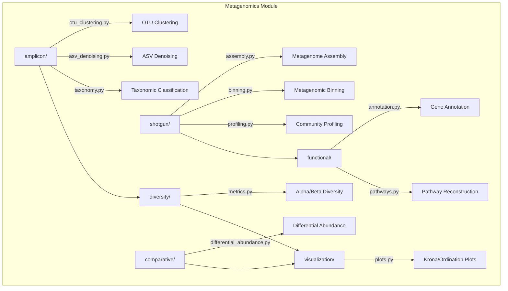

# Metagenomics

## Overview

Microbiome and metagenomic analysis module for METAINFORMANT. Covers amplicon profiling (16S/ITS), shotgun metagenomics, community diversity, functional annotation, and differential abundance testing.

## Contents

- **amplicon/** - OTU clustering, ASV denoising, taxonomic classification
- **shotgun/** - Metagenome assembly, binning, community profiling
- **diversity/** - Alpha diversity (Shannon, Simpson, Chao1), beta diversity (Bray-Curtis, Jaccard, Aitchison), PERMANOVA, ordination
- **functional/** - Gene annotation, ORF prediction, metabolic pathway reconstruction
- **comparative/** - Differential abundance (ALDEx2-like, ANCOM-like), LEfSe-style effect sizes, biomarker discovery
- **visualization/** - Krona charts, stacked bar plots, rarefaction curves, ordination plots

## Architecture



## Usage

```python
from metainformant.metagenomics.amplicon import otu_clustering, asv_denoising, taxonomy
from metainformant.metagenomics.shotgun import assembly, binning, profiling
from metainformant.metagenomics.diversity import metrics
from metainformant.metagenomics.functional import annotation, pathways
from metainformant.metagenomics.comparative import differential_abundance
```
