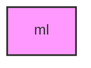

# ML

## Overview
Machine learning module for METAINFORMANT.

## 📦 Contents
- **[evaluation/](evaluation/)**
- **[features/](features/)**
- **[models/](models/)**
- `[__init__.py](__init__.py)`

## 📊 Structure



## Usage
Import module:
```python
from metainformant.ml import ...
```
