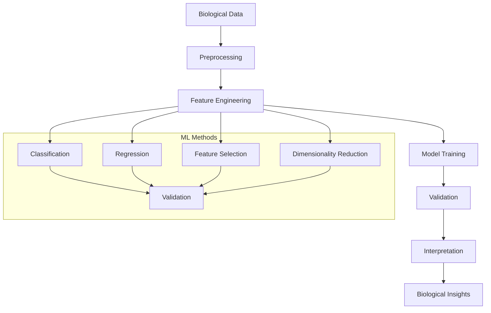

# Machine Learning: Biological Data Analysis

The machine learning module provides statistical and machine learning methods for biological data analysis, including classification, regression, feature selection, and model validation tailored for biological applications.

## Overview

This module offers a comprehensive toolkit for applying machine learning techniques to biological datasets, with emphasis on biological interpretation, robust validation, and integration with other METAINFORMANT modules.

## Core Components

### [Classification](./classification.md)
Supervised learning methods for biological prediction tasks:
- Binary and multi-class classification
- Biological sequence classification
- Expression-based phenotype prediction
- Model interpretability tools
- Cross-validation and ensemble methods

### [Regression](./regression.md)
Continuous trait prediction and modeling:
- Linear and non-linear regression
- Regularization methods (Lasso, Ridge, Elastic Net)
- Survival analysis and time-series prediction
- Feature importance analysis
- Model comparison and selection

### [Feature Selection](./features.md)
Dimensionality reduction and feature importance analysis:
- Univariate statistical tests
- Recursive feature elimination
- L1-based selection (Lasso)
- Biological feature ranking
- Stability-based selection methods

### [Model Validation](./validation.md)
Comprehensive model assessment and validation:
- Cross-validation strategies
- Bootstrap resampling and confidence intervals
- Permutation testing
- Learning curves and validation curves
- Model comparison and statistical testing

### [Dimensionality Reduction](./dimensionality.md)
Manifold learning and dimensionality reduction:
- Principal Component Analysis (PCA)
- t-SNE and UMAP
- Non-negative Matrix Factorization (NMF)
- Independent Component Analysis (ICA)
- Biological data-specific methods

## Architecture



## Key Features

### Biological Applications
- **Sequence-Based Prediction**: Classify sequences by function or structure
- **Expression-Based Phenotyping**: Predict phenotypes from gene expression
- **Network-Based Learning**: Use network features for prediction
- **Multi-omics Integration**: Combine multiple data types for prediction

### Robust Validation
- **Cross-Validation**: Multiple CV strategies for reliable performance estimates
- **Bootstrap Methods**: Confidence intervals and statistical testing
- **Permutation Tests**: Assess significance of model performance
- **Learning Curves**: Diagnose overfitting and sample size requirements

### Interpretability
- **Feature Importance**: Identify most predictive biological features
- **Model Explanation**: Understand individual predictions
- **Biological Annotation**: Link features to biological knowledge
- **Pathway Analysis**: Connect predictions to biological pathways

## Quick Start

### Basic Classification

```python
from metainformant.ml import classification

# Prepare biological data
features = load_expression_data()  # Gene expression matrix
labels = load_phenotype_labels()   # Binary phenotype labels

# Train classifier
model = classification.train_classifier(
    features,
    labels,
    method="random_forest",
    test_size=0.2,
    random_state=42
)

# Make predictions
predictions = classification.predict(model, test_features)
probabilities = classification.predict_proba(model, test_features)

# Evaluate performance
metrics = classification.evaluate_classification(predictions, test_labels)
print(f"Accuracy: {metrics['accuracy']:.3f}")
print(f"AUC: {metrics['auc']:.3f}")
```

### Feature Selection

```python
from metainformant.ml import features

# Select important biological features
selected_features = features.select_features(
    features,
    labels,
    method="univariate",
    k=1000,                    # Select top 1000 features
    scoring="f_classif"        # Statistical test
)

# Get feature importance scores
importance_scores = features.feature_importance(
    model,
    selected_features,
    method="permutation"       # Permutation importance
)

# Biological interpretation
biological_features = features.interpret_features(
    importance_scores,
    annotation_database       # Gene annotations
)
```

### Model Validation

```python
from metainformant.ml import validation

# Comprehensive model validation
validation_results = validation.cross_validate(
    model,
    features,
    labels,
    cv=5,                      # 5-fold cross-validation
    scoring=["accuracy", "precision", "recall", "f1", "auc"],
    return_train_score=True
)

# Bootstrap confidence intervals
bootstrap_results = validation.bootstrap_validation(
    model,
    features,
    labels,
    n_bootstrap=1000,
    confidence_level=0.95
)

# Statistical significance testing
p_value = validation.permutation_test(
    validation_results['test_accuracy'],
    n_permutations=1000
)
```

## Integration with Other Modules

### With DNA Sequences

```python
from metainformant.dna import sequences
from metainformant.ml import classification

# Extract features from DNA sequences
sequences = sequences.read_fasta("sequences.fasta")
sequence_features = sequences.extract_kmer_features(sequences, k=3)

# Classify sequences by function
functional_labels = sequences.get_functional_labels(sequences)
model = classification.train_classifier(sequence_features, functional_labels)

# Predict function for new sequences
new_features = sequences.extract_kmer_features(new_sequences, k=3)
predictions = classification.predict(model, new_features)
```

### With Expression Data

```python
from metainformant.rna import workflow
from metainformant.ml import regression

# Load expression data
expression_data = workflow.extract_expression_patterns(rna_data)

# Predict continuous phenotypes
phenotype_values = load_continuous_phenotypes()
model = regression.train_regressor(
    expression_data,
    phenotype_values,
    method="xgboost",
    validation="cross_validation"
)

# Feature importance analysis
importance = regression.feature_importance(model, expression_data)
top_genes = importance.nlargest(50)  # Top 50 predictive genes
```

### With Network Data

```python
from metainformant.networks import ppi
from metainformant.ml import classification

# Use network features for prediction
network_features = ppi.extract_network_features(interaction_network)

# Combine with expression features
combined_features = pd.concat([expression_features, network_features], axis=1)

# Train integrated model
model = classification.train_classifier(
    combined_features,
    labels,
    feature_selection=True
)
```

## Performance Features

- **Scalable Algorithms**: Efficient implementations for large biological datasets
- **Parallel Processing**: Multi-core support for computationally intensive operations
- **Memory Optimization**: Streaming processing for large feature matrices
- **GPU Support**: CUDA acceleration for deep learning methods

## Model Interpretability

### Feature Importance Analysis

```python
from metainformant.ml import features

# Analyze feature contributions
importance = features.permutation_importance(model, features, labels)

# Biological interpretation
gene_importance = features.map_to_genes(importance, gene_mapping)
pathway_importance = features.map_to_pathways(gene_importance, pathway_database)

# Visualize importance
features.plot_feature_importance(importance, top_n=20)
```

### Model Explanation

```python
from metainformant.ml import explain

# Explain individual predictions
explanation = explain.explain_prediction(
    model,
    instance,
    features,
    method="shap"
)

print(f"Prediction: {explanation['prediction']}")
print(f"Top positive features: {explanation['top_positive']}")
print(f"Top negative features: {explanation['top_negative']}")
```

## Advanced Workflows

### Multi-omics Prediction

```python
from metainformant.multiomics import integration
from metainformant.ml import classification

# Load multi-omics data
multiomics_data = integration.load_multiomics_data([
    "genomics.csv",
    "transcriptomics.csv",
    "proteomics.csv"
])

# Feature engineering
combined_features = integration.extract_multiomic_features(multiomics_data)

# Multi-omics classification
model = classification.train_classifier(
    combined_features,
    labels,
    method="ensemble",        # Use ensemble of methods
    feature_selection=True,
    cross_validation=True
)
```

### Time Series Analysis

```python
from metainformant.ml import regression

# Time series prediction
time_series_data = load_time_series_expression()
time_features = regression.extract_time_features(time_series_data)

# Train time series model
model = regression.train_regressor(
    time_features,
    time_targets,
    method="lstm",           # LSTM for time series
    time_window=10           # 10 time points window
)
```

## Testing

Machine learning functionality is tested comprehensively:

```bash
# Run all ML tests
uv run pytest tests/test_ml_*.py -v

# Test specific components
uv run pytest tests/test_ml_features.py::test_select_features -v
uv run pytest tests/test_ml_validation.py::test_cross_validate -v
```

## Related Documentation

- [Classification Methods](./classification.md): Supervised classification algorithms
- [Regression Methods](./regression.md): Continuous prediction models
- [Feature Selection](./features.md): Dimensionality reduction and selection
- [Model Validation](./validation.md): Model assessment and validation
- [Dimensionality Reduction](./dimensionality.md): Manifold learning methods
