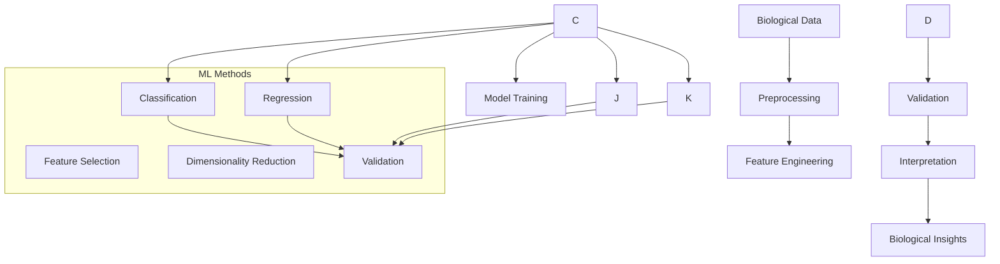

# Machine Learning: Biological Data Analysis

The machine learning module provides statistical and machine learning methods for biological data analysis, including classification, regression, feature selection, and model validation tailored for biological applications.

## Overview

This module offers a comprehensive toolkit for applying machine learning techniques to biological datasets, with emphasis on biological interpretation, robust validation, and integration with other METAINFORMANT modules.

## Core Components

### Classification
Supervised learning methods for biological prediction tasks:
- Binary and multi-class classification
- Biological sequence classification
- Expression-based phenotype prediction
- Model interpretability tools
- Cross-validation and ensemble methods

### Regression
Continuous trait prediction and modeling:
- Linear and non-linear regression
- Regularization methods (Lasso, Ridge, Elastic Net)
- Ensemble and linear model families (linear, random forest, gradient boosting, ridge, lasso, SVR)
- Feature importance analysis
- Model comparison and selection

### Feature Selection
Dimensionality reduction and feature importance analysis:
- Univariate statistical tests
- Recursive feature elimination
- L1-based selection (Lasso)
- Biological feature ranking
- Stability-based selection methods

### Model Validation
Comprehensive model assessment and validation:
- Cross-validation strategies
- Bootstrap resampling and confidence intervals
- Permutation-based feature importance
- Learning curves and validation curves
- Model comparison and statistical testing

### Dimensionality Reduction
Manifold learning and dimensionality reduction:
- Principal Component Analysis (PCA)
- t-SNE and UMAP
- Non-negative Matrix Factorization (NMF)
- Independent Component Analysis (ICA)
- Biological data-specific methods

## Architecture


```mermaid
flowchart TD
    AbiologicalData[Biological Data] --> B[Preprocessing]
    B --> CfeatureEngineering[Feature Engineering]
    C --> DmodelTraining[Model Training]
    D --> E[Validation]
    E --> F[Interpretation]
    F --> GbiologicalInsights[Biological Insights]

    subgraph MethodsmlMethods[ML Methods]
        H[Classification]
        I[Regression]
        JfeatureSelection[Feature Selection]
        KdimensionalityReduction[Dimensionality Reduction]
        L[Validation]
    end

    C --> H
    C --> I
    C --> J
    C --> K
    H --> L
    I --> L
    J --> L
    K --> L
```

## Key Features

### Biological Applications
- **Sequence-Based Prediction**: Classify sequences by function or structure
- **Expression-Based Phenotyping**: Predict phenotypes from gene expression
- **Network-Based Learning**: Use network features for prediction
- **Multi-omics Integration**: Combine multiple data types for prediction

### Robust Validation
- **Cross-Validation**: Multiple CV strategies for reliable performance estimates
- **Bootstrap Methods**: Confidence intervals and statistical testing
- **Permutation Tests**: Assess significance of model performance
- **Learning Curves**: Diagnose overfitting and sample size requirements

### Interpretability
- **Feature Importance**: Identify most predictive biological features
- **Model Explanation**: Understand individual predictions
- **Biological Annotation**: Link features to biological knowledge
- **Pathway Analysis**: Connect predictions to biological pathways

## Quick Start

```python-snippet
from metainformant.ml.models.classification import create_biological_classifier, cross_validate_biological

# Train a classifier (methods: 'rf', 'gb', 'lr', 'ensemble')
model = create_biological_classifier(method="rf", random_state=42)
model.fit(features, labels)

# Predict on held-out data
predictions = model.predict(test_features)
probabilities = model.predict_proba(test_features)

# Evaluate performance
metrics = model.evaluate(test_features, test_labels)
print(f"Accuracy: {metrics['accuracy']:.3f}")
print(f"AUC: {metrics['roc_auc']:.3f}")

# Cross-validate a method directly
cv_results = cross_validate_biological(features, labels, method="rf", cv_folds=5)
```

### Feature Selection

```python-snippet
from metainformant.ml.features.features import (
    select_features_univariate,
    select_features_recursive,
    biological_feature_ranking,
    select_features_biological,
)
from metainformant.ml.interpretability.feature_selection import boruta_selection

# Univariate statistical selection (f_classif or chi2)
mask, selected = select_features_univariate(features, labels, method="f_classif", k=1000)

# Recursive elimination
mask, selected = select_features_recursive(features, labels, n_features_to_select=100)

# Biological ranking (methods: 'importance', 'univariate', 'stability')
ranking = biological_feature_ranking(features, labels, feature_names=feature_names)

# Consensus biological selection across methods
consensus = select_features_biological(features, labels, feature_names=feature_names)

# Boruta-style selection (builds an internal random forest; no model argument)
boruta = boruta_selection(features, labels, max_iter=100, random_state=42)
```

### Model Validation

```python-snippet
from metainformant.ml.evaluation.validation import (
    cross_validate,
    cross_validation_scores,
    bootstrap_validate,
    learning_curve,
)

# Cross-validation with a scoring metric
cv_results = cross_validate(model, features, labels, cv=5, scoring="accuracy")

# Per-metric fold scores
fold_scores = cross_validation_scores(model, features, labels, cv=5, scoring=["accuracy", "f1"])

# Bootstrap confidence intervals (model_func maps train/test splits to predictions)
bootstrap_results = bootstrap_validate(features, labels, model_func, n_bootstrap=200)

# Learning curves from a model factory
curve = learning_curve(features, labels, model_factory)
```

## Integration with Other Modules

### With DNA Sequences

```python-snippet
import numpy as np
from metainformant.dna.sequence.core import read_fasta
from metainformant.dna.sequence.composition import gc_content, melting_temperature
from metainformant.ml.models.classification import BiologicalClassifier

sequences = read_fasta("sequences.fasta")

# Simple per-sequence features (GC content, melting temperature)
X = np.array([[gc_content(seq), melting_temperature(seq)] for seq in sequences.values()])
labels = np.array(functional_labels)  # one label per sequence

model = BiologicalClassifier(algorithm="random_forest", random_state=42)
model.fit(X, labels)
```

### With Expression Data

```python-snippet
from metainformant.ml.models.regression import train_regressor, evaluate_regressor

# Predict continuous phenotypes from expression (methods: 'linear', 'rf', 'gb',
# 'ridge', 'lasso', 'svr', 'elasticnet')
model = train_regressor(expression_data, phenotype_values, method="rf")

# Evaluate on held-out data
metrics = evaluate_regressor(model, X_test, y_test)
```

## Performance Features

- **Scalable Algorithms**: Efficient implementations for large biological datasets
- **Parallel Processing**: Multi-core support for computationally intensive operations
- **Memory Optimization**: Streaming processing for large feature matrices

## Model Interpretability

### Feature Importance Analysis

```python-snippet
from metainformant.ml.interpretability.explainers import compute_permutation_importance

# Permutation importance: returns importances_mean, importances_std,
# feature_names, and baseline_score
importance = compute_permutation_importance(
    model, X_test, y_test, n_repeats=20, metric="accuracy", random_state=42
)
ranked = sorted(
    zip(importance["feature_names"], importance["importances_mean"]),
    key=lambda pair: pair[1],
    reverse=True,
)
for name, score in ranked[:20]:
    print(f"{name}: {score:.4f}")
```

### Model Explanation

```python-snippet
from metainformant.ml.interpretability.explainers import compute_shap_values_kernel, compute_lime_explanation

# Kernel SHAP approximation (pass a predict callable, not a fitted estimator)
shap_result = compute_shap_values_kernel(model.predict, instances, n_samples=100)
print(f"SHAP values: {shap_result['shap_values']}")

# LIME for a single instance
lime_result = compute_lime_explanation(model.predict, instance, feature_names)
print(f"Local prediction: {lime_result['local_prediction']}")
print(f"R-squared: {lime_result['r_squared']}")
```

## Advanced Workflows

### Multi-omics Prediction

```python-snippet
from metainformant.multiomics.analysis.integration import integrate_omics_data, joint_pca
from metainformant.ml.models.classification import cross_validate_biological

# Integrate omics layers (DataFrames or file paths, keyed by omics type)
omics = integrate_omics_data(
    {
        "dna": "genomics.csv",
        "rna": "transcriptomics.csv",
        "protein": "proteomics.csv",
    }
)

# Joint dimensionality reduction across layers
components, loadings, explained_variance = joint_pca(omics, n_components=10)

# Cross-validate a classifier on integrated features
cv_results = cross_validate_biological(X_integrated, labels, method="ensemble", cv_folds=5)
```

## Testing

Machine learning functionality is tested comprehensively:

```bash
# Run all ML tests
uv run pytest tests/ml -v

# Test a specific component
uv run pytest tests/ml/test_ml_automl.py -v
```

## Related Documentation

- [ML Module Guide](README.md): Full module documentation and examples
