# Multi-Omics: Integrated Biological Data Analysis

The multi-omics module provides tools for integrating and analyzing data from multiple omic layers including genomics, transcriptomics, proteomics, and epigenomics to enable systems-level biological analysis.

## Overview

This module enables comprehensive systems biology analysis by combining data from different molecular layers to understand complex biological processes, identify multi-omic signatures, and discover integrated biomarkers.

## Core Components

### [Data Integration](./integration.md)
Framework for combining heterogeneous biological datasets:
- Cross-platform data harmonization and alignment
- Multi-omics data container (`MultiOmicsData`) with automatic sample matching
- File I/O using core.io for CSV/TSV/Excel formats with gzip support
- Sample and feature ID mapping for dataset harmonization
- Metadata integration and alignment
- Integration helpers for DNA, RNA, and protein modules

### Joint Analysis Methods
Statistical and computational methods for multi-omic analysis:
- **Joint PCA**: Principal component analysis across concatenated omics layers
- **Joint NMF**: Non-negative matrix factorization with shared sample factors
- **Canonical Correlation Analysis (CCA)**: Find maximally correlated patterns between omics layers
- Automatic sample alignment and validation
- Comprehensive error handling and logging

### Planned Features
The following features are planned for future releases:
- Multi-view clustering and consensus clustering
- Cross-omics biomarker discovery pipelines
- Pathway-level integration and enrichment analysis
- Batch effect correction for integrated datasets
- Integrative network construction

## Architecture

```mermaid
flowchart TD
    A[Genomics] --> B[MultiOmicsData]
    C[Transcriptomics] --> B
    D[Proteomics] --> B
    E[Epigenomics] --> B

    B --> FdataIntegration[Data Integration]
    F --> GjointAnalysis[Joint Analysis]
    F --> HbiomarkerDiscovery[Biomarker Discovery]
    F --> IpathwayIntegration[Pathway Integration]

    G --> JjointPca/nmf[Joint PCA/NMF]
    G --> KcanonicalCorrelation[Canonical Correlation]
    G --> Lmulti-viewClustering[Multi-view Clustering]

    H --> Mcross-omicsSignatures[Cross-omics Signatures]
    H --> NintegratedFeatures[Integrated Features]
    H --> O[Validation]

    I --> PpathwayActivity[Pathway Activity]
    I --> QcrosstalkAnalysis[Crosstalk Analysis]
    I --> RsystemsNetworks[Systems Networks]

    J --> SbiologicalInsights[Biological Insights]
    K --> S
    L --> S
    M --> S
    N --> S
    O --> S
    P --> S
    Q --> S
    R --> S
```



## Key Features

### Multi-Omics Data Container
- **Sample Alignment**: Automatic alignment of samples across omics layers
- **Data Validation**: Comprehensive validation of multi-omic datasets
- **Missing Data Handling**: Robust handling of missing values across layers
- **Metadata Integration**: Integration of sample and feature metadata

### Integration Methods
- **Joint PCA**: Principal component analysis across concatenated omics layers with layer weighting
- **Joint NMF**: Non-negative matrix factorization with shared sample factors and convergence detection
- **Canonical Correlation**: Find maximally correlated patterns between two omics layers
- Automatic data validation and error handling
- Comprehensive logging for debugging and monitoring

### Module Integration Helpers
- **from_dna_variants()**: Convert VCF files to genomics layer DataFrame
- **from_rna_expression()**: Load expression data for transcriptomics layer
- **from_protein_abundance()**: Convert protein data to proteomics layer

## Quick Start

### Basic Multi-Omics Integration

```python
from metainformant.multiomics import MultiOmicsData, integrate_omics_data
import pandas as pd

# Method 1: Create from DataFrames
genomics_data = pd.read_csv("genomics_features.csv", index_col=0)
transcriptomics_data = pd.read_csv("expression_matrix.csv", index_col=0)
proteomics_data = pd.read_csv("protein_abundances.csv", index_col=0)

multiomics_data = MultiOmicsData(
    genomics=genomics_data,
    transcriptomics=transcriptomics_data,
    proteomics=proteomics_data
)

print(f"Integrated {multiomics_data.n_samples} samples across {len(multiomics_data.layer_names)} omics layers")

# Method 2: Load from files
data_dict = {
    "genomics": "genomics_features.csv",
    "transcriptomics": "expression_matrix.csv",
    "proteomics": "protein_abundances.csv"
}
multiomics_data = integrate_omics_data(data_dict)
```

### Joint Dimensionality Reduction

```python
from metainformant.multiomics import joint_pca, joint_nmf

# Joint PCA across omics layers
embeddings, loadings, explained_variance = joint_pca(
    multiomics_data,
    n_components=50,
    standardize=True,
    layer_weights={"genomics": 1.0, "transcriptomics": 2.0}  # Optional layer weighting
)

# Access joint components
print(f"Joint embeddings shape: {embeddings.shape}")
print(f"First component explained variance: {explained_variance[0]:.3f}")
print(f"Genomics loadings shape: {loadings['genomics'].shape}")

# Joint NMF for multi-view factorization
W, H = joint_nmf(
    multiomics_data,
    n_components=20,
    max_iter=200,
    regularization=0.01,
    random_state=42,
    tolerance=1e-6  # Convergence tolerance
)

# W: shared sample factors (n_samples x n_components)
# H: layer-specific feature factors (dict of n_components x n_features)
print(f"Sample factors shape: {W.shape}")
print(f"Genomics feature factors: {H['genomics'].shape}")
```

### Canonical Correlation Analysis

```python
from metainformant.multiomics import canonical_correlation

# CCA between transcriptomics and proteomics
X_c, Y_c, X_w, Y_w, correlations = canonical_correlation(
    multiomics_data,
    layer_pair=("transcriptomics", "proteomics"),
    n_components=10,
    regularization=0.01
)

# Interpret correlations
print(f"Canonical correlations: {correlations}")
print(f"First canonical variate correlation: {correlations[0]:.3f}")
print(f"Transcriptomics weights shape: {X_w.shape}")
print(f"Proteomics weights shape: {Y_w.shape}")
```

## Integration with Other Modules

### With RNA Expression Data

```python
from metainformant.multiomics import MultiOmicsData, from_rna_expression, joint_pca

# Load RNA expression data using helper function
expression_data = from_rna_expression("expression.tsv")

# Or load manually and integrate
import pandas as pd
expression_data = pd.read_csv("expression.tsv", index_col=0, sep="\t")

# Add to multi-omics container
multiomics_data = MultiOmicsData(
    transcriptomics=expression_data,
    # Add other omics data...
)

# Joint analysis with expression
embeddings, loadings, variance = joint_pca(multiomics_data, n_components=50)
```

### With DNA Variants

```python
from metainformant.multiomics import MultiOmicsData, from_dna_variants, from_rna_expression

# Load genomics data from VCF
genomics_data = from_dna_variants("variants.vcf")

# Load transcriptomics data
transcriptomics_data = from_rna_expression("expression.tsv")

# Create multi-omics dataset
multiomics_data = MultiOmicsData(
    genomics=genomics_data,
    transcriptomics=transcriptomics_data
)
```

### With Protein Data

```python
from metainformant.multiomics import MultiOmicsData, from_protein_abundance, from_rna_expression

# Load protein abundance data
proteomics_data = from_protein_abundance("proteins.csv")

# Load transcriptomics for comparison
transcriptomics_data = from_rna_expression("expression.tsv")

# Create multi-omics dataset
multiomics_data = MultiOmicsData(
    proteomics=proteomics_data,
    transcriptomics=transcriptomics_data
)
```

## Advanced Workflows

### Saving and Loading Multi-Omics Data

```python
from metainformant.multiomics import MultiOmicsData

# Save multi-omics data to directory
multiomics_data.save("output/multiomics_data")

# Load saved data
loaded_data = MultiOmicsData.load("output/multiomics_data")
```

### Subsetting Multi-Omics Data

```python
# Subset by samples
subset_samples = multiomics_data.subset_samples(["sample1", "sample2", "sample3"])

# Subset by features
subset_features = multiomics_data.subset_features({
    "transcriptomics": ["GENE1", "GENE2", "GENE3"],
    "genomics": ["SNP_001", "SNP_002"]
})
```

## Performance Features

- **Scalable Integration**: Efficient algorithms for large multi-omic datasets
- **Memory Optimization**: Streaming processing for large feature matrices
- **Parallel Processing**: Multi-core support for computationally intensive operations
- **Sparse Matrix Support**: Memory-efficient storage for sparse omics data

## Data Compatibility

### Supported Data Types
- **Genomics**: SNP data, copy number variations, genomic features
- **Transcriptomics**: Gene expression (RNA-seq, microarray), alternative splicing
- **Proteomics**: Protein abundance, post-translational modifications
- **Epigenomics**: DNA methylation, histone modifications, chromatin accessibility
- **Metabolomics**: Metabolite concentrations and profiles

### Data Format Requirements
- **Sample Alignment**: Samples must be aligned across omics layers
- **Feature Annotation**: Features should be properly annotated
- **Quality Control**: Pre-filtering and normalization recommended
- **Missing Data**: Robust handling of missing values across layers

## Limitations and Considerations

- **Memory Requirements**: Large datasets may require significant memory. Consider subsetting data before analysis.
- **Sample Size**: Joint analysis methods require at least 2-3 samples. CCA requires at least 3 samples.
- **Feature Count**: n_components is automatically capped to min(n_samples, n_features) - 1.
- **Data Types**: All data must be numeric. Non-numeric columns will trigger warnings.
- **File Formats**: Supports CSV, TSV, and Excel files. Gzip compression is automatically handled.
- **Missing Data**: Currently requires complete data across all layers. Missing value imputation should be performed before integration.

## Testing

Multi-omics functionality is tested comprehensively:

```bash
# Run all multi-omics tests
uv run pytest tests/test_multiomics_*.py -v

# Test specific components
uv run pytest tests/test_multiomics_integration.py::TestMultiOmicsData::test_multiomics_data_initialization -v
uv run pytest tests/test_multiomics_integration.py::test_joint_pca_basic -v
```

## Related Documentation

- [Data Integration API](./integration.md): Complete API reference for integration functions
- [Module README](../src/metainformant/multiomics/README.md): Detailed usage examples and integration patterns
