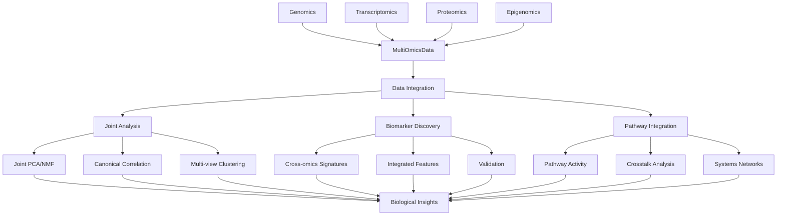

# Multi-Omics: Integrated Biological Data Analysis

The multi-omics module provides tools for integrating and analyzing data from multiple omic layers including genomics, transcriptomics, proteomics, and epigenomics to enable systems-level biological analysis.

## Overview

This module enables comprehensive systems biology analysis by combining data from different molecular layers to understand complex biological processes, identify multi-omic signatures, and discover integrated biomarkers.

## Core Components

### [Data Integration](./integration.md)
Framework for combining heterogeneous biological datasets:
- Cross-platform data harmonization and alignment
- Multi-omics data container with sample matching
- Joint statistical analysis across omics layers
- Batch effect correction for integrated datasets
- Data quality assessment and filtering

### [Joint Analysis](./joint_analysis.md)
Statistical and computational methods for multi-omic analysis:
- Joint dimensionality reduction (joint PCA, NMF)
- Canonical correlation analysis (CCA)
- Multi-view clustering and consensus clustering
- Cross-omics correlation and association analysis
- Integrative network construction

### [Biomarker Discovery](./biomarkers.md)
Multi-omics biomarker identification and validation:
- Cross-omics signature identification
- Integrated feature selection across omics
- Multi-omics biomarker discovery pipelines
- Validation and statistical testing
- Biological interpretation of multi-omic signatures

### [Pathway Integration](./pathway_integration.md)
Pathway-level integration and enrichment analysis:
- Multi-omics pathway analysis
- Cross-omics pathway crosstalk detection
- Pathway activity inference from multiple data types
- Integrated pathway visualization
- Systems-level pathway interpretation

## Architecture



## Key Features

### Multi-Omics Data Container
- **Sample Alignment**: Automatic alignment of samples across omics layers
- **Data Validation**: Comprehensive validation of multi-omic datasets
- **Missing Data Handling**: Robust handling of missing values across layers
- **Metadata Integration**: Integration of sample and feature metadata

### Integration Methods
- **Joint PCA**: Principal component analysis across multiple omics
- **Joint NMF**: Non-negative matrix factorization for multi-view data
- **Canonical Correlation**: Find correlations between omics layers
- **Multi-view Clustering**: Consensus clustering across data types

### Biomarker Discovery
- **Cross-omics Signatures**: Identify patterns across multiple data types
- **Integrated Feature Selection**: Select features important across omics
- **Multi-omics Validation**: Statistical validation of integrated biomarkers
- **Biological Interpretation**: Link to pathways and functional annotation

## Quick Start

### Basic Multi-Omics Integration

```python
from metainformant.multiomics import integration

# Load data from multiple omics layers
genomics_data = pd.read_csv("genomics_features.csv", index_col=0)
transcriptomics_data = pd.read_csv("expression_matrix.csv", index_col=0)
proteomics_data = pd.read_csv("protein_abundances.csv", index_col=0)

# Create multi-omics container
multiomics_data = integration.MultiOmicsData(
    genomics=genomics_data,
    transcriptomics=transcriptomics_data,
    proteomics=proteomics_data
)

print(f"Integrated {multiomics_data.n_samples} samples across {multiomics_data.n_omics} omics layers")
```

### Joint Dimensionality Reduction

```python
from metainformant.multiomics import joint_pca, joint_nmf

# Joint PCA across omics layers
joint_pca_result = joint_pca(
    multiomics_data,
    n_components=50,
    standardize=True,
    weights=None  # Equal weighting, or specify custom weights
)

# Access joint components
joint_components = joint_pca_result['components']
explained_variance = joint_pca_result['explained_variance']

# Joint NMF for multi-view factorization
joint_nmf_result = joint_nmf(
    multiomics_data,
    n_components=20,
    max_iter=1000,
    random_state=42
)
```

### Multi-Omics Biomarker Discovery

```python
from metainformant.multiomics import biomarker_discovery

# Identify multi-omics signatures
signatures = biomarker_discovery.find_multiomics_signatures(
    multiomics_data,
    phenotype_labels,
    min_overlap=2,           # Minimum omics layers
    max_features=100,        # Maximum features per signature
    statistical_test="f_test"
)

# Validate signatures
validated_signatures = biomarker_discovery.validate_signatures(
    signatures,
    multiomics_data,
    validation_method="cross_validation",
    n_folds=5
)

# Export for interpretation
biomarker_discovery.export_signatures(
    validated_signatures,
    output_file="multiomics_signatures.csv"
)
```

## Integration with Other Modules

### With Expression Data

```python
from metainformant.rna import workflow
from metainformant.multiomics import integration

# Load RNA expression data
expression_data = workflow.extract_expression_patterns(rna_data)

# Add to multi-omics container
multiomics_data = integration.MultiOmicsData(
    transcriptomics=expression_data,
    # Add other omics data...
)

# Joint analysis with expression
joint_analysis = integration.joint_pca(multiomics_data)
```

### With Network Analysis

```python
from metainformant.networks import ppi, pathway
from metainformant.multiomics import integration

# Load PPI network
protein_network = ppi.load_string_network()

# Load pathway data
pathway_network = pathway.load_pathway_database("kegg")

# Multi-omics network analysis
network_results = integration.multi_omics_network_analysis(
    multiomics_data,
    protein_network,
    pathway_network,
    analysis_type="integrated"
)
```

### With Machine Learning

```python
from metainformant.ml import classification
from metainformant.multiomics import biomarker_discovery

# Multi-omics feature extraction
multiomic_features = biomarker_discovery.extract_multiomic_features(
    multiomics_data,
    feature_types=["expression", "genomic", "proteomic"]
)

# Multi-omics classification
model = classification.train_classifier(
    multiomic_features,
    labels,
    method="ensemble",
    feature_selection=True
)
```

## Advanced Workflows

### Cross-Omics Correlation Analysis

```python
from metainformant.multiomics import canonical_correlation

# Canonical correlation between transcriptomics and proteomics
cca_results = canonical_correlation(
    multiomics_data.transcriptomics,
    multiomics_data.proteomics,
    n_components=10,
    regularization=0.1
)

# Interpret correlations
correlations = cca_results['correlations']
canonical_variables = cca_results['canonical_variables']
```

### Multi-Omics Clustering

```python
from metainformant.multiomics import multi_view_clustering

# Multi-view clustering across omics layers
clustering_results = multi_view_clustering(
    multiomics_data,
    n_clusters=5,
    method="consensus",      # Consensus clustering
    base_methods=["kmeans", "hierarchical", "spectral"],
    consensus_function="majority"
)

# Analyze cluster coherence
cluster_omics = clustering_results['cluster_omics']
consensus_matrix = clustering_results['consensus_matrix']
```

## Performance Features

- **Scalable Integration**: Efficient algorithms for large multi-omic datasets
- **Memory Optimization**: Streaming processing for large feature matrices
- **Parallel Processing**: Multi-core support for computationally intensive operations
- **Sparse Matrix Support**: Memory-efficient storage for sparse omics data

## Data Compatibility

### Supported Data Types
- **Genomics**: SNP data, copy number variations, genomic features
- **Transcriptomics**: Gene expression (RNA-seq, microarray), alternative splicing
- **Proteomics**: Protein abundance, post-translational modifications
- **Epigenomics**: DNA methylation, histone modifications, chromatin accessibility
- **Metabolomics**: Metabolite concentrations and profiles

### Data Format Requirements
- **Sample Alignment**: Samples must be aligned across omics layers
- **Feature Annotation**: Features should be properly annotated
- **Quality Control**: Pre-filtering and normalization recommended
- **Missing Data**: Robust handling of missing values across layers

## Testing

Multi-omics functionality is tested comprehensively:

```bash
# Run all multi-omics tests
uv run pytest tests/test_multiomics_*.py -v

# Test specific components
uv run pytest tests/test_multiomics_integration.py::test_MultiOmicsData -v
uv run pytest tests/test_multiomics_joint_analysis.py::test_joint_pca -v
```

## Related Documentation

- [Data Integration](./integration.md): Multi-omics data container and integration
- [Joint Analysis](./joint_analysis.md): Joint statistical analysis methods
- [Biomarker Discovery](./biomarkers.md): Multi-omics biomarker identification
- [Pathway Integration](./pathway_integration.md): Pathway-level multi-omics analysis
