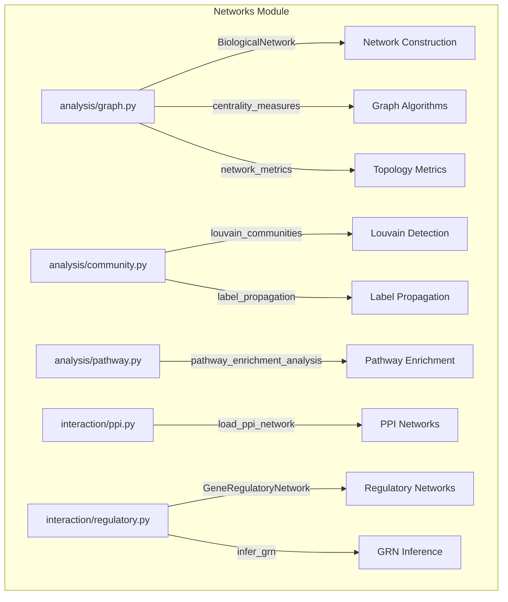

# NETWORKS

## Overview
Network analysis module for METAINFORMANT.

## 📦 Contents
- **[analysis/](analysis/)** — Graph algorithms, community detection, pathway analysis
- **[interaction/](interaction/)** — Protein-protein and regulatory interactions
- **[regulatory/](regulatory/)** — Gene regulatory network analysis
- **[config/](config/)** — Network analysis configuration
- **[workflow/](workflow/)** — Network analysis workflows

## 📊 Structure



## Usage
Import module:
```python
from metainformant.networks import ...
```
