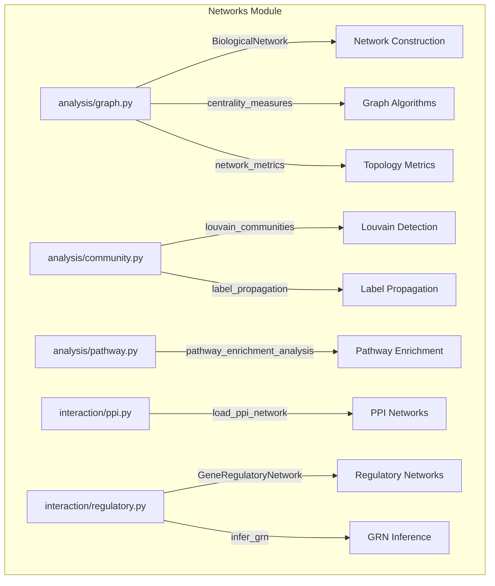

# NETWORKS

## Overview
Network analysis module for METAINFORMANT.

## Contents
- **[analysis/](graph.md)** — Graph algorithms, community detection, pathway analysis
- **[interaction/](ppi.md)** — Protein-protein and regulatory interactions
- **[regulatory/](regulatory.md)** — Gene regulatory network analysis
- **config/** — Network analysis configuration
- **workflow/** — Network analysis workflows

## Structure



## Usage
Import module:
```python-snippet
from metainformant.networks import ...
```
