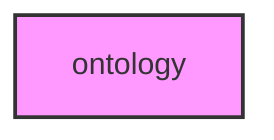

# ONTOLOGY

## Overview
Gene ontology and functional annotation module for METAINFORMANT.

## 📦 Contents
- `core/` — GO ontology loading, OBO parsing, type definitions (`go.py`, `obo.py`, `types.py`)
- `query/` — Ontology querying and serialization (`query.py`, `serialize.py`)
- `visualization/` — Ontology visualization (`visualization.py`)
- `pathway_enrichment/` — Pathway enrichment analysis

## 📊 Structure



## Usage
Import module:
```python
from metainformant.ontology import ...
```
