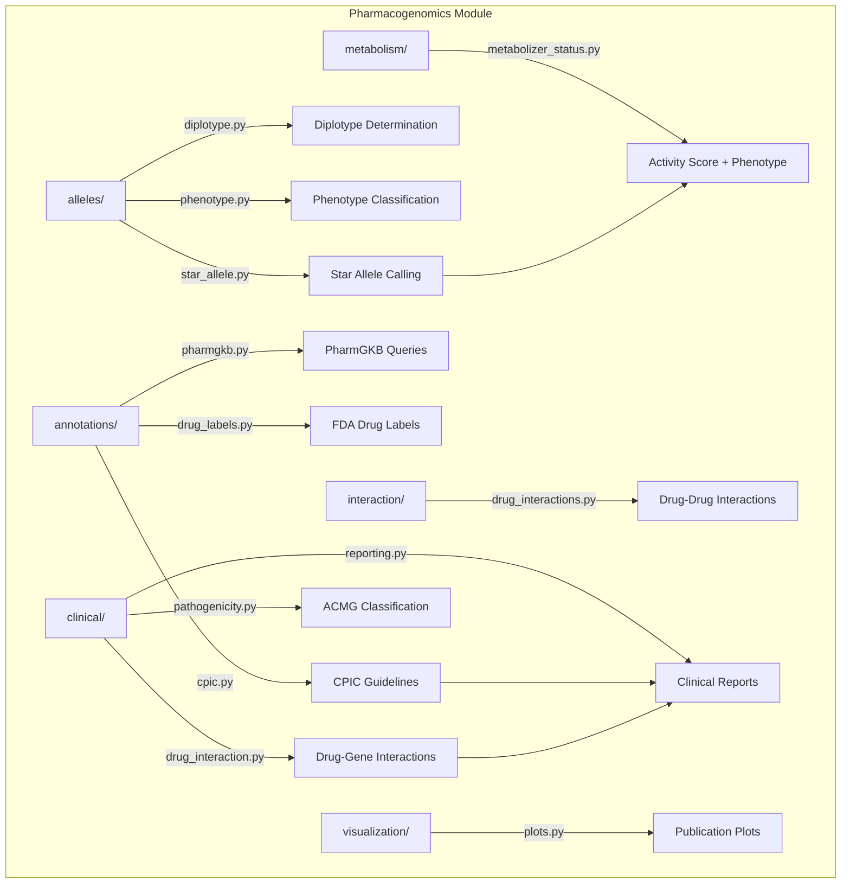

# Pharmacogenomics

## Overview

Clinical pharmacogenomic analysis module for METAINFORMANT. Covers star allele calling, metabolizer phenotyping, CPIC guideline lookups, drug interaction prediction, and report generation.

## Contents

- **alleles/** - Star allele calling, diplotype determination, phenotype classification
- **annotations/** - CPIC guideline lookups, PharmGKB queries, FDA drug label parsing
- **metabolism/** - CPIC activity score computation, metabolizer phenotype prediction
- **interaction/** - Drug-drug interaction prediction, polypharmacy risk, CYP profiling
- **clinical/** - ACMG variant classification, drug-gene analysis, clinical reports
- **visualization/** - Metabolizer distributions, allele frequencies, drug response heatmaps

## Architecture



## Usage

```python
from metainformant.pharmacogenomics.alleles import star_allele, diplotype, phenotype
from metainformant.pharmacogenomics.annotations import cpic, pharmgkb
from metainformant.pharmacogenomics.metabolism import metabolizer_status
from metainformant.pharmacogenomics.interaction import drug_interactions
from metainformant.pharmacogenomics.clinical import reporting, pathogenicity
```
