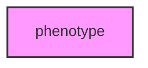

# PHENOTYPE

## Overview
Phenotype module for MetaInformAnt.

## 📦 Contents
- **[analysis/](analysis/)**
- **[behavior/](behavior/)**
- **[chemical/](chemical/)**
- **[data/](data/)**
- **[electronic/](electronic/)**
- **[morphological/](morphological/)**
- **[sonic/](sonic/)**
- **[visualization/](visualization/)**
- `[__init__.py](__init__.py)`

## 📊 Structure



## Usage
Import module:
```python
from metainformant.phenotype import ...
```
