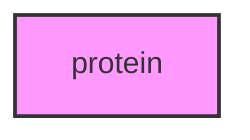

# PROTEIN

## Overview
Protein sequence and structure analysis module for METAINFORMANT.

## 📦 Contents
- **[database/](database/)**
- **[sequence/](sequence/)**
- **[structure/](structure/)**
- **[visualization/](visualization/)**
- `[__init__.py](__init__.py)`

## 📊 Structure



## Usage
Import module:
```python
from metainformant.protein import ...
```
