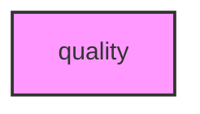

# QUALITY

## Overview
Functionality for quality.

## 📦 Contents


## 📊 Structure


```mermaid
graph TD
    quality[quality]
    style quality fill:#f9f,stroke:#333,stroke-width:2px
```

## Usage
Import module:
```python
from metainformant.quality import ...
```
