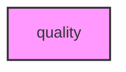

# QUALITY

## Overview
Quality control analysis module for METAINFORMANT.

## 📦 Contents
- **[analysis/](analysis/)**
- **[io/](io/)**
- `[__init__.py](__init__.py)`

## 📊 Structure



## Usage
Import module:
```python
from metainformant.quality import ...
```
