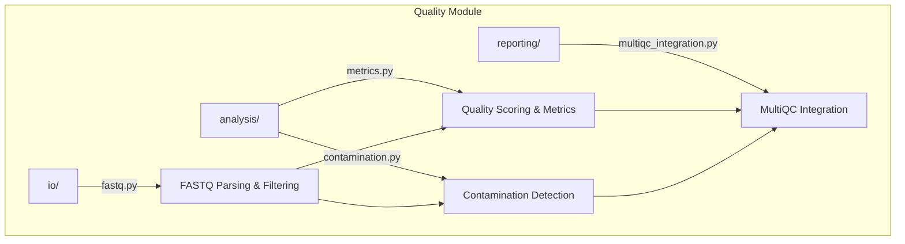

# QUALITY

## Overview
Quality control analysis module for METAINFORMANT.

## Contents
- **[Analysis](metrics.md)**
- **[I/O](fastq.md)**
- `__init__.py`

## Structure


```mermaid
graph TD
    subgraph "Quality Module"
        IO[io/] --> |fastq.py| FQ[FASTQ Parsing & Filtering]

        A[analysis/] --> |metrics.py| QM[Quality Scoring & Metrics]
        A --> |contamination.py| CD[Contamination Detection]

        R[reporting/] --> |multiqc_integration.py| MQ[MultiQC Integration]
    end

    FQ --> QM
    FQ --> CD
    QM --> MQ
    CD --> MQ
```

## Usage
Import module:
```python-snippet
from metainformant.quality import ...
```
