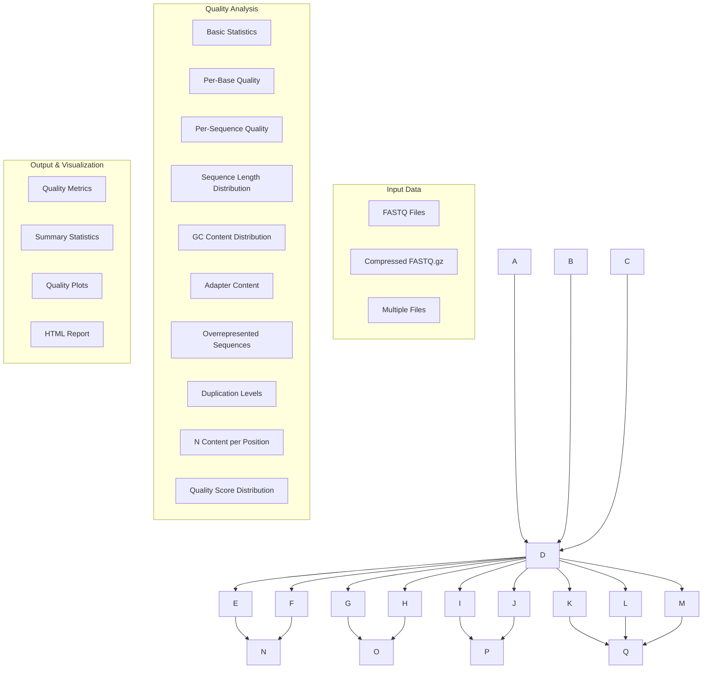

# Quality Control

METAINFORMANT's quality control module provides comprehensive tools for assessing and visualizing the quality of high-throughput sequencing data.

## Overview

The quality control module offers FastQC-like functionality for analyzing FASTQ files and other sequencing data formats. It provides detailed metrics, visualizations, and reports to help researchers identify potential issues in their sequencing data before downstream analysis.

## Architecture



## Key Features

### Comprehensive Analysis
- **Basic Statistics**: Read count, length distribution, GC content
- **Quality Metrics**: Per-base and per-sequence quality scores
- **Sequence Analysis**: Length distribution, GC content, N content
- **Contamination Detection**: Adapter content, overrepresented sequences
- **Duplication Assessment**: Sequence duplication levels

### FastQC Compatibility
- **Similar Metrics**: Implements most FastQC analysis modules
- **Familiar Output**: Results comparable to FastQC reports
- **Performance**: Optimized implementation with Python/NumPy
- **Extensibility**: Easy to add custom analysis modules

### Integration
- **Core Utilities**: Uses METAINFORMANT's I/O and path handling
- **Batch Processing**: Analyze multiple files efficiently
- **Visualization**: Generate publication-ready plots
- **Output Flexibility**: JSON, CSV, and HTML report formats

## Quick Start

```python
from metainformant.quality.fastq import analyze_fastq_quality

# Analyze single FASTQ file
results = analyze_fastq_quality("sample.fastq.gz")

# Print basic statistics
print("Basic Statistics:")
print(f"  Total sequences: {results['basic_stats']['total_sequences']:,}")
print(f"  Sequence length: {results['basic_stats']['sequence_length']}")
print(f"  GC content: {results['basic_stats']['gc_content']:.1f}%")
print(f"  Mean quality: {results['basic_stats']['mean_quality']:.1f}")

# Check for issues
if results['adapter_content']['max_adapter_content'] > 20:
    print("Warning: High adapter content detected")

if results['basic_stats']['mean_quality'] < 28:
    print("Warning: Low mean quality score")
```

## Analysis Modules

### [FASTQ Analysis](./fastq.md)
Comprehensive quality assessment for FASTQ sequencing files including:
- Per-base quality scores and nucleotide content
- Sequence length and GC content distributions  
- Adapter contamination detection
- Duplicate sequence identification
- Overrepresented sequence analysis

## Module Structure

- **[fastq.py](./fastq.md)**: Complete FASTQ quality analysis suite

## Additional Modules

### Contamination Detection
- **Cross-species contamination**: Detect reads from unexpected organisms
- **rRNA contamination**: Identify ribosomal RNA sequences
- **Mycoplasma detection**: Screen for common cell culture contaminants
- **Adapter detection**: Identify and remove adapter sequences
- **Vector contamination**: Detect plasmid and vector sequences

### Quality Metrics
- **Quality score calculations**: Comprehensive quality scoring algorithms
- **Completeness and accuracy metrics**: Statistical quality assessments
- **Batch effect detection**: Identify systematic differences between samples
- **Quality normalization**: Correct for technical artifacts

## Planned Extensions

Future quality control modules will include:

### Alignment Quality
- **BAM/SAM analysis**: Quality metrics for aligned reads
- **Mapping statistics**: Alignment rates and insert size distributions
- **Coverage analysis**: Depth and evenness of coverage

### Advanced Multi-Sample Analysis
- **Sample correlation**: Compare samples for consistency
- **Outlier detection**: Identify problematic samples
- **Reproducibility assessment**: Technical and biological replicate analysis

## File Format Support

### Current Support
- **FASTQ**: Standard and compressed (.gz) formats
- **Multi-file**: Batch processing of multiple FASTQ files
- **Paired-end**: Support for R1/R2 paired files

### Planned Support
- **BAM/SAM**: Aligned read quality assessment
- **FASTA**: Sequence quality for assembled genomes
- **BCL**: Direct analysis from Illumina base calls

## Integration with Analysis Pipelines

### Preprocessing Integration

```python
from metainformant.quality.fastq import analyze_fastq_quality
from metainformant.dna.fastq import process_fastq_file

# 1. Quality assessment
qc_results = analyze_fastq_quality("raw_reads.fastq.gz")

# 2. Apply quality filters based on QC results
if qc_results['basic_stats']['mean_quality'] >= 30:
    # High quality - minimal filtering
    filtered_reads = process_fastq_file(
        "raw_reads.fastq.gz",
        min_quality=20,
        min_length=50
    )
else:
    # Lower quality - more stringent filtering
    filtered_reads = process_fastq_file(
        "raw_reads.fastq.gz", 
        min_quality=25,
        min_length=75
    )
```

### Pipeline Quality Gates

```python
def quality_gate_check(qc_results, thresholds=None):
    """
    Determine if sequencing data passes quality thresholds.
    
    Args:
        qc_results: Results from analyze_fastq_quality()
        thresholds: Dictionary of quality thresholds
    
    Returns:
        bool: True if data passes all thresholds
    """
    
    if thresholds is None:
        thresholds = {
            'min_mean_quality': 28,
            'max_adapter_content': 20,
            'max_n_content': 5,
            'min_total_sequences': 1000000
        }
    
    checks = {
        'mean_quality': qc_results['basic_stats']['mean_quality'] >= thresholds['min_mean_quality'],
        'adapter_content': qc_results['adapter_content']['max_adapter_content'] <= thresholds['max_adapter_content'],
        'n_content': qc_results['n_content_per_position']['max_n_content'] <= thresholds['max_n_content'],
        'sequence_count': qc_results['basic_stats']['total_sequences'] >= thresholds['min_total_sequences']
    }
    
    all_passed = all(checks.values())
    
    if not all_passed:
        print("Quality gate failures:")
        for check, passed in checks.items():
            if not passed:
                print(f"  - {check}: FAIL")
    
    return all_passed

# Example usage
if quality_gate_check(qc_results):
    print("✓ Data passes quality gates - proceeding with analysis")
else:
    print("✗ Data fails quality gates - consider preprocessing or exclusion")
```

## Output Formats

### JSON Output
```python
# Structured data for programmatic access
results = analyze_fastq_quality("sample.fastq.gz", output_format="json")

# Save results
import json
with open("qc_results.json", "w") as f:
    json.dump(results, f, indent=2)
```

### CSV Output
```python
# Tabular format for spreadsheet analysis
results = analyze_fastq_quality("sample.fastq.gz", output_format="csv")

# Results saved as CSV files:
# - basic_stats.csv
# - per_base_quality.csv  
# - sequence_length_distribution.csv
# - etc.
```

### HTML Report (Planned)
```python
# Interactive HTML report similar to FastQC
generate_html_report(qc_results, output_file="qc_report.html")
```

## Performance Characteristics

### Benchmarks
- **Processing Speed**: ~1-2 million reads per minute
- **Memory Usage**: <1GB for typical FASTQ files
- **Scalability**: Linear scaling with file size
- **Parallel Processing**: Support for multi-file batch analysis

### Optimization Features
- **Streaming Analysis**: Process large files without loading into memory
- **Compressed Input**: Direct analysis of gzipped files
- **Sampling**: Optional subsampling for very large datasets
- **Caching**: Cache intermediate results for repeated analysis

## Best Practices

### Quality Assessment Workflow

1. **Pre-analysis QC**: Always run quality control before any analysis
2. **Threshold Setting**: Establish appropriate quality thresholds for your application
3. **Comparative Analysis**: Compare quality metrics across samples
4. **Documentation**: Keep detailed records of quality metrics and decisions

### Interpretation Guidelines

1. **Quality Scores**: Phred scores ≥30 are generally considered high quality
2. **GC Content**: Should match expected values for your organism
3. **Adapter Content**: <1% is ideal, >20% requires attention
4. **Duplication**: High duplication may indicate PCR artifacts or low complexity

### Integration with Workflows

1. **Automated QC**: Integrate quality checks into analysis pipelines
2. **Quality Gates**: Use QC results to automatically filter poor samples
3. **Parameter Optimization**: Adjust analysis parameters based on QC results
4. **Reporting**: Include QC metrics in final analysis reports

## Dependencies

### Required
- `numpy`: Numerical computations
- `pandas`: Data manipulation  
- `scipy`: Statistical functions

### Optional
- `matplotlib`: For generating quality plots
- `seaborn`: Enhanced visualization
- `plotly`: Interactive quality reports

## Testing

Comprehensive tests are available in `tests/test_quality_fastq.py`:

```bash
# Run quality control tests
uv run pytest tests/test_quality_fastq.py -v
```

## Related Documentation

- [FASTQ Analysis](./fastq.md): Detailed FASTQ quality assessment
- [DNA FASTQ Processing](../dna/fastq.md): FASTQ sequence processing
- [Core I/O](../core/io.md): File handling utilities
- [Visualization](../visualization/plots.md): Quality plot generation
