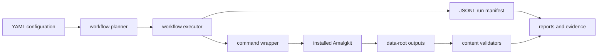

# RNA module architecture

The RNA module is a thin, testable orchestration layer around the installed
Amalgkit CLI. It does not invent a second command vocabulary: the command
registry and installed `--help` output define what can be executed.

## Data flow



## Main components

- `src/metainformant/rna/amalgkit/commands.py` declares current commands,
  command-specific options, and step categories.
- `src/metainformant/rna/amalgkit/_amalgkit_impl.py` builds safe command lines,
  filters wrapper-only values, runs subprocesses, and captures logs.
- `src/metainformant/rna/engine/workflow_planning.py` applies defaults,
  resolves output roots, and determines resumable completion.
- `src/metainformant/rna/engine/workflow_execution.py` executes the plan and
  records step results.
- `src/metainformant/rna/engine/workflow_steps.py` validates prerequisites and
  performs post-step checks.
- `src/metainformant/rna/engine/progress_db.py` exposes sample-level progress
  without scanning raw data unnecessarily.
- `src/metainformant/rna/analysis/` contains downstream statistics and
  visualization helpers; it is separate from pipeline execution.

## Current command registry

```python
CURRENT_AMALGKIT_STEPS = {
    "metadata", "select", "getfastq", "integrate", "quant", "merge",
    "wsfilter", "cstmm", "csfilter", "finalize", "sanity",
}
```

The default single-species plan is:

```text
metadata → select → getfastq → integrate → quant → merge →
wsfilter → finalize → sanity
```

Cross-species commands are opt-in because their inputs and interpretation are
different from per-species processing.

## Integrity boundaries

Each species configuration resolves to one work root. The planner and wrappers
must not mix output roots from another species or silently redirect a mounted
data root. A valid analysis records:

- configuration and tool-version fingerprints;
- selected metadata and sample-ID reconciliation;
- per-sample quantification evidence;
- exact upstream/downstream input paths;
- checksums or file sizes for compact result artifacts;
- warnings and incomplete species explicitly.

## Extension rule

Add a new command only when the installed Amalgkit release exposes it and a
real command-builder test, prerequisite validator, documentation page, and
evidence-manifest field are added together. A smoke import is not sufficient
for a new scientific step.
