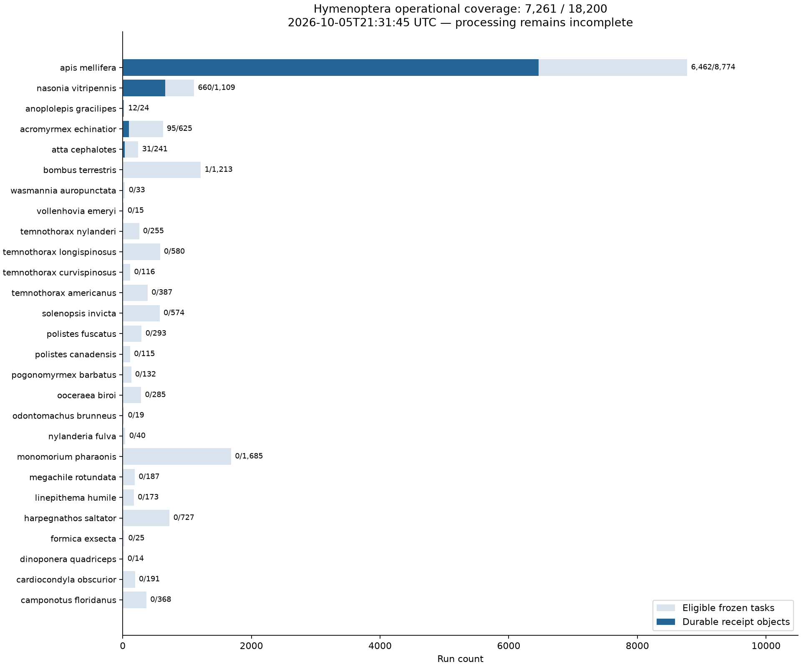

# Hymenoptera completion checkpoint — 2026-10-05

Observed at **2026-10-05T21:31:45.062900+00:00**. This is an operational checkpoint, not a
completed expression atlas or a biological result.

| Quantity | Checkpoint |
|---|---:|
| Configured species | 27 |
| Eligible frozen runs | 18,200 |
| Newly included runs | 2,492 |
| Explicit permanent exclusions | 106 |
| Eligible runs with durable receipt objects | 7,261 (39.9%) |
| Remaining eligible runs | 10,939 |
| Active AWS jobs | 1 |
| Conservative gross campaign usage | $70.13 |
| Approved total gross ceiling | $750 |

Receipt coverage intersects listed S3 receipt keys with eligible frozen task IDs.
It does not replace the final all-sample restore and hash-validation certificate.
The reference-binding repair adds a separate bound-receipt namespace; this
historical coverage table counts recovery receipt objects. Those objects require
verified resealing against actual frozen index bytes before completion eligibility.
The independent cost checkpoint precedes the object-list completion by less than
one minute; credits do not reduce the gross campaign guard.



The [TSV](figures/hymenoptera_coverage_20261005.tsv) supplies every plotted count.
The [JSON](figures/hymenoptera_coverage_20261005.json) records inventory and receipt
key hashes, time, scope, and count semantics. The frozen inventory hash is
`be233765099cf0baa662fb899d666988e93e83042b072d36b3735fe5f47e9324`. This snapshot remains dated while processing continues.

## Recovery and processing

Original outputs yielded 6,600 verified durable locks; ten filesystem failures
remain eligible for normal reprocessing. Sparse recovery of five truncated cloud
archives recovered 464 valid complete samples without retaining their raw-read
payloads. These are recovery counts and may overlap later receipt coverage; do
not add them to the table denominator or count them as new biological samples.

All 21 zero-read ENA stubs now have hash-bound public NCBI RNA-Seq evidence and
verified source-file sizes. The real Bombus SRR21294731 canary processed
13,746,128 pairs and pseudoaligned 12,214,277 (88.9%). It was durably published
and successfully restored from S3 into a fresh destination. This demonstrates
acquisition, quantification, and restore for that run.

The controller admits one bounded EC2 worker at a time, reserves each complete
job deadline before admission, and terminates overdue instances. Worker storage
is encrypted; disk floors, raw-byte admission limits, exact reference-index
selection, receipt validation, and shutdown watchdogs apply. Durable storage uses
content-addressed blobs, verified receipt publication, conditional writes and S3
versioning; it does not claim legal Object Lock retention.

## Methods and validation

[Methods](HYMENOPTERA_METHODS.md) document the pinned Amalgkit 0.16.60 workflow,
normalization, Welch testing, multiplicity handling, PCA, metadata alignment,
figure semantics and inferential boundaries. [Durability](DURABLE_QUANT.md)
documents the recovery and completion interfaces. The committed `uv.lock`
records the tested dependency resolution; use `uv sync --frozen --extra rna
--extra aws` from the repository root.

The clean Python 3.14.7 parent run passed **10,420 tests**, with 41 skips and
201 network/external-tool deselections. All **61 focused controls** passed
without marker deselection, and the nested project passed **154 tests**.
Controls include independent numerical oracles, malformed inputs, real-file
restore/corruption cases, metadata boundary cases, controller ownership/replay,
and independently checked interval geometry. Skipped or deselected integrations
are not asserted as verified by those runs.

## Remaining release gates

Complete all eligible receipt coverage, restore and verify every bound output,
then run merge, wsfilter, finalize and sanity on the same snapshot. Harmonize
metadata and biological replicate units; verify orthology, study/batch design,
and species trees before inferential comparisons. Generate final statistics,
figures and captions from those validated products, and pass the complete
project evidence manifest. These gates remain unfinished.

## Replot the preserved table

This reproduces the counts from the published snapshot without AWS credentials:

```python
from pathlib import Path
import matplotlib.pyplot as plt
import pandas as pd

frame = pd.read_csv("docs/rna/figures/hymenoptera_coverage_20261005.tsv", sep="\t")
assert len(frame) == 27 and frame.eligible.sum() == 18200
assert frame.receipt_count.sum() == 7261
fig, ax = plt.subplots(figsize=(12, 10), layout="constrained")
y = range(len(frame))
ax.barh(y, frame.eligible, label="Eligible frozen tasks", color="#d9e3ee")
ax.barh(y, frame.receipt_count, label="Durable receipt objects", color="#246596")
ax.set_yticks(list(y), frame.species.str.replace("_", " "), fontsize=9)
ax.set_xlabel("Run count")
ax.set_title("Hymenoptera coverage: 7,261 / 18,200 — 2026-10-05 checkpoint")
ax.legend()
Path("output").mkdir(exist_ok=True)
fig.savefig("output/hymenoptera_coverage_checkpoint.png", dpi=160)
```
