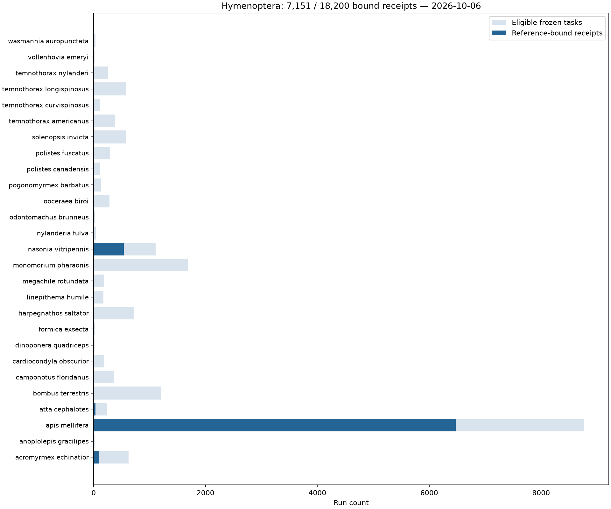

# Hymenoptera completion checkpoint — 2026-10-06

Observed at **2026-10-06T13:46:22.727311+00:00**. This describes processing coverage, not a
completed expression atlas or biological result.

| Quantity | Checkpoint |
|---|---:|
| Configured species | 27 |
| Eligible frozen runs | 18,200 |
| Newly included runs | 2,492 |
| Permanent exclusions | 106 |
| Eligible runs with reference-bound receipt objects | 7,151 (39.3%) |
| Remaining eligible runs | 11,049 |
| Active AWS workers | 1 |
| Conservative gross usage | $79.00 |
| Authorized gross ceiling | $750 |

The [TSV](figures/hymenoptera_coverage_20261006.tsv) contains every plotted count.
The [JSON](figures/hymenoptera_coverage_20261006.json) records observation times,
inventory and receipt-key hashes, and count semantics. The usage checkpoint is
from 2026-10-06T13:46:08.913548+00:00. Receipt listing is intersected with frozen eligible
task identifiers. Final completion still requires restoring and validating every
output and issuing the all-sample certificate.

## Recovery and operational continuity

All 6,610 original local candidates now have reference-bound seals, including the
ten earlier filesystem failures. This count overlaps receipt coverage and must not
be added to it. Legacy unbound recovery receipts remain immutable and do not count
as completion evidence. The controller was resumed from its existing ledger after
its local terminal session stopped; the existing EC2 worker and task assignment
were preserved. Processing continues with one bounded worker at a time.

## Integrity and resource controls

[Durability](DURABLE_QUANT.md) describes the separated storage, validation, input
bundling and cost-accounting modules. Quant validation now rejects boolean or
fractional read counters, impossible alignment counts, target-count mismatches,
nonpositive lengths and overflowing aggregate expression. Fractional abundance
estimates remain valid. Twelve deterministic malformed examples were accepted
before the repair and rejected after it. All 60 focused controls pass, and the real
Bombus SRR21294731 bound receipt was restored from S3 and validated again against
the frozen configuration and index, including all 31,232 targets.

New worker reservations include current regional compute and provisioned gp3
prices, a conservative shortest-month storage conversion, public IPv4 and an
operating margin. Each admission persists its own rate; legacy jobs retain their
original ledger rate. Termination requests accrue cost until termination is
observed. Worker startup uses both RNA and AWS extras from the frozen lock.

[Methods](HYMENOPTERA_METHODS.md) retain the pinned Amalgkit 0.16.60 contract,
normalization, statistical testing, multiplicity and visualization semantics.
All-sample quant completion, downstream merge/wsfilter/finalize/sanity, finalized
matrix certification, harmonized replicate units and inferential release gates
remain unfinished. Hosted tests additionally require the scoped private-submodule
credential; local checks cannot establish hosted authentication readiness.

## Later resource observation

The one-worker table above remains the 13:46 UTC snapshot. A separately
[recorded later checkpoint](../../projects/hymenoptera_amalgkit/doc/01_infrastructure/completion_checkpoint_20261006.json)
documents the six-worker trial, shared deadline reservations and unchanged $750
gross ceiling. Do not substitute those later resource facts into this preserved
coverage figure or interpret added capacity as a measured linear speedup.
