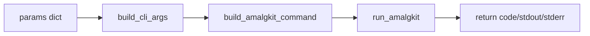

# RNA: amalgkit Wrapper

Utilities converting parameter dicts to CLI flags and executing `amalgkit` subcommands.

Key functions: `build_cli_args`, `build_amalgkit_command`, `check_cli_available`, `run_amalgkit`, and convenience wrappers per subcommand: `metadata`, `integrate`, `config`, `select`, `getfastq`, `quant`, `merge`, `cstmm`, `curate`, `csca`, `sanity`.



Example

```python
from metainformant.rna import amalgkit as ak

ok, help_text = ak.check_cli_available()
cmd = ak.build_amalgkit_command("metadata", {"species-list": ["Apis_mellifera"], "threads": 8})

# Execute a step and capture output
res = ak.run_amalgkit("metadata", {"species-list": ["Apis_mellifera"]}, work_dir="output/amalgkit/work")
print(res.returncode, len(res.stdout))
```

## Config-driven workflow

Drive a full multi-step run from a config file under `config/`.

1. Edit `config/amalgkit_pbarbatus.yaml` (provided) or create your own.
2. From Python:

```python
from metainformant.rna.workflow import load_workflow_config, execute_workflow

cfg = load_workflow_config("config/amalgkit_pbarbatus.yaml")
codes = execute_workflow(cfg, check=False)
print(codes)
```

Logs are written to the configured `log_dir`. A line-delimited JSON manifest is written to `<work_dir>/amalgkit.manifest.jsonl`.

### CLI

You can also run from the CLI using a config file:

```bash
python3 -m metainformant rna run-config --config config/amalgkit_pbarbatus.yaml --check | cat
```

Check that `amalgkit` is on PATH first:

```bash
amalgkit -h | head -n 20
```

### Provided config for Pogonomyrmex barbatus

See `config/amalgkit_pbarbatus.yaml`. It targets NCBI:txid144034 and sets sensible defaults to write under `output/` per repo policy.

## Parameters to CLI flags

The wrapper follows simple rules implemented in `build_cli_args`:

- None values are skipped
- bool True adds only the flag (False is skipped)
- lists/tuples repeat the flag per item
- `pathlib.Path` is stringified
- other scalars are appended as `--flag value`

This enables a clean, typed interface in Python while preserving the exact `amalgkit` flag names.

## Logging and manifests

All `run_amalgkit` invocations can write per-step logs to `log_dir` (default `work_dir/logs`). The workflow runner also emits:

- JSON Lines manifest: `work_dir/amalgkit.manifest.jsonl`
- Compact JSON summary: `work_dir/amalgkit.report.json`
- Markdown summary: `work_dir/amalgkit.report.md`

These artifacts support reproducibility and audit trails for meta-analysis runs.
