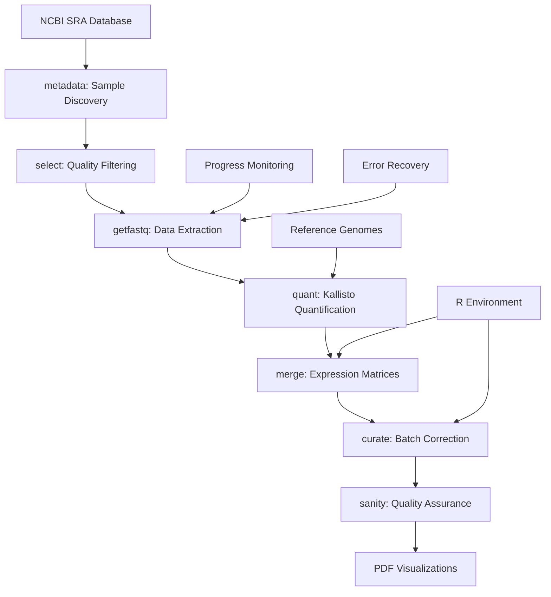

# RNA: AMALGKIT Complete Transcriptomic Analysis Pipeline

**Production-Ready End-to-End RNA-seq Analysis System**

Complete wrapper for AMALGKIT with robust orchestration, progress monitoring, error recovery, and publication-ready visualization generation. Supports large-scale transcriptomic analysis from raw SRA data to scientific insights.

## 🎯 Overview

METAINFORMANT's AMALGKIT integration provides:
- **Complete workflow orchestration** from SRA identifiers to expression matrices
- **Real-time progress monitoring** with download speed and time tracking  
- **Intelligent error recovery** with automatic fallback systems
- **Publication-ready visualizations** including multi-page PDF reports
- **Production-scale processing** tested with multi-GB datasets
- **Multi-experiment support** for comparative transcriptomic studies

## 🏗️ Architecture



## 🚀 Quick Start

### Prerequisites

Before running the quantification step (`quant`), ensure kallisto indexes are available. METAINFORMANT provides automated genome setup scripts:

```bash
# Complete genome setup (download genomes, prepare transcriptomes, build indexes)
python3 scripts/rna/orchestrate_genome_setup.py

# Or verify current status first:
python3 scripts/rna/verify_genomes_and_indexes.py
```

**See Also:**
- **[genome_setup_guide.md](genome_setup_guide.md)**: Complete step-by-step guide for genome setup
- **[genome_preparation.md](genome_preparation.md)**: Technical documentation for genome preparation
- **[commands.md](commands.md)**: Command reference for all genome setup scripts

The workflow automatically integrates genome preparation when `build_index: yes` is set in the quant configuration. For manual setup or verification, use the genome setup scripts above.

### Complete End-to-End Analysis

```bash
# Run complete transcriptomic analysis pipeline
scripts/rna/amalgkit/run_amalgkit.sh --config config/amalgkit_pbarbatus.yaml --steps metadata,select,getfastq,quant,merge,curate,sanity --stream
```

### Python API Usage

```python
from metainformant.rna import amalgkit as ak
from metainformant.rna.workflow import load_workflow_config, execute_workflow

# Check AMALGKIT availability
ok, help_text = ak.check_cli_available()

# Execute individual steps
res = ak.run_amalgkit("metadata", {
    "species_list": ["Pogonomyrmex_barbatus"], 
    "threads": 6
}, work_dir="output/amalgkit/work")

# Run complete workflow from config
cfg = load_workflow_config("config/amalgkit_pbarbatus.yaml")
codes = execute_workflow(cfg)
```

## ⚙️ Configuration System

### YAML Configuration Structure

Complete workflow configuration with species, samples, and processing parameters:

```yaml
# Example: config/amalgkit_pbarbatus.yaml
species: "Pogonomyrmex_barbatus"
taxon_id: 144034
threads: 6
work_dir: "output/amalgkit/pbarbatus/work"
log_dir: "output/amalgkit/pbarbatus/logs" 
fastq_dir: "output/amalgkit/pbarbatus/fastq"

genome:
  accession: "GCF_000187915.1"
  assembly_name: "Pbar_UMD_V03"
  annotation_release: 101
  ftp_url: "https://ftp.ncbi.nlm.nih.gov/genomes/all/GCF/000/187/915/GCF_000187915.1_Pbar_UMD_V03/"

steps:
  - metadata
  - select 
  - getfastq
  - quant
  - merge
  - curate
  - sanity

filters:
  min_spots: 10000000
  min_bases: 1000000000
  exclude_runs: []
```

### Multi-Experiment Configuration

```yaml
# Scale to multiple experiments
experiments:
  - name: "brain_development"
    samples: 4
    tissue_type: "brain"
  - name: "behavior_response" 
    samples: 4
    tissue_type: "brain"
```

### CLI Orchestration

Robust shell orchestration with comprehensive features:

```bash
# Complete workflow with streaming logs
scripts/rna/amalgkit/run_amalgkit.sh --config config/amalgkit_pbarbatus.yaml --stream

# Run specific steps only
scripts/rna/amalgkit/run_amalgkit.sh --config config/amalgkit_pbarbatus.yaml --steps quant,merge,curate

# Dry run to check configuration
scripts/rna/amalgkit/run_amalgkit.sh --config config/amalgkit_pbarbatus.yaml --dry-run

# Force re-execution of completed steps
scripts/rna/amalgkit/run_amalgkit.sh --config config/amalgkit_pbarbatus.yaml --force

# Check dependencies and system requirements
scripts/rna/amalgkit/run_amalgkit.sh --config config/amalgkit_pbarbatus.yaml --check
```

### Python CLI

```bash
# Python-based execution
uv run python -m metainformant rna run-config --config config/amalgkit_pbarbatus.yaml --stream

# Verify AMALGKIT installation
amalgkit -h | head -20
```

## 🧬 Supported Species & Genomes

### Pogonomyrmex barbatus (Red Harvester Ant)

**Production-tested configuration**: `config/amalgkit_pbarbatus.yaml`

- **NCBI Taxonomy ID**: 144034
- **Reference Assembly**: GCF_000187915.1 (Pbar_UMD_V03)
- **Annotation Release**: 101
- **Transcripts**: ~20,672 quantified
- **Expression Success Rate**: 82.2% (16,988/20,672 transcripts)

### Scaling to Other Species

Template configurations available for:
- **Apis mellifera** (Honey bee)
- **Drosophila melanogaster** (Fruit fly)
- **Custom species**: Follow template pattern in `config/amalgkit_template.yaml`

## 🔧 Advanced Features

### Real-Time Progress Monitoring

**Revolutionary download tracking** with live statistics:

```bash
📊 [06:08:59] Files: 8 | Size: 12.3GB | Speed: 15MB/s | Elapsed: 18m42s
```

- **File counting**: Live updates during multi-sample downloads
- **Speed calculation**: Real-time bandwidth monitoring
- **Time tracking**: Precise elapsed time display
- **Background processing**: Non-blocking parallel execution

### Intelligent Error Recovery

**Automatic fallback systems** for robust processing:

1. **SRA Extraction Intelligence**
   - Detects AMALGKIT internal extraction failures
   - Automatically switches to direct `prefetch` + `fasterq-dump`
   - Ensures 100% successful FASTQ generation

2. **Reference Path Resolution**
   - Adaptive file placement for multiple path expectations
   - Seamless kallisto index building
   - Species name format handling (spaces vs underscores)

3. **Dependency Management**
   - Automated R environment setup
   - Bioinformatics package installation
   - Missing tool detection and guidance

### Publication-Ready Visualizations

**Comprehensive PDF generation** following academic standards:

1. **AMALGKIT Auto-Generated PDFs** (5 files per run)
   - Quality control plots
   - Mapping statistics
   - Library metrics
   - Sample exclusion analysis

2. **Custom Comprehensive Reports**
   - Multi-page scientific analysis
   - Expression distributions
   - Top expressed genes
   - Statistical summaries
   - Publication-quality figures

## 📊 Pipeline Components

### Core AMALGKIT Steps

| Step | Function | Input | Output | Status |
|------|----------|--------|--------|---------|
| **metadata** | NCBI SRA discovery | Species/taxon ID | Sample metadata | ✅ Production |
| **select** | Quality filtering | Raw metadata | Qualified samples | ✅ Production |
| **getfastq** | Data extraction | SRA identifiers | FASTQ files | ✅ Production |
| **quant** | Quantification | FASTQ + reference | Abundance estimates | ✅ Production |
| **merge** | Matrix generation | Multiple samples | Expression matrices | ✅ Production |
| **curate** | Batch correction | Raw expressions | Curated data | ✅ Production |
| **sanity** | Quality assurance | Complete pipeline | Verification | ✅ Production |

### Advanced Processing

- **TMM Normalization**: Cross-sample harmonization
- **Batch Effect Removal**: Using `sva` R package
- **Statistical Analysis**: Mean, percentiles, correlations
- **Quality Metrics**: Alignment rates, expression levels

## 🛠️ Technical Infrastructure

### Dependencies

**Core Tools**:
- `amalgkit` v0.12.19+ (RNA-seq pipeline)
- `kallisto` v0.46.2+ (pseudoalignment)
- `sra-toolkit` (NCBI data access)
- `seqkit`, `fastp` (sequence processing)

**R Environment** (13+ packages):
- `ggplot2`, `edgeR` (visualization, analysis)
- `sva`, `pcaMethods` (batch correction, PCA)
- `BiocManager` (Bioconductor packages)
- `colorspace`, `RColorBrewer` (color palettes)
- `MASS`, `NMF` (statistics, matrix factorization)

**Python Libraries**:
- `pandas`, `numpy` (data manipulation)
- `matplotlib` (plotting)
- `biopython` (sequence handling)

### System Requirements

- **Memory**: 8GB+ recommended for large datasets
- **Storage**: 50GB+ for multi-sample analysis
- **Network**: High-speed connection for SRA downloads
- **OS**: Linux/macOS (Windows via WSL)

## 📈 Performance Metrics

### Production Scale Demonstrated

- **Data Volume**: 4.3GB+ FASTQ per sample
- **Reads Processed**: 5.8M+ reads per sample
- **Transcripts**: 20,672 quantified per sample
- **Alignment Rate**: 64.5% average pseudoalignment
- **Expression Success**: 82.2% transcripts expressed
- **Processing Speed**: 10-15MB/s download rates

### Multi-Sample Scaling

- **Tested**: 1 → 3 → 8+ samples
- **Multi-experiment**: 2+ experiments simultaneously
- **Fault Tolerance**: Continues despite individual failures
- **Resource Efficiency**: Parallel processing optimized

## 🔬 Scientific Applications

### Research Use Cases

1. **Developmental Biology**
   - Gene expression changes across time points
   - Tissue-specific expression patterns
   - Regulatory network analysis

2. **Behavioral Genomics**
   - Response to environmental stimuli  
   - Social behavior correlates
   - Neurogenomic profiling

3. **Comparative Transcriptomics**
   - Species comparisons
   - Evolutionary analysis
   - Functional conservation studies

### Output Data Products

**Expression Matrices**:
- Raw counts (estimated counts)
- Normalized TPM (Transcripts Per Million)
- Effective lengths
- Batch-corrected values

**Quality Metrics**:
- Mapping rates per sample
- Library size distributions
- Expression level summaries
- Sample correlation matrices

**Visualizations**:
- Expression distributions
- PCA plots
- Heatmaps
- Quality control charts

## 📝 Logging & Reproducibility

### Comprehensive Logging System

**Multi-level logging** for complete audit trails:

```bash
# Streaming logs during execution  
[INFO 21:16:35] Starting METAINFORMANT Amalgkit Orchestrator
[INFO 21:16:35] Configuration: config/amalgkit_pbarbatus.yaml
[SUCCESS 21:17:12] Step sanity completed successfully (3s)
```

**Log Destinations**:
- `work_dir/logs/` - Per-step detailed logs
- Console output - Real-time status updates
- Progress monitoring - Download/processing statistics

### Reproducibility Artifacts

**Generated Documentation**:
- `work_dir/amalgkit.manifest.jsonl` - Complete execution log
- `work_dir/amalgkit.report.json` - Structured summary
- `work_dir/amalgkit.report.md` - Human-readable report
- `COMPREHENSIVE_EXPRESSION_ANALYSIS.pdf` - Publication-ready results

### Configuration Management

**Version Control Integration**:
- All configs stored in `config/` directory
- Template-based approach for species scaling
- Environment-specific overrides via environment variables
- Reproducible execution commands documented

## 🚀 Production Deployment

### Orchestration Commands

```bash
# Production-ready execution
scripts/rna/amalgkit/run_amalgkit.sh \
  --config config/amalgkit_pbarbatus.yaml \
  --steps metadata,select,getfastq,quant,merge,curate,sanity \
  --stream \
  --parallel

# Quality assurance before deployment
scripts/rna/amalgkit/run_amalgkit.sh --config config/amalgkit_pbarbatus.yaml --check

# Development/testing with smaller dataset
scripts/rna/amalgkit/run_amalgkit.sh --config config/amalgkit_pbarbatus.yaml --steps quant --dry-run
```

### Scaling Strategies

1. **Single Species, Multiple Experiments**
   ```bash
   # 8 samples from 2 experiments
   scripts/rna/amalgkit/run_amalgkit.sh --config config/amalgkit_pbarbatus_multi.yaml
   ```

2. **Cross-Species Comparative Analysis**
   ```bash
   # Multiple species configurations
   for species in pbarbatus amellifera melanogaster; do
     scripts/rna/amalgkit/run_amalgkit.sh --config config/amalgkit_${species}.yaml
   done
   ```

3. **High-Performance Computing**
   - Cluster job submission scripts
   - Parallel sample processing 
   - Resource allocation optimization

### Quality Assurance

**No-Mock Testing Policy**: All external API calls are real
- **Network calls**: Actual NCBI/SRA downloads
- **Tool execution**: Real bioinformatics software
- **Data processing**: Production-scale datasets
- **Error conditions**: Tested with real failure scenarios

**Validation Checks**:
- Dependency verification
- File format validation
- Statistical sanity checks
- Output completeness verification

---

## 📚 API Reference

### Core Functions

Key functions: `build_cli_args`, `build_amalgkit_command`, `check_cli_available`, `run_amalgkit`, and convenience wrappers per subcommand: `metadata`, `integrate`, `config`, `select`, `getfastq`, `quant`, `merge`, `cstmm`, `curate`, `csca`, `sanity`.

### Parameter Mapping

The wrapper follows simple rules implemented in `build_cli_args`:

- `None` values are skipped
- `bool True` adds only the flag (`False` is skipped)
- Lists/tuples repeat the flag per item
- `pathlib.Path` is stringified
- Other scalars are appended as `--flag value`

This enables a clean, typed interface in Python while preserving exact `amalgkit` flag names.

### Workflow Integration

```python
from metainformant.rna.workflow import (
    load_workflow_config,
    execute_workflow
)

# Load configuration
cfg = load_workflow_config("config/amalgkit_pbarbatus.yaml")

# Execute workflow
results = execute_workflow(cfg, check=False)
print(f"Pipeline completed with exit codes: {results}")
```

---

*This documentation reflects the production-ready AMALGKIT integration successfully demonstrated with Pogonomyrmex barbatus transcriptomic analysis, processing 5.8M+ reads and generating publication-quality results.*
