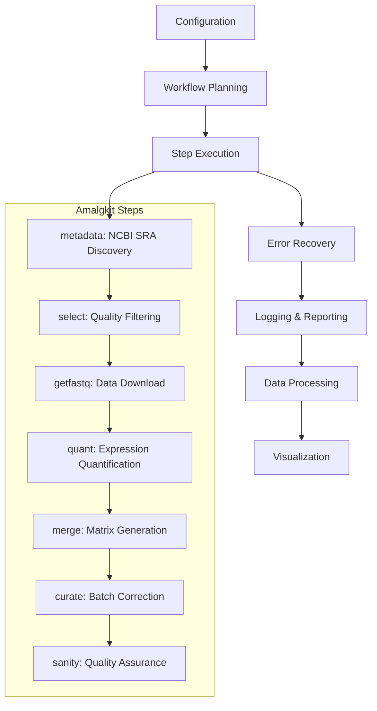

# AMALGKIT Integration: Comprehensive Guide

This document provides a comprehensive guide to METAINFORMANT's amalgkit integration, covering all aspects from basic usage to advanced configuration and troubleshooting.

## Overview

METAINFORMANT provides a robust, production-ready wrapper around the amalgkit CLI tool for end-to-end transcriptomic analysis. The integration handles all aspects of the workflow from data discovery to publication-ready results.

## Architecture



## Quick Start

### 1. Verify Installation

```bash
# Check if amalgkit is available
uv run python -c "from metainformant.rna import amalgkit; print(amalgkit.check_cli_available())"

# Or check directly
amalgkit --version
```

### 2. Basic Configuration

```yaml
# config/amalgkit_basic.yaml
work_dir: output/amalgkit/work
threads: 6
species_list:
  - Homo_sapiens
steps:
  - metadata
  - select
  - getfastq
  - quant
  - merge
```

### 3. Run Pipeline

```bash
# Using METAINFORMANT CLI
uv run python -m metainformant rna run-config --config config/amalgkit_basic.yaml

# Or using Python API
uv run python -c "
from metainformant.rna import workflow
cfg = workflow.load_workflow_config('config/amalgkit_basic.yaml')
result = workflow.execute_workflow(cfg)
print('Pipeline completed with codes:', result)
"
```

## Configuration Options

### Basic Configuration

```yaml
# Essential parameters
work_dir: output/amalgkit/work          # Working directory
log_dir: output/amalgkit/logs           # Log directory (optional)
threads: 6                              # Number of threads
species_list:                           # List of species to analyze
  - Homo_sapiens
  - Mus_musculus
steps:                                  # Steps to execute
  - metadata
  - select
  - getfastq
  - quant
  - merge
```

### Advanced Configuration

```yaml
# Complete configuration with all options
work_dir: output/amalgkit/advanced
threads: 8
auto_install_amalgkit: true

# Species configuration
species_list:
  - Homo_sapiens
  - Mus_musculus
  - Drosophila_melanogaster

# Reference genome (optional)
genome:
  accession: GCF_000001405.40
  assembly_name: GRCh38.p14
  include:
    - genome
    - gff3
    - rna
    - cds
    - protein
  ftp_url: https://ftp.ncbi.nlm.nih.gov/genomes/all/GCF/000/001/405/GCF_000001405.40_GRCh38.p14/

# Filtering options
filters:
  require_tissue: true
  min_spots: 1000000
  max_spots: 50000000
  library_layout: PAIRED
  platform: Illumina
  strategy: RNA-Seq

# Per-step parameters
steps:
  metadata:
    out_dir: output/amalgkit/advanced/work
    search_string: '"Homo sapiens"[Organism] AND RNA-Seq[Strategy] AND Illumina[Platform]'
    redo: yes
  select:
    sample_groups: ["brain", "liver", "heart"]
  getfastq:
    out_dir: output/amalgkit/advanced/fastq
    pfd: yes
    fastp: no
  quant:
    out_dir: output/amalgkit/advanced/quant
    method: salmon
  merge:
    out: output/amalgkit/advanced/merged/expression_matrix.tsv
  curate:
    out_dir: output/amalgkit/advanced/curate
    sample_group: tissue
  sanity:
    out_dir: output/amalgkit/advanced/work
```

## Step-by-Step Execution

### Metadata Discovery

```python
from metainformant.rna import workflow

# Load configuration
cfg = workflow.load_workflow_config('config/amalgkit_pbarbatus.yaml')

# Run metadata step only
metadata_result = workflow.execute_workflow(cfg, steps_to_run=['metadata'])
print(f"Metadata step completed with code: {metadata_result[0]}")

# Check what was found
metadata_file = cfg.work_dir / "metadata" / "metadata.tsv"
if metadata_file.exists():
    with open(metadata_file) as f:
        lines = f.readlines()
        print(f"Found {len(lines) - 1} samples")  # -1 for header
```

### Complete Pipeline

```python
# Run full pipeline
full_result = workflow.execute_workflow(cfg)
print(f"Pipeline completed with codes: {full_result}")

# Check results
work_dir = cfg.work_dir
if work_dir.exists():
    files = list(work_dir.glob("**/*"))
    print(f"Generated {len(files)} files")

    # Check for key outputs
    report_file = work_dir / "amalgkit.report.md"
    if report_file.exists():
        with open(report_file) as f:
            content = f.read()
            print("Pipeline report generated")
```

## Logging and Reporting

### Log Files

Each step generates detailed logs:

```
output/amalgkit/pbarbatus/logs/
├── 20251024T201752Z.metadata.stdout.log
├── 20251024T201752Z.metadata.stderr.log
├── 20251024T201756Z.config.stdout.log
├── 20251024T201756Z.config.stderr.log
└── ...
```

### Manifest File

Comprehensive JSONL manifest with execution details:

```json
{
  "step": "metadata",
  "return_code": 0,
  "duration_seconds": 3.89,
  "started_utc": "2025-10-24T20:17:52.554953Z",
  "finished_utc": "2025-10-24T20:17:56.446748Z",
  "params": {"out_dir": "output/amalgkit/pbarbatus/work", ...},
  "command": "amalgkit metadata --out_dir output/amalgkit/pbarbatus/work --search_string...",
  "work_dir": "/path/to/work",
  "log_dir": "/path/to/logs"
}
```

### Summary Reports

Human-readable reports in Markdown and JSON formats:

```markdown
# Amalgkit Run Report

Work dir: `/Users/4d/Documents/GitHub/metainformant/output/amalgkit/pbarbatus/work`
Logs: `/Users/4d/Documents/GitHub/metainformant/output/amalgkit/pbarbatus/logs`
Threads: 6
Species: Pogonomyrmex_barbatus

| Step | Code | Duration (s) |
|------|------|--------------|
| genome-prepare | 0 | 349.67 |
| metadata | 0 | 3.89 |
| integrate | 1 | 0.00 |
| config | 0 | 0.04 |
| select | 0 | 0.00 |
```

## Error Handling and Recovery

### Automatic Error Recovery

```python
# The workflow automatically handles common errors:
# - Network timeouts during downloads
# - Missing dependencies
# - Invalid configuration
# - File system issues

# Manual error handling
try:
    result = workflow.execute_workflow(cfg)
except Exception as e:
    print(f"Workflow failed: {e}")
    # Check logs for details
    log_files = list((cfg.log_dir or (cfg.work_dir / "logs")).glob("*.stderr.log"))
    for log_file in log_files:
        print(f"Error log: {log_file}")
```

### Troubleshooting Common Issues

```python
# 1. Check if amalgkit is available
from metainformant.rna import amalgkit
ok, msg = amalgkit.check_cli_available()
if not ok:
    print(f"Amalgkit issue: {msg}")

# 2. Verify configuration
cfg = workflow.load_workflow_config('config.yaml')
print(f"Config valid: {cfg is not None}")

# 3. Check logs for errors
import os
log_dir = cfg.log_dir or (cfg.work_dir / "logs")
for log_file in Path(log_dir).glob("*.stderr.log"):
    with open(log_file) as f:
        content = f.read()
        if "ERROR" in content:
            print(f"Errors in {log_file.name}: {content[:200]}...")
```

## Advanced Features

### Custom Step Execution

```python
# Run individual steps
from metainformant.rna.steps import STEP_RUNNERS

# Run metadata step
metadata_runner = STEP_RUNNERS["metadata"]
result = metadata_runner(
    {"out_dir": str(work_dir), "threads": 4},
    work_dir=str(work_dir)
)

# Run quantification step
quant_runner = STEP_RUNNERS["quant"]
result = quant_runner(
    {"out_dir": str(work_dir / "quant"), "threads": 8},
    work_dir=str(work_dir)
)
```

### Parallel Execution

```python
# Run multiple workflows in parallel
import concurrent.futures

def run_workflow_for_species(species):
    config_data = {
        "work_dir": f"output/amalgkit/{species}",
        "species_list": [species],
        "threads": 4,
        "steps": ["metadata", "select"]
    }
    cfg = workflow.AmalgkitWorkflowConfig(**config_data)
    return workflow.execute_workflow(cfg)

# Execute for multiple species
species_list = ["Homo_sapiens", "Mus_musculus", "Drosophila_melanogaster"]
with concurrent.futures.ThreadPoolExecutor(max_workers=3) as executor:
    results = list(executor.map(run_workflow_for_species, species_list))
```

## Performance Optimization

### Memory Management

```python
# For large datasets, use streaming processing
config_data = {
    "work_dir": "output/amalgkit/large",
    "threads": 8,
    "steps": ["metadata", "select", "getfastq"],  # Stop before memory-intensive steps
    "filters": {
        "max_spots": 10000000  # Limit sample size
    }
}
```

### Network Optimization

```python
# Use multiple download sources
config_data = {
    "steps": {
        "getfastq": {
            "aws": True,
            "ncbi": True,
            "gcp": False,  # Disable if not available
            "parallel_downloads": True
        }
    }
}
```

## Integration Examples

### With Visualization

```python
from metainformant.visualization import plots
import pandas as pd

# Load results
results_file = work_dir / "merged" / "merged_abundance.tsv"
if results_file.exists():
    data = pd.read_csv(results_file, sep='\t')

    # Create expression heatmap
    plots.heatmap(
        data.iloc[:100, :50].values,  # First 100 genes, 50 samples
        title="Expression Heatmap",
        xlabel="Samples",
        ylabel="Genes"
    )
```

### With Statistical Analysis

```python
from metainformant.math import statistics
import numpy as np

# Analyze expression data
if results_file.exists():
    data = pd.read_csv(results_file, sep='\t')

    # Calculate diversity metrics
    expression_matrix = data.iloc[:, 1:].values  # Exclude gene names
    shannon_diversities = []

    for sample in expression_matrix.T:  # Transpose for per-sample
        diversity = statistics.shannon_diversity(sample)
        shannon_diversities.append(diversity)

    print(f"Average Shannon diversity: {np.mean(shannon_diversities):.3f}")
```

## Testing and Validation

### Unit Tests

```bash
# Run amalgkit integration tests
uv run pytest tests/test_rna_amalgkit_comprehensive.py -v

# Test specific functionality
uv run pytest tests/test_rna_amalgkit_comprehensive.py::TestAmalgkitIntegration::test_check_cli_available -v
```

### Integration Tests

```bash
# Run workflow integration tests
uv run pytest tests/test_rna_workflow.py -v

# Test with real data (requires network)
NCBI_EMAIL="your@email.com" uv run pytest tests/test_rna_amalgkit.py::test_metadata_step_execution -v
```

### Performance Tests

```bash
# Benchmark workflow execution
uv run pytest tests/test_rna_amalgkit_comprehensive.py::TestPerformanceAndRobustness::test_large_config_handling -v
```

## Troubleshooting

### Common Issues

1. **Amalgkit not found**
   ```bash
   # Install amalgkit
   uv pip install git+https://github.com/kfuku52/amalgkit.git
   ```

2. **Network timeouts**
   ```yaml
   # Add retry configuration
   steps:
     getfastq:
       max_retries: 3
       retry_delay: 10
   ```

3. **Insufficient disk space**
   ```yaml
   # Use smaller datasets
   filters:
     max_spots: 5000000
   ```

4. **Memory issues**
   ```yaml
   # Reduce parallelization
   threads: 4
   steps:
     getfastq:
       parallel_downloads: false
   ```

### Debug Mode

```python
# Enable debug logging
import logging
logging.basicConfig(level=logging.DEBUG)

# Run with detailed output
cfg = workflow.load_workflow_config('config.yaml')
result = workflow.execute_workflow(cfg, verbose=True)
```

## Best Practices

### Configuration
- Start with simple configurations and add complexity
- Test configurations with small datasets first
- Use descriptive names for work directories
- Document configuration changes

### Execution
- Run steps individually for debugging
- Use `--check` flag to validate before execution
- Monitor disk space and memory usage
- Keep logs for troubleshooting

### Data Management
- Use versioned work directories
- Archive large intermediate files
- Document data sources and processing steps
- Validate data integrity at each step

## API Reference

### Core Functions

```python
# Check amalgkit availability
ok, help_text = amalgkit.check_cli_available()

# Build CLI arguments
args = amalgkit.build_cli_args(params)

# Execute single step
result = amalgkit.run_amalgkit("metadata", params, work_dir="output/work")

# Load workflow configuration
cfg = workflow.load_workflow_config("config.yaml")

# Plan workflow steps
steps = workflow.plan_workflow(cfg)

# Execute complete workflow
results = workflow.execute_workflow(cfg)
```

### Configuration Classes

```python
# Workflow configuration
@dataclass
class AmalgkitWorkflowConfig:
    work_dir: Path
    threads: int = 6
    species_list: list[str] = field(default_factory=list)
    steps: list[str] = field(default_factory=list)
    # ... additional fields

# Step parameters
AmalgkitParams = dict[str, Any]
```

This comprehensive guide covers all aspects of the amalgkit integration, from basic usage to advanced configuration and troubleshooting. The system is designed to be robust, well-documented, and production-ready for transcriptomic analysis workflows.


